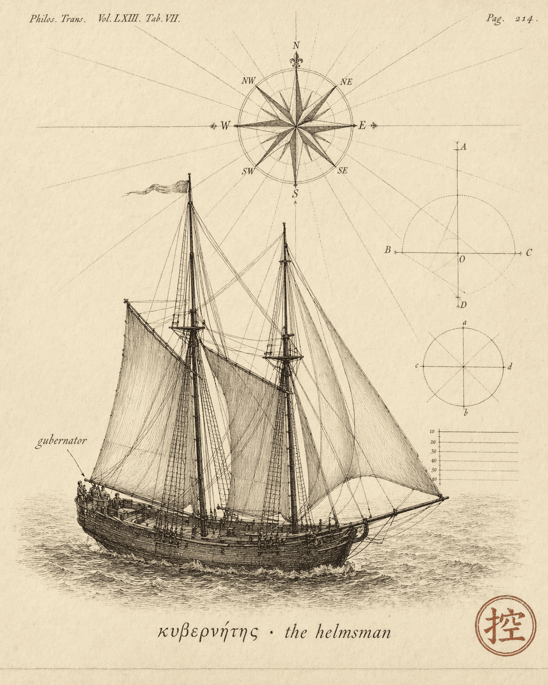

# The helmsman

An agentic system's output is the resultant of two forces — model capability and everything you do at the harness layer. [Orthogonality](../ch-01-orthogonality/index.md) tells you where to aim. But what is the actual mechanism of "aiming"? What kind of work is your harness doing?

In 1948, a mathematician gave that work a name.

The word *cybernetics* comes from the Greek κυβερνήτης — helmsman. Not a philosopher, not an architect. A helmsman. Someone adjusting course in real time, against wind and current.

Norbert Wiener used this word to name a discipline: the study of how systems achieve control through feedback — whether the system is a steam engine, a cat, or a social organization.

???+ quote "Wiener's core insight (paraphrased)"

    A system's function depends on the quality of information flowing through it. Corrupt the information with noise, and the system loses stability. Break the feedback loop, and control becomes an empty word.

    — Paraphrased from *Cybernetics: Or Control and Communication in the Animal and the Machine* (1948)

If you have written any agentic system code, this might sound familiar.

## Feedback: an overused word, an underused concept

In everyday language, "feedback" means someone tells you how you did. In cybernetics, feedback is a precise mechanism: **the system's output is routed back as input, shaping the system's subsequent behavior.**

This mechanism has two modes. Note: "positive" and "negative" here do not mean "good" and "bad" — positive feedback is often dangerous, negative feedback is usually what you want. The names are counterintuitive, but the logic is clean:

**Negative feedback** corrects deviation and drives toward equilibrium. The thermostat is the textbook example — temperature too high, heater off; too low, heater on; the system oscillates around the setpoint. Your agent calls a tool, gets a result, adjusts its next decision accordingly — that is negative feedback at work.

**Positive feedback** amplifies deviation and drives toward runaway. The screech when a microphone gets too close to a speaker is positive feedback — sound picked up, amplified, picked up again, amplified again, until the system saturates. Your agent produces a hallucination — the model confidently outputs something factually wrong — and that wrong information enters the context. The model, reasoning from a now-corrupted context, produces more errors. Positive feedback — only what runs away is meaning, not sound.

Both modes coexist in every agent system. Negative feedback steers toward the goal. Positive feedback steers away from it — and accelerates.

## You are already doing cybernetics

If you have written agent code, you have already been practicing cybernetics.

| What you write in the harness | What cybernetics calls it |
|-------------------------------|--------------------------|
| System prompt, tool definitions | Initial conditions and interface definitions of the control signal |
| Output parser, evaluator | Observer |
| The loop that concatenates tool results and calls the model again | Closed-loop feedback loop |
| Context management (compaction, summarization) | Signal filtering and noise reduction |
| Permission system, sandbox isolation | Constraint boundaries of the actuator |
| Max steps, timeouts | Safety valves against positive-feedback runaway |

These components together form your **harness** — the entire feedback control system wrapped around the LLM. This system does not require a human in the loop at every turn; harness code closes the loop automatically. The human's role is at design time, not runtime.

!!! tip "Why give your intuitions a name"

    Putting a theoretical framework on these practices is not about padding a resume. It is about seeing something clearly: which of your gut-instinct design choices have theoretical backing, which ones are just getting lucky — and whether theory can help you get lucky more reliably.

The harness is a single whole, but it has internal division of labor. Cybernetics describes that division with three roles — Observer, Controller, Plant.

## Further Reading

- Wiener, N. (1948). *Cybernetics: Or Control and Communication in the Animal and the Machine*. MIT Press.
