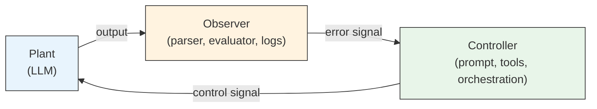

# Observer-Controller-Plant

Knowing the harness is a feedback control system is a start. But "the whole system" is too coarse — when something goes wrong, you have no idea where to look. Cybernetics splits the system into three roles.

## Three roles

**Plant (the controlled object)** — the thing you want to control but cannot directly modify from the inside. In classical control theory, it is a motor, a chemical reactor, the aerodynamic surfaces of an aircraft. In an agentic system, it is the LLM. You give it input; it gives you output. You cannot crack open its parameter matrix and manually tweak a weight — you can only influence its output through its input.

**Controller** — the part that generates control signals based on observed signals. System prompt, tool definitions, orchestration logic, permission system, context management strategy — these determine "what gets fed to the LLM next turn."

**Observer** — the part that senses the plant's output. Output parser, evaluator LLM (a separate model checking the primary model's output), human-in-the-loop approval flows, logging systems — they determine "whether the LLM's output meets the mark, and where the gap is."

Controller and observer are both your harness code. The plant is the only part that does not belong to the harness — it is what the harness exists to control. OCP is not dividing your system into three separate programs. It is performing **responsibility decomposition** within the harness: inside the same codebase, which components are doing control, which are doing observation.

## Closed loop and open loop

If your agent is just `prompt → response`, fire and forget, you are doing **open-loop control** — issuing a command without looking at the result. Open-loop control works when the plant's behavior is highly predictable.

LLM behavior is not highly predictable — [ch-01](../ch-01-orthogonality/02-what-is-the-model.md) covered this: probabilistic output is one of its operational characteristics. So nearly every production-grade agentic system is closed-loop. The ones that are not are either chatbots or rolling the dice.

The essence of closed-loop control is straightforward: **observe, compare, adjust, repeat.** The agent loop's `while has_tool_calls: execute → feed_back → call_again` is this cycle expressed in code.

## Mapping table

Aligning cybernetics terminology with agent system components makes the whole picture click:

| Cybernetics concept | Agent system counterpart | Example |
|---------------------|--------------------------|---------|
| Plant | LLM | Claude, GPT |
| Controller | Control components in the harness | system prompt, tool definitions, orchestration logic, context management |
| Observer | Observation components in the harness | JSON parser, evaluator LLM, human review, logs |
| Reference signal | Task objective | "Fix this bug" |
| Error signal | Gap between objective and actual output | Tests still failing |
| Control signal | Next-round input | Adjusted prompt + tool results |
| Feedback | Tool results / evaluation results | bash output, test results, linter output |

You do not need to memorize this table. What you need is an instinct: when you hit a design problem in an agent system, try asking — is this a plant problem, a controller problem, or an observer problem? That single distinction, just sorting into the right bucket, sharpens your troubleshooting direction considerably.

## The separation principle

!!! info "Separation Principle"

    Control theory has a theorem: under conditions of linearity, Gaussian noise, and a few other assumptions, the controller and the observer can be **designed independently**. You can design the optimal controller first (assuming perfect observation), then design the optimal observer (assuming perfect control), combine them, and the result is still optimal.

    LLM systems are neither linear nor Gaussian — the theorem does not apply directly. But the **engineering spirit** behind it is worth borrowing.

Put plainly: **"getting the model to output in the right format" and "checking whether the model's output is correct" are two different jobs.** The first belongs to the controller (prompt engineering, structured output, tool design). The second belongs to the observer (validation, evaluation, testing).

A classic symptom of conflating the two: stuffing a paragraph into the system prompt that says "please verify your own output for correctness" — the controller moonlighting as the observer. Sometimes this works (models do have some self-correction ability), but it couples two problems that could have been optimized independently. Once coupled, every time you adjust the prompt, you cannot tell whether you are tuning control or tuning observation. Debugging becomes guesswork.

Anthropic's generator/evaluator separation architecture in harness design is exactly this principle in engineering practice — generation and evaluation handled by different components, each iterated independently.

Three roles, one loop, one separation principle — that is the basic skeleton cybernetics gives you. But this skeleton faces a unique challenge: its plant is a language model with a near-infinite output space. How does your controller cope with that kind of variety? Ashby answered this in 1956.

## Further Reading

- Ahn, K., Zhang, Z., & Sra, S. (2024). What's the Magic Word? A Control Theory of LLM Prompting. [arXiv:2310.04444](https://arxiv.org/abs/2310.04444)
