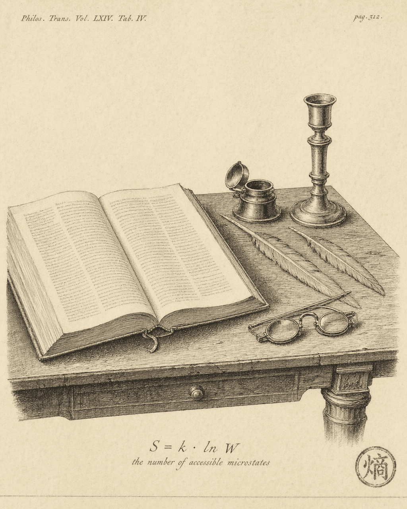

# What is entropy

What does your desk look like right now?

If you are like most people, the honest answer is "worse than last week." Not because you trashed it on purpose. Quite the opposite, you have been tidying up. But disorder is the default direction. Left alone, things drift toward mess.

That intuition is more precise than it feels. Behind it sits a mathematical structure that spans thermodynamics and information theory, and that structure is directly connected to a parameter you adjust every time you call an LLM.

## Boltzmann's desk

In the 1870s, Ludwig Boltzmann was chewing on a question that sounds easy until you try to answer it: why does heat always flow from hot objects to cold ones, never the other way around?

His answer was disarmingly simple: it is not that reverse flow *cannot* happen. It is just overwhelmingly *unlikely*.

Go back to your desk. Say there are five books, three pens, and a mug of coffee on it. "Tidy" configurations are rare: books sorted by size, pens in the holder, coffee safely to the right of the keyboard. "Messy" configurations are legion. Books at every angle, pens in every crevice, coffee perched ominously above the trackpad. The number of ways to be messy dwarfs the number of ways to be neat.

Boltzmann compressed this into a single line:

$$S = k \ln W$$

$S$ is entropy. $W$ is the number of microscopic arrangements that all look the same from the outside, the count of microstates compatible with a given macrostate. A tidy desk has a small $W$, so low entropy. A messy desk has an enormous $W$, so high entropy.

Systems drift from low-$W$ states toward high-$W$ states without anyone pushing them, purely because high-$W$ states occupy a vastly larger share of possibility space. That is the statistical heart of the second law of thermodynamics. Not a prohibition. A crushing probability.

## Shannon's telephone line

In 1948, Claude Shannon was sitting in Bell Labs working on an entirely different problem: how do you quantify how much information a communication channel can carry?

He needed a measure for surprise. "How uncertain was I before I received this message?" The more uncertain you were, the more information the message carries. "The sun will rise tomorrow" tells you almost nothing. "There will be a total solar eclipse tomorrow" tells you a great deal.

The formula Shannon arrived at:

$$H = -\sum_{i} p_i \log p_i$$

$H$ is information entropy. $p_i$ is the probability of the $i$-th possible outcome. When all outcomes are equally likely, $H$ is at its maximum: you have no basis for predicting what comes next. When one outcome's probability approaches 1, $H$ drops toward zero. The result is a foregone conclusion, carrying no surprise at all.

Two people, different fields, different decades, facing different problems, arrived at structurally identical formulas.

Not a coincidence. In 1957, E.T. Jaynes provided the unifying framework: Boltzmann's physical entropy and Shannon's information entropy are instances of the same mathematical structure, a measure of uncertainty, or equivalently, of the number of states compatible with what you know. In physics it quantifies uncertainty over microstates; in information theory, uncertainty over messages. Same skeleton, different flesh.

There is an often-repeated anecdote about Shannon's choice of the word "entropy" for his measure. Supposedly, von Neumann advised him to use the term, partly because the connection to thermodynamic entropy is genuine, and partly because "nobody really knows what entropy means, so in a debate you will always have the advantage." Whether the story actually happened is anyone's guess. But it has survived decades of retelling, probably because it captures something real about the concept: mathematically rigorous, intuitively slippery.

## Temperature: the entropy knob you already use

If you have ever called an LLM API, you have adjusted a `temperature` parameter.

The name is not a metaphor. It does mathematically the same thing as the temperature parameter in the Boltzmann distribution.

When an LLM generates the next token, it first computes a raw score (logit) for every token in its vocabulary. Those scores then pass through a softmax function to produce a probability distribution, and `temperature` is the scaling factor in that conversion.

Set `temperature` close to 0 and the distribution collapses. The highest-scoring token absorbs nearly all the probability mass, output becomes near-deterministic, and in Shannon's formula $H$ approaches zero.

Crank it up and the distribution flattens. The gap between high-scoring and low-scoring tokens shrinks, output grows unpredictable, entropy climbs. Push `temperature` toward infinity and the distribution converges to uniform; $H$ hits its maximum.

You are not "sort of like" controlling entropy when you move that slider. The Shannon entropy of the output distribution changes monotonically with temperature. Mathematical fact, not analogy.

??? note "Why temperature and entropy are monotonically related"

    The LLM softmax output is $p_i = e^{z_i / T} / \sum_j e^{z_j / T}$, where $z_i$ is the logit and $T$ is temperature. This is structurally identical to the Boltzmann distribution $p_i = e^{-E_i / kT} / Z$. As $T \to 0$, the distribution degenerates to argmax (zero entropy); as $T \to \infty$, it converges to uniform (maximum entropy). Shannon entropy $H$ is strictly monotonically increasing in $T$ — not an empirical observation, but a mathematical property of the softmax function.

In physics, high temperature means particles explore their microstates more randomly. In an LLM, high temperature means the model explores its token space more randomly. Same formula, same behavior, different substrate.

## From your desk to agent systems

Back to the desk.

A tidy desk has few compatible states, low entropy. But you do not need to do anything special to make it messier. You just need to *use* it. Every book you pick up, every pen you set down, every sip of coffee nudges the system toward higher entropy. Maintaining low entropy costs continuous energy: you have to keep tidying.

A long-running agent system faces the same force. Context windows accumulate noise. Tool calls inject unpredictable external state. Intent drifts across multi-turn conversations. Errors cascade and amplify. None of these are bugs. They are the default direction.

But "an agent system's desk is getting messier" is, so far, just an intuition. To turn it into something with engineering weight, several questions need answers. What exactly is the "desk" in an agent system? What counts as "messy"? How fast does the mess grow? And can any of it be measured?

---

## Further reading

- Shannon, C.E. (1948). "A Mathematical Theory of Communication." *Bell System Technical Journal*, 27(3), 379-423.
- Jaynes, E.T. (1957). "Information Theory and Statistical Mechanics." *Physical Review*, 106(4), 620-630.
