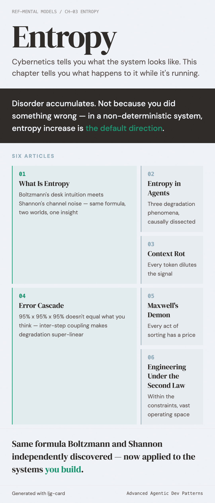

# Entropy

Cybernetics tells you what the system looks like — feedback loops, OCP triangles, state machines. But it doesn't tell you one thing: **what happens to the system while it's running.**

The answer is: disorder accumulates.

It has nothing to do with what you did right or wrong. In a non-deterministic system, entropy increase is the default direction. This is the information-theoretic version of the second law of thermodynamics, and it applies to agent systems just as it applies to gas molecules in a box.

This chapter starts from the same formula that Boltzmann and Shannon independently discovered, traces the specific forms that entropy takes in agent systems, interrogates the causal structure behind them, and arrives at a design philosophy: not fighting the laws of nature, but finding the engineering operating space within them.

---

| # | Article | In one sentence |
|---|---------|----------------|
| 01 | [What Is Entropy](01-what-is-entropy.md) | Boltzmann's desk intuition meets Shannon's channel noise — same formula, two worlds, one insight |
| 02 | [Entropy in Agent Systems](02-entropy-in-agents.md) | Three degradation phenomena, causally dissected — intent drift is an emergent effect of context rot and error cascade |
| 03 | [Context Rot](03-context-rot.md) | Attention dilution through the lens of channel capacity — context isn't free, and every token dilutes the signal |
| 04 | [Error Cascade](04-error-cascade.md) | 95% times 95% times 95% doesn't equal what you think — inter-step coupling makes degradation super-linear |
| 05 | [Maxwell's Demon](05-maxwells-demon.md) | Sorting information, maintaining order — but every act of sorting has a price |
| 06 | [Engineering Under the Second Law](06-engineering-under-entropy.md) | Shannon proved it: within the constraints, there is still vast engineering operating space |
