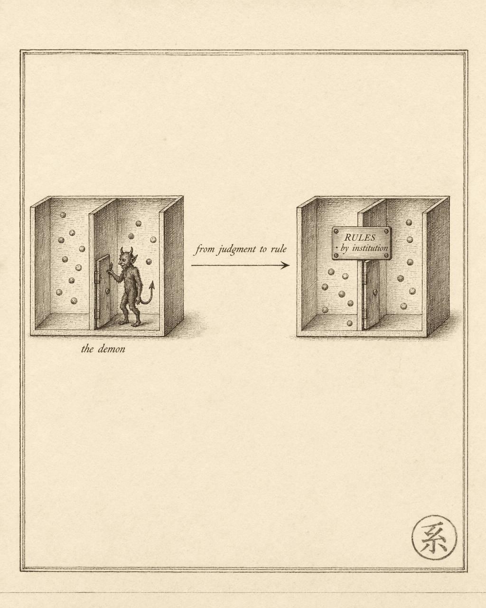

# From Demon to OS

Maxwell's Demon works. It reads the partition, classifies each molecule, and operates the trapdoor accordingly. The second law is not violated locally — it is suspended, at the cost of the Demon's continuous presence and judgment. A harness engineer does the same thing: observe the context, filter noise, control what information enters. Structurally, it is the same job.

But the Demon scales to exactly one door.

One Demon, one judgment at a time. No rules, no fallback when it is absent, no audit trail when it makes a mistake. This is not an implementation problem — it is the structural ceiling of the case-by-case judgment pattern. You cannot have one Demon per tool call.

Write the sorting rules down as policy, and you have an operating system.

## Karpathy's three-year refinement

In 2023, Andrej Karpathy described LLMs as "the kernel process of an emerging operating system." The phrase stuck. It captured something intuitively right about the relationship between language models and the broader computational infrastructure forming around them.

Three years later, he made the intuition precise. In a 2026 exchange on X:

!!! quote "Karpathy, March 2026"

    LLM = CPU (dynamics: statistical and vague not deterministic and precise)
    Agent = OS kernel (the "smartest" process managing resources and coordinating other processes)
    Harness = OS (the full system with all its components, policies, abstractions)

The 2026 version does not invalidate the 2023 intuition — it resolves it into structure. The 2023 observation was holistic: something OS-like is emerging around LLMs. The 2026 version decomposes that intuition into three distinct layers with distinct roles.

The decomposition matters because it changes what you look for. Once you see the three layers separately, the questions become specific: what does memory management look like when RAM is a context window? What does scheduling look like when a CPU call costs money? What does a trust boundary look like when the CPU itself can be "persuaded" by language?

## The three-layer mapping

| OS Layer | Agent System | Core Property |
|:---------|:------------|:--------------|
| CPU | LLM | Statistical and vague, not deterministic and precise |
| OS kernel | Agent | Manages resources, coordinates processes |
| Full OS | Harness | All components, policies, abstractions |

The architectural relationship is preserved across the mapping. The CPU executes instructions; it does not decide what to execute. The kernel orchestrates resources, schedules processes, enforces boundaries — it is the decision layer above the execution layer. The full OS wraps everything: memory subsystems, scheduling algorithms, permission models, inter-process communication, all the accumulated engineering that makes the hardware usable.

An LLM executes tokens. It does not decide what task to work on, which tools to call, when to stop, or how to allocate a budget. An agent — specifically the orchestrating logic — does that coordination. The harness is the full system: context management, task scheduling, trust enforcement, collaboration protocols.

The analogy is not decorative. OS engineers spent fifty years solving problems that agent engineers are encountering now, in slightly different shapes. Every design intuition buried in OS architecture — why preemptive scheduling beats cooperative, why virtual memory beats manual allocation, why least-privilege is worth its complexity — came from painful failures. That accumulated intuition does not need to be re-earned from scratch.

## Where "statistical and vague" changes everything

Karpathy's one-sentence CPU definition does something subtle. It does not just say "LLM is like a CPU." It specifies the exact dimension where the analogy holds and exactly where it breaks. The dynamics are statistical and vague, not deterministic and precise.

An OS kernel trusts its CPU implicitly. The CPU executes whatever instruction sequence it receives. It does not understand the instructions. It cannot be convinced to ignore a segment fault or escalate privileges through a well-crafted argument. The hardware barrier between user mode and kernel mode is enforced by the physics of the chip, not by the CPU's willingness to cooperate.

An agent's CPU is different. The LLM is the system that reads all inputs — including inputs that might be deliberately crafted to alter its behavior. There is no type system, no instruction validator, no hardware mechanism that distinguishes instructions from data. Natural language is the interface, and natural language has no equivalent to a segment fault. This single property cascades into every design decision: memory management cannot just track what is present, it must track what is accurate. Scheduling cannot just detect process termination, it must judge semantic completion. Trust boundaries cannot rely on hardware enforcement, they must be layered architecturally.

Four OS abstractions, each worth fifty years of refinement, each needing adaptation for a probabilistic CPU — and each breaking at a precise point that reveals something the OS never had to solve.

---

The most immediate constraint in any agent system is also the most visible: the context window. Everything the LLM "knows" at inference time has to fit there. How OS engineers solved the analogous problem — infinite logical memory from finite physical memory — is where the story begins.

---

## Further reading

- Karpathy, A. (2023). Intro to Large Language Models. YouTube. ("the kernel process of an emerging operating system")
- Karpathy, A. (2026-03-31). Reply to @gvanrossum. X. (The three-layer decomposition: LLM=CPU, Agent=kernel, Harness=OS)
