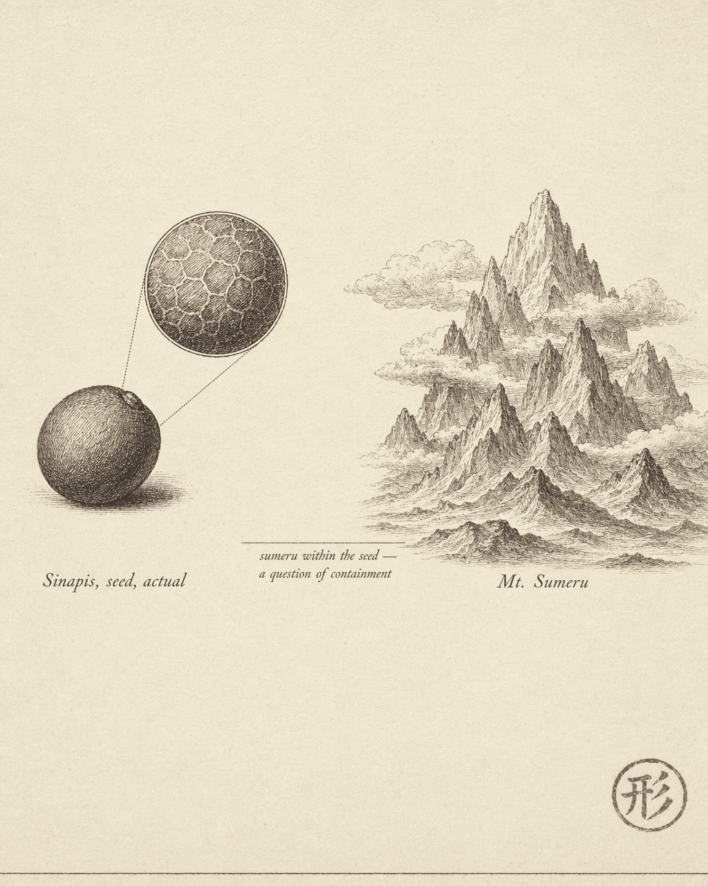

# Mount Sumeru in a mustard seed

Picture a net stretched across the entire universe. At every node hangs a jewel, and each jewel's polished surface reflects every other jewel in the net. But the reflections themselves contain reflections — each mirrored jewel carries the image of every other, including the one you started from. Peer into any single jewel and you see the whole net, infinitely nested.

This is **Indra's Net**, an image from the Avatamsaka Sutra — a Mahayana Buddhist text composed around the third century CE and later systematized by the Tang dynasty monk Fazang as the centerpiece of Huayan philosophy. It is not decorative mysticism. It is one of the earliest sustained attempts to articulate a structural property: that the whole can be present in each of its parts.

A different sutra pushes the same intuition further.

!!! quote "Vimalakirti Sutra, Chapter of Inconceivable Liberation"

    Mount Sumeru, vast and towering, is placed inside a mustard seed. The mustard seed does not grow larger; Sumeru does not shrink. Mount Sumeru retains its original form.

Mount Sumeru is the axis of the Buddhist cosmos — the largest thing conceivable. A mustard seed is smaller than a sesame seed. Sumeru enters the seed without distortion: scale changes, structure stays intact.

These two passages come from different scriptures, but they share one structural intuition. Indra's Net says *every part mirrors the whole* — pick any jewel and you see the entire net. The Sumeru passage says *the largest structure fits inside the smallest container without loss* — the container's scale is irrelevant to the content's structure.

One emphasizes the mapping relationship. The other emphasizes scale-invariance. Together, they outline something precise: the information of the whole is present in every part, and that presence survives changes in scale.

This is not mystical rhetoric. It is a claim about structure — stated in the vocabulary of Buddhist philosophy.

Seventeen hundred years later, a mathematician stumbled into the same territory from a completely different direction.

## How long is a coastline?

Lewis Fry Richardson was a British meteorologist with an unusual side interest: he wanted to know whether the length of a shared border between two countries predicted the probability of war between them. When he died in 1961, he left behind unpublished manuscripts containing a strange finding. The same coastline, measured from different data sources, yielded different lengths.

Not measurement error. Something systematic: the finer the ruler, the longer the coast.

Measure the coastline of Britain with a 200-kilometer ruler and you get one number. Switch to a 100-kilometer ruler and you can trace more bays and headlands — the total grows. Use 50 kilometers, and more detail enters the picture. 25, 12, 6 — with each step down, the total length increases, and there is no sign of convergence.

In principle, an infinitely fine ruler would give an infinitely long coastline.

This challenges a deep assumption. We take it for granted that a physical object has a definite length. A table is 1.2 meters. A road is 300 kilometers. These numbers do not change because you swap rulers. But a coastline is different. Its length depends on the precision of measurement, and it does not converge to a limit. "How long is the coast of Britain?" turns out to have no answer within classical measurement.

In 1967, Benoit Mandelbrot published a paper in *Science* with a title so blunt it bordered on provocation: *How Long Is the Coast of Britain? Statistical Self-Similarity and Fractional Dimension*. Working from Richardson's data, he supplied a mathematical framework: the coastline's length diverges because it is not a smooth one-dimensional curve. Its dimension is a **fraction**.

The fractal dimension of Britain's coastline: D ≈ 1.25. More complex than a straight line (dimension 1), but not complex enough to fill a plane (dimension 2). It lives between the two.

??? info "Intuition for fractal dimension"

    Fractal dimension quantifies how thoroughly a shape fills its ambient space — its degree of "roughness" or "crumpledness." D = 1 is a perfectly smooth line. D = 2 is a completely filled plane. D = 1.25 means the coastline is more complex than a line but falls well short of a surface.

    Norway's coastline has D ≈ 1.52 — the fjords make it far more crinkled, pushing it closer to two dimensions. South Africa's coastline has D ≈ 1.02 — relatively smooth, barely more than a line.

    Dimensions are no longer restricted to whole numbers. That alone is a conceptual breakthrough.

Here is the key insight: the statistical character of a coastline is consistent across scales. The jagged outline you see in a satellite photograph and the jagged outline you see looking down from a cliff at the rocks below your feet are different shapes, but they share the same *statistical pattern of jaggedness*.

Zoom in and new detail appears. Zoom in again — more detail. Each layer of detail is statistically similar to the layer above.

This is **statistical self-similarity**: not exact replication, but scale-invariant statistical distribution.

Nature is full of it. River drainage networks, the bronchial tree of a lung, the branching paths of lightning, the silhouette of a mountain range. The pattern you observe at one scale reappears when you shift to another.

But natural self-similarity is approximate, statistical. Is there a shape that is self-similar in the strict, mathematical sense?

## The Koch snowflake

In 1904, the Swedish mathematician Helge von Koch constructed a curve.

Start with an equilateral triangle. Divide each side into thirds. On the middle third of each side, erect a smaller equilateral triangle pointing outward, then remove the base of that triangle. Each original side has now become four segments, each one-third the length of the original. Repeat the same operation on every new side. And again. And again. Infinitely.

The result is a "snowflake" — its boundary infinitely intricate, every segment a scaled-down copy of the whole.

Two properties make the Koch snowflake a textbook fractal.

**Finite area, infinite perimeter.** The area increases only slightly with each iteration and converges to 8/5 of the original triangle's area. But the perimeter multiplies by 4/3 at every step — after infinitely many iterations, it tends to infinity. A shape of finite size whose boundary is infinitely long.

**Exact self-similarity.** Take any segment of the snowflake's edge and magnify it by a factor of 3. What you get is identical to the entire edge — not "statistically similar," but mathematically congruent. The part *is* a perfect rescaling of the whole.

??? info "Fractal dimension of the Koch snowflake"

    At each step, every edge segment produces 4 copies of itself, each scaled down by a factor of 3. The fractal dimension is defined as:

    $$D = \frac{\log N}{\log S}$$

    where N is the number of self-similar pieces (4) and S is the scaling factor (3):

    $$D = \frac{\log 4}{\log 3} \approx 1.26$$

    Nearly identical to the British coastline's 1.25 — one is a mathematically constructed exact fractal, the other a naturally evolved statistical fractal, yet their dimensions are strikingly close.

The Koch snowflake makes one thing visible: **self-similar structure does not require a complicated generator**. A single rule — "replace the middle third of every edge with an outward bump" — repeated without end, is enough.

Complexity is not designed. It is iterated. Between the simplicity of the rule and the complexity of the result lies a vast gap, and what bridges it is repetition.

## z &rarr; z&sup2; + c

Take that thought to its limit.

Pick a complex number c. Starting from z = 0, repeatedly compute z &rarr; z&sup2; + c. If the sequence stays bounded — does not fly off toward infinity — color the point c black. Do this for every point c in the complex plane.

Six characters of rule. The shape they produce is called the **Mandelbrot set**.

Its boundary is among the most complex shapes known to mathematics. Zoom into any region of that boundary and you find new structure — spirals, tendrils, miniature copies of the set itself. Zoom further, and there is more. Zoom without end, and new detail never stops. And within that detail, variations of the overall shape keep recurring. The part echoes the whole.

Two things are worth pausing on.

First, the Koch snowflake's rule still involves a geometric operation — "find the middle third, erect a triangle." The Mandelbrot set's rule involves no geometry at all. It is pure algebra: square and add. Nobody *designed* those spirals and tendrils. They are what happens when the same rule acts on itself, over and over.

Second, the Mandelbrot set's self-similarity is neither the exact congruence of the Koch snowflake nor the purely statistical resemblance of a coastline. It is a subtler third kind: the miniature "baby Mandelbrots" that appear at every scale are recognizably similar to the parent shape but not identical — each carries its own unique decorative detail. Similar, yet not the same. Theme and variation.

**Fractals are not designed. They are what emerges when a simple rule is applied to itself repeatedly.**

That sentence is worth sitting with. The Koch snowflake is one replacement rule executed without end. The Mandelbrot set is one algebraic rule executed without end. A coastline is the result of waves and geological forces eroding rock at every scale, repeatedly, over millions of years. In all three cases the complexity does not live in the rule — the rule is almost trivially simple. The complexity lives in the accumulation of iteration.

---

## From temple to mathematics

Back to where we started.

The Sumeru-in-a-mustard-seed passage says: the largest structure fits inside the smallest container — scale changes, structure does not. Indra's Net says: every part mirrors the whole — the whole is present in every part.

The Mandelbrot set says: zoom into any region of the boundary and you find echoes of the overall shape. The Koch snowflake says: take any segment of the edge, magnify it to full size, and it is congruent with the whole.

One is a Buddhist intuition. The other is a mathematical discovery. The paths could not be more different. What they describe is the same structural property: **a resonance between part and whole — structural echo**.

An honest boundary statement belongs here.

This series is about mental models for agentic systems. We are not claiming that agentic systems are fractals in any mathematical sense — they do not satisfy the formal definition of self-similarity, and they have no precisely computable fractal dimension. This is analogy, not identity.

What we *are* saying is that the core intuition of fractals — **structural echo between part and whole** — provides an engineering lens worth looking through. The observe-reason-act loop inside a single agent, the dispatch-execute-aggregate flow at a multi-agent orchestration layer, the emergent coordination patterns across an agent network — when structures at different scales begin to rhyme, that is not coincidence. It is a signal worth investigating.

But before we investigate engineering implications, there is a more fundamental question.

Every fractal we encountered in this article — the Koch snowflake, the Mandelbrot set, a coastline — shares one trait: none of them were designed in a single stroke. Each is the product of a simple rule applied to itself, again and again. Iteration is the generative mechanism.

So what, exactly, is iteration? Under what conditions does the repeated application of a simple rule produce structure — and under what conditions does it produce only noise?

