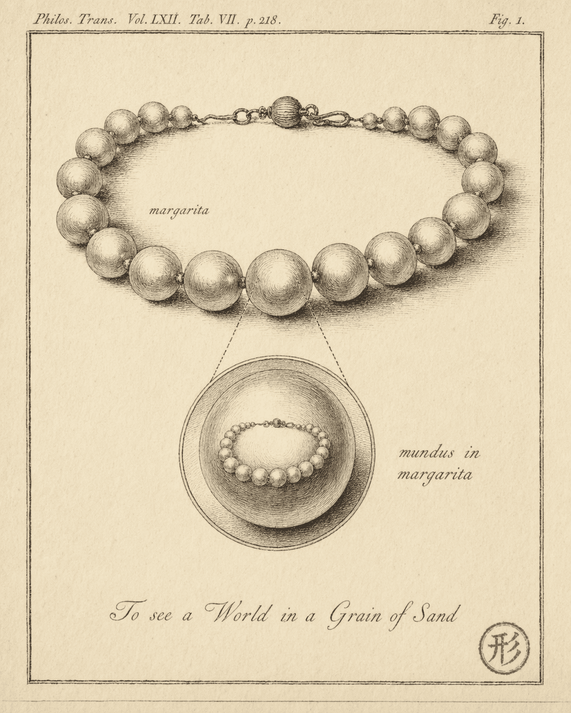

# Worlds within worlds

Every cell in your body carries the full genome. Not as an archive — as a live, expressible program. A liver cell holds the complete instructions for building an eye. A skin cell contains the entire blueprint for a heart. They are "liver" or "skin" not because they lack information, but because their environment has activated certain genes and silenced others.

Complete information. Selective expression.

This is worth stopping for. It is not merely a biological fact — it hints at a structural property that keeps surfacing across philosophy, computation, and agent engineering.

## The gap

The first article in this chapter observed a phenomenon: structural echo between part and whole. Indra's Net, Koch snowflakes, the Mandelbrot set — whether the observation came from Buddhist philosophy or twentieth-century mathematics, it pointed at the same thing. Zoom into a part, and you see the shape of the whole.

The second article asked where that echo comes from. The answer was recursion — a simple rule applied to its own output, repeatedly, with structural consistency across scales. That is the generator.

But there is a gap between "the part looks like the whole" and "the part *is* the whole."

A segment of the Koch snowflake's edge is a scaled-down copy of the entire edge. Geometrically perfect self-similarity. But that segment does not *do* anything on its own. It has no internal state, no causal chain, no capacity to evolve independently. It is a geometric fragment that happens to resemble its parent shape.

A cell is different. A cell does not merely look like an organism — it **carries the complete information to build one**, and it is itself a fully operational system. Place a cell in a petri dish with the right culture medium and it survives, metabolizes, divides. It is not a component. It is a complete world.

This article is about the far side of that gap: **not just parts that resemble wholes, but parts that constitute complete, independently viable worlds — worlds that follow the same structural laws as the whole they are embedded in.**

## The gold lion

In the seventh century, the Tang dynasty monk Fazang faced a pedagogical problem. He needed to explain Huayan Buddhism's central claim — that each part of reality contains the totality — to Empress Wu Zetian, who was not a philosopher. He pointed to a golden lion statue in the palace.

!!! quote "Fazang, *Treatise on the Golden Lion* (金狮子章)"

    Gold has no inherent form; it follows the craftsman's skill and manifests as the lion's shape. The lion's form is empty — it is nothing but gold. ... Take any single hair-pore of the lion: it contains the entire lion. Every hair-pore is likewise.

Gold, as a substance, has no fixed shape — it takes the form of a lion only because a craftsman made it so. The lion's shape is "empty," meaning not that it does not exist, but that it is not a separate entity independent of the gold. Form and substance are inseparable. Then the critical move: pick any single hair-pore on the lion's body, and that pore contains the entire lion. Every pore does.

This is not a claim about visual resemblance — the pore does not *look like* a tiny lion. Fazang's point is that the gold in the pore and the gold of the whole lion are the same gold. Structure and substrate cannot be separated. The part does not "map to" the whole. The part **is** the whole, expressed at a different position and scale.

Fazang was the third patriarch of the Huayan school, and his contribution was to take the poetic imagery of the Avatamsaka Sutra — Indra's Net, the interpenetration of all phenomena — and formalize it into a systematic philosophical framework. Francis Cook's *Hua-yen Buddhism* (1977) remains the standard English-language study of this tradition for readers who want the full philosophical architecture.

"One is all, all is one" — a line from the Avatamsaka Sutra that is often treated as Zen-flavored mysticism. In Fazang's systematic reading, it is a precise structural description: every part contains sufficient information to reconstruct the whole, and the whole is nothing other than the simultaneous expression of all its parts.

A thousand years later, an English poet arrived at nearly the same intuition through entirely different means.

!!! quote "William Blake, *Auguries of Innocence* (c. 1803, pub. 1863)"

    To see a world in a grain of sand,
    And a heaven in a wild flower,
    Hold infinity in the palm of your hand,
    And eternity in an hour.

A world in a grain of sand. Not "a grain of sand reminds you of a world" — the grain *is* a world. The logic is structurally identical to Fazang's hair-pore argument: the part contains enough structure to constitute a complete, self-consistent existence.

These philosophical intuitions grew independently across cultures separated by a millennium and half the planet. Fazang never read Blake. Blake almost certainly never read the Avatamsaka Sutra. Yet they converge on the same structural insight: **the part does not merely mirror the whole — the part is itself a complete world.**

## The genome in every cell

Philosophical intuition is one thing. Molecular biology is another.

The human body contains roughly 37 trillion cells. Every one of them — with rare exceptions like mature red blood cells, which eject their nuclei — carries the complete genome: approximately 3.2 billion base pairs encoding all the information needed to build the entire organism.

But cells do not merely store this information passively. That is the critical point.

A stem cell carries the full genome. When it receives signals from its environment — chemical gradients, physical contact, molecular messages from neighboring cells — its gene expression profile shifts. Certain genes activate. Others go silent. Same blueprint, different context, different outcome:

- Near the neural tube, a stem cell differentiates into a neuron — expressing ion channel proteins, extending axons and dendrites, acquiring the ability to conduct electrical signals.
- In bone marrow, a stem cell differentiates into a red blood cell — massively upregulating hemoglobin production, eventually ejecting its own nucleus to make room for more oxygen cargo.
- Near muscle tissue, a stem cell differentiates into a muscle fiber — expressing actin and myosin, gaining the capacity to contract.

The same complete information. Different contexts. Entirely different functions.

This pattern has a direct structural counterpart in agent engineering: the same agent architecture — same model, same core capabilities — configured with different system prompts and tool sets, exhibiting entirely different behaviors. One agent architecture can be a code reviewer, a document writer, a data analyst. What determines its function is the "environment" — the signals you place around it.

An explicit disclaimer belongs here: **this is a structural mapping, not a mechanistic equivalence.**

The genome is read by molecular machinery inside the cell — ribosomes translate mRNA into proteins, RNA polymerase transcribes DNA into RNA, spliceosomes edit pre-mRNA. These molecular machines are themselves encoded by the genome, but they are physically distinct from it. The "reader" and the "blueprint" are two different things.

A system prompt, by contrast, is processed by the LLM itself. The same model is both reader and executor. Reader and blueprint collapse into one.

What the two systems share is an abstract pattern: **encoded information, written into a system at initialization, selectively expressed through interaction with the environment, shaping the system's functional specialization.** This pattern is real and testable. But if you mistake structural similarity for mechanistic equivalence — if you conclude that a system prompt "is" a digital genome, or that a tool set "is" epigenetic regulation — you have slipped from a useful analogy into a false equation.

## Simulations within simulations

In 2003, the philosopher Nick Bostrom published "Are We Living in a Computer Simulation?" in the *Philosophical Quarterly*. The paper's conclusion is a trilemma — three propositions of which at least one must be true. We do not need to evaluate whether the conclusion is correct. What matters here is its **premise structure**.

Bostrom's reasoning rests on an assumption: if a sufficiently advanced civilization has enough computational resources, it could simulate a complete universe containing conscious beings. And the civilization inside that simulation, if it develops sufficient technology, could run another simulation inside its own reality.

Strip away the debates about consciousness and probability, and what remains is a purely structural claim: **computation can nest. A complete computational system can run inside another computational system, and the inner system need not be aware of the outer one.**

This is not a thought experiment. Conway's Game of Life already provides the minimal implementation.

The OTCA metapixel uses roughly two thousand Game of Life cells to construct a single "metacell." The cells inside this metacell follow the standard B3/S23 rules — exactly the same rules as every other cell on the grid. But observed from a distance, the metacell as a whole behaves exactly like a single Game of Life cell. Tile enough metacells together and you have a complete Game of Life running at a larger scale inside the original Game of Life.

The inner "world" is complete for its inner "inhabitants." It has its own rules (B3/S23 — the same as the outer layer, though the inner layer does not need to "know" this). It has its own state (the on/off pattern of metacells). It has its own causal chains (inner-layer gliders and oscillators evolve according to inner-layer dynamics). The inner world does not need to know that the outer world exists. It is a self-consistent, complete system.

Here is the key property: **the completeness of the inner world does not depend on awareness of the outer world.** You do not need to know you are inside a simulation to run a complete causal chain within that simulation. Completeness is structural — it depends on whether the rules are sufficient to support self-consistent evolution, not on whether you know where the rules came from.

## Agents creating sub-agents: world construction

Back to engineering.

When an agent creates a sub-agent, what is it doing?

On the surface: delegating a task. But structurally, it is doing something more interesting. **It is constructing a complete world.**

- **System prompt** — the physical laws of this world. It defines what is permitted, what matters, where the boundaries are.
- **Tool set** — the interactive environment. Whatever the sub-agent can "touch" constitutes its reality.
- **Task description** — the purpose of this world's existence. It gives the sub-agent a direction, an answer to "why am I here."
- **Context** — the initial state. The sub-agent begins its existence from this information.

The sub-agent runs inside this world. It observes (reads context and tool outputs), decides (generates next tokens), acts (calls tools), verifies (checks feedback). A complete perceive-decide-act loop. Then the world closes, and the results pass back to the creator.

The critical point: **the sub-agent does not know, and does not need to know, the orchestrator's full context.**

The orchestrator might be managing ten sub-agents simultaneously, each handling a different subtask. A given sub-agent sees only its own system prompt, its own tool set, its own task description. It does not know it is "the third one created." It does not know the other nine exist. It does not know the orchestrator's ultimate goal. For the sub-agent, its world is the entirety of what exists.

This is structurally identical to the metacell Game of Life. The inner layer does not know about the outer layer. The inner layer has its own complete rules and causal chains. The inner layer's "completeness" is structural — it depends on whether the system prompt defines a clear behavioral space and whether the tool set supports task execution, not on whether the sub-agent "knows" the orchestrator's full picture.

Between 2025 and 2026, this structure appeared independently across major agent products. Claude Code's primary agent can spawn sub-agents, each with its own system prompt and tool permission set distinct from the primary agent's configuration. OpenAI's Codex shipped subagent capabilities at general availability in March 2026, allowing agents to dynamically create child agents at runtime. Devin's multi-step workflows exhibit structurally similar nesting patterns.

Did these products borrow design ideas from each other? Possibly — or possibly not. Public information does not settle the question. But regardless of each team's design process, the structure they converged on is strikingly similar: an orchestrator constructs a complete runtime environment for a sub-agent, the sub-agent runs independently within it, and upon completion returns its results.

Structural convergence is often more telling than any individual designer's intent.

## Pattern unification

Four domains. One structure.

| Domain | "Whole" | "Part" | What the part contains | Can the part run independently? |
|--------|---------|--------|------------------------|---------------------------------|
| Huayan philosophy | Indra's Net | A single jewel | Complete image of the entire net | Each jewel is a complete world |
| Biology | Organism | A single cell | Complete genome | Yes — survives in a petri dish |
| Computation | Outer Game of Life | Metacell inner layer | Complete B3/S23 rule set | Yes — evolves independently |
| Agent engineering | Orchestrator | Sub-agent | System prompt + tools + task | Yes — testable in isolation |

These four rows do not describe four things that "sort of look alike." They share a testable structural property: **a part contains sufficient information to constitute a complete, independently viable functional world.**

"Testable" is not rhetorical. It implies a concrete test:

**Extract the part from the whole. Can it run on its own?**

- A cell can. Remove a cell from an organism, place it in a petri dish with appropriate culture medium, and it survives, metabolizes, divides. The entire existence of single-celled organisms is proof of this.
- A metacell inner-layer Game of Life can. Extract the inner layer's initial state, run it in a standalone simulator under B3/S23 rules, and its evolution is identical to what it would have been inside the outer layer.
- A sub-agent can. Extract its system prompt, tool set, and task description, launch it in an independent agent runtime, and it executes its task without needing the orchestrator to exist.

If a "part" fails this test — if it cannot function when separated from the "whole" — then what you have is not a world within a world. It is a component. Components can have self-similar shapes, but they lack independent causal chains, their own "physical laws," their own standing as a "world."

A segment of the Koch snowflake's edge is a component. It looks like the whole, but extract it and nothing happens. It has no state, no evolution, no timeline of its own.

Cells, metacells, and sub-agents are worlds. Each possesses complete operational rules, independently evolvable state, and self-consistent causal chains. They do not merely resemble their parent wholes — each one **is** a whole, nested inside another.

---

This "part as complete world" property is not a one-time invention by a single mind. It appears independently in nature, philosophy, and computation.

What is more telling is that engineers are independently reinventing it — not because they read the Avatamsaka Sutra or studied OTCA metapixels, but because in the process of solving real problems, this structure keeps proving itself effective.

That is not coincidence. When entirely separate domains converge on the same structure without cross-referencing each other, it usually means the structure reflects a constraint that transcends any single domain — something about how complex systems manage information across scales.

The next article looks at how engineers arrived at this structure on their own.

