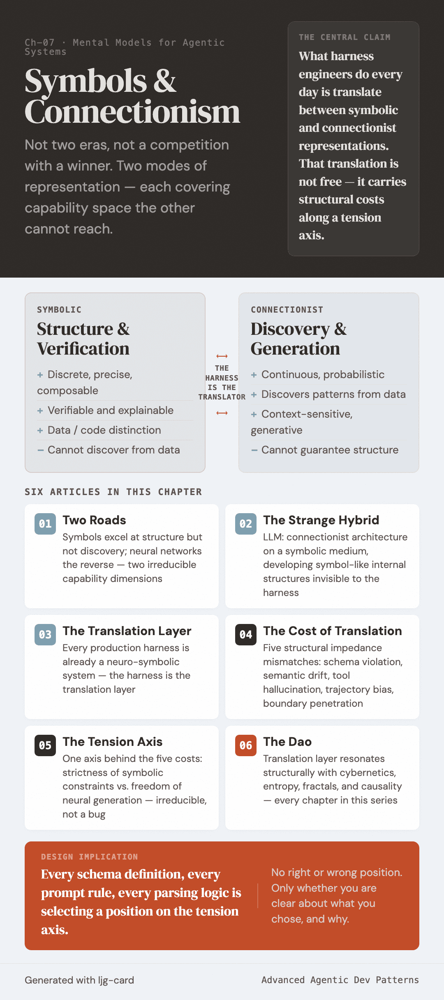

# Symbols & Connectionism

Symbolic systems and neural networks are not two eras, not a competition with a winner. They are two modes of representation — one excels at structure, the other at discovery — each covering a capability space the other cannot reach.

Large language models sit at their intersection: a connectionist architecture manipulating a symbolic medium, developing symbol-like internal structures that are invisible at the engineering interface. What harness engineers do every day is translate between these two representations. That translation is not free — it carries structural costs distributed along a tension axis: structural guarantees at one end, generative freedom at the other.

Seeing the shape of this axis, you face every harness design decision knowing at least what you are trading off.

---

| | Title | One-liner |
|---|-------|-----------|
| 01 | [Two roads](01-two-roads.md) | Symbols excel at structure but not discovery; neural networks the reverse — two irreducible capability dimensions |
| 02 | [The strange hybrid](02-strange-hybrid.md) | The LLM is a connectionist architecture on a symbolic medium, developing symbol-like structures invisible to the harness |
| 03 | [The translation layer](03-translation-layer.md) | Every production harness is already a neuro-symbolic system — the harness is the translation layer between two representations |
| 04 | [The cost of translation](04-cost-of-translation.md) | Five structural impedance mismatches: schema violation, semantic drift, tool hallucination, trajectory bias, boundary penetration |
| 05 | [The tension axis](05-tension-axis.md) | One axis behind the five costs — strictness of symbolic constraints vs. freedom of neural generation |
| 06 | [The dao of symbols and connectionism](06-the-dao.md) | How the translation layer resonates structurally with cybernetics, entropy, fractals, and causality |

!!! note "Prerequisites"

    This chapter assumes the reader has read:

    - [Ch-01 Orthogonality](../ch-01-orthogonality/index.md) — Two forces, the model's operational characteristics
    - [Ch-02 Cybernetics](../ch-02-cybernetics/index.md) — Feedback loops, the OCP triangle
    - [Ch-03 Entropy](../ch-03-entropy/index.md) — Information decay in long reasoning chains
    - [Ch-05 Fractal](../ch-05-fractal/index.md) — Self-similar structures across scales
    - [Ch-06 Causality](../ch-06-causality/index.md) — The carrier problem for causal discipline
