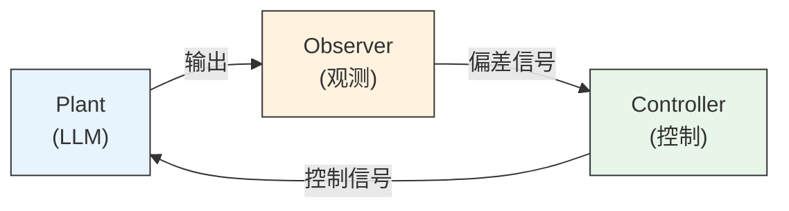

# Observer-Controller-Plant

知道 harness 是一个反馈控制系统，这还不够。"整个系统"太笼统了——出了问题你不知道该往哪看。控制论把这个系统拆成三个角色。

## 三个角色

**Plant（被控对象）**——你想控制但不能直接修改内部的那个东西。在传统控制论里，它是电机、是化工反应器、是飞行器的气动面。在 agentic system 里，它是 LLM。你给它输入，它给你输出。你无法打开它的参数矩阵去手动改一个权重——你只能通过输入来影响它的输出。

**Controller（控制器）**——根据观测信号生成控制信号的部分。System prompt、tool definitions、编排逻辑、权限系统、上下文管理策略——这些决定了"下一轮喂给 LLM 什么"。

**Observer（观察者）**——感知 plant 输出的部分。Output parser、evaluator LLM（用另一个模型来检查主模型的输出）、human-in-the-loop 审批流程、日志系统——它们决定了"LLM 的输出是否达标，差距在哪"。

Controller 和 observer 都是你的 harness 代码。Plant 是唯一不属于 harness 的部分——它是你的 harness 要去控制的对象。OCP 不是在把你的系统分成三个独立的程序，而是在对 harness 内部做**职责分解**：同一个代码库里，哪些组件在做控制，哪些在做观测。

## 闭环与开环

如果你的 agent 只是 `prompt → response`、用一次就扔，你在做**开环控制**——发出指令但不看结果。开环控制在被控对象行为高度可预测时可以工作。

LLM 的行为不是高度可预测的——[ch-01](../ch-01-orthogonality/02-what-is-the-model.md) 说过，概率性是它的操作特性之一。所以几乎所有生产级 agentic system 都是闭环的。不是闭环的那些，要么是 chatbot，要么是在冒险。

闭环控制的本质很简单：**观测、比较、调整、重复。** Agent loop 的 `while has_tool_calls: execute → feed_back → call_again` 就是这个回路的代码实现。

## 映射表

把控制论的术语和 agent 系统的组件对齐，整张图就清晰了：

| 控制论概念 | Agent 系统对应 | 例子 |
|-----------|--------------|------|
| Plant | LLM | Claude, GPT |
| Controller | Harness 中的控制组件 | system prompt, tool definitions, 编排逻辑, 上下文管理 |
| Observer | Harness 中的观测组件 | JSON parser, evaluator LLM, human review, 日志 |
| Reference signal | 任务目标 | "修复这个 bug" |
| Error signal | 目标与实际输出的差距 | 测试仍然失败 |
| Control signal | 下一轮输入 | 调整后的 prompt + tool results |
| Feedback | 工具结果 / 评估结果 | bash output, test results, linter output |

你不需要记住这张表。你需要的是一个直觉：当你在 agent 系统里碰到一个设计问题，试着问自己——这是 plant 的问题、controller 的问题、还是 observer 的问题？仅仅是分清这一点，就能让你的排查方向精确很多。

## 分离原理

!!! info "Separation Principle"

    控制论有一条定理：在线性系统、高斯噪声等条件下，控制器的设计和观察器的设计可以**独立进行**。你可以先设计最优控制器（假设观测完美），再设计最优观察器（假设控制完美），最后把两者组合起来，整体仍然是最优的。

    LLM 系统既不线性也不高斯——这条定理不能直接套用。但它背后的**工程精神**可以借鉴。

说白了：**"让模型按格式输出"和"检查模型输出是否正确"是两件事。** 前者是 controller 的事（prompt engineering、structured output、tool design），后者是 observer 的事（validation、evaluation、testing）。

混淆二者的典型症状：在 system prompt 里写一大段"请在输出中自行检查是否正确"——controller 在兼任 observer。有时候这能工作（模型的 self-correction 能力确实存在），但它把两个本可以独立优化的问题耦合在了一起。一旦耦合，你改 prompt 的时候不知道自己在调控制还是在调观测，调试就变成了碰运气。

Anthropic 在 harness 设计中采用的 generator/evaluator 分离架构，正是这条原理的工程实践——生成和评估由不同的组件负责，各自独立迭代。

三个角色、一个回路、一条分离原理——这是控制论给你的基本骨架。但这个骨架有一个麻烦：它的 plant 是一个输出空间近乎无限的语言模型。你的 controller 要怎么应对这种多样性？Ashby 在 1956 年给出了答案。

## 延伸阅读

- Ahn, K., Zhang, Z., & Sra, S. (2024). What's the Magic Word? A Control Theory of LLM Prompting. [arXiv:2310.04444](https://arxiv.org/abs/2310.04444). — 用控制论的数学框架严格分析 prompt 如何作为控制信号影响 LLM 输出，把本文的类比变成了可证明的定理

## 概念与实体

本文涉及的核心概念与实体，在项目知识库中有更详细的资料：

- [Harness Engineering](../../wiki/concepts/harness-engineering.md) — OCP 三角色是 harness 内部的职责分解框架
- [Evaluator-Optimizer](../../wiki/concepts/evaluator-optimizer.md) — 分离原理的工程实践：generator/evaluator 分离架构
- [Implicit Loop Architecture](../../wiki/concepts/implicit-loop-architecture.md) — 闭环控制回路在隐式循环架构中的具体实现
- [Augmented LLM](../../wiki/concepts/augmented-llm.md) — LLM 作为 Plant 时，增强层（工具、检索）如何改变控制回路的结构
- [Tool Design](../../wiki/concepts/tool-design.md) — tool definitions 是 controller 的核心控制信号之一
