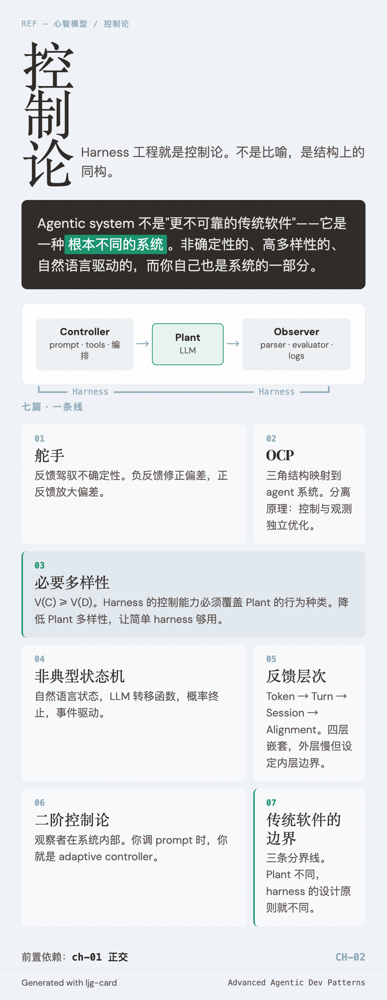

# 控制论

Harness 工程就是控制论——不是比喻，是结构上的同构。Wiener 1948 年定义的反馈控制框架、Ashby 的必要多样性定律、von Foerster 的二阶观察，全部直接映射到你每天在写的 agent 代码上。

理解这个映射，你看 agentic system 的眼光会变：它不是"更不可靠的传统软件"，而是一种根本不同的系统——非确定性的、高多样性的、自然语言驱动的，而你自己也是这个系统的一部分。

---

七篇文章，一条线读下来：

| | 篇目 | 一句话 |
|---|---|---|
| 01 | [舵手](01-helmsman.md) | 1948 年的控制论和 2026 年的 agent harness 在做同一件事：用反馈驾驭不确定性。 |
| 02 | [Observer-Controller-Plant](02-ocp.md) | 经典控制论的三角结构，一一映射到 agent 系统的组件。 |
| 03 | [必要多样性](03-requisite-variety.md) | Ashby 定律：你的 harness 能处理的情况种类，必须覆盖模型可能产出的行为种类。 |
| 04 | [非典型状态机](04-atypical-fsm.md) | Agent loop 是状态机，但状态是自然语言、转移函数是 LLM、转移是概率性的。 |
| 05 | [反馈的层次](05-feedback-layers.md) | 从 token 级到 alignment 级，反馈回路嵌套在反馈回路之中。 |
| 06 | [二阶控制论](06-second-order.md) | 当观察者就是系统的一部分——你调 prompt 的时候，你在里面，不在外面。 |
| 07 | [传统软件的边界](07-the-boundary.md) | 非确定性执行、自然语言控制信号、涌现行为——三条分界线，三套不同的工程逻辑。 |

从 01 到 07 顺序读。每篇假设你读过前面的。

前置依赖：[ch-01 正交](../ch-01-orthogonality/index.md)。
