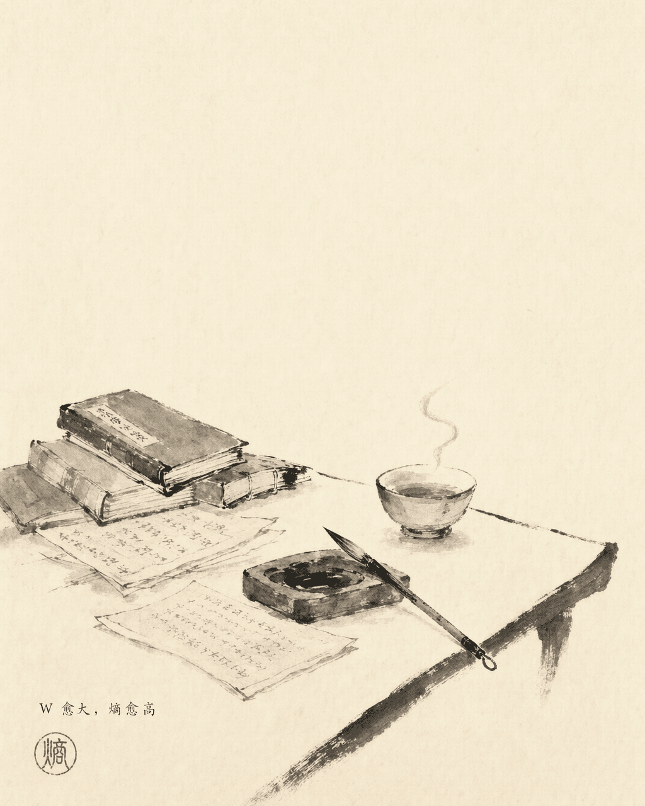

# 熵是什么

你的桌面现在是什么样？

如果你和大多数人一样，答案是"比上周更乱"。不是因为你故意弄乱它——恰恰相反，你一直在整理。但乱是默认方向。

这个直觉比你以为的更精确。它背后有一个跨越物理学和信息论的数学结构，而这个结构和你每天在 LLM 系统里调的一个参数直接相关。

## Boltzmann 的桌面

1870 年代，Ludwig Boltzmann 在思考一个问题：为什么热量总是从热的物体流向冷的物体，而不是反过来？

他的回答惊人地简洁：不是"不能"，是"极其不可能"。

回到你的桌面。假设桌上有五本书、三支笔、一杯咖啡。"整齐"的排列方式很少——书按大小排好，笔插在笔筒里，咖啡在右手边。但"乱"的排列方式有无数种——书可以散在任何位置，笔可以在任何角落，咖啡可能在键盘上方摇摇欲坠。

Boltzmann 把这个直觉写成了一行公式：

$$S = k \ln W$$

$S$ 是熵，$W$ 是系统在宏观状态不变的前提下，微观上有多少种可能的排列方式。整齐桌面的 $W$ 小，熵低。凌乱桌面的 $W$ 大，熵高。

系统倾向于从 $W$ 小的状态走向 $W$ 大的状态，不需要任何外力推动——纯粹因为 $W$ 大的状态在可能性空间里占据的体积压倒性地更大。这就是热力学第二定律的统计学本质：不是一条禁令，而是一个压倒性的概率。

## Shannon 的电话线

1948 年，Claude Shannon 在贝尔实验室研究一个完全不同的问题：怎么量化一条通信线路能传输多少信息？

他需要一个度量——"收到这条消息之前，我有多不确定？"不确定性越大，消息携带的信息量越大。"太阳明天会升起"几乎不携带信息；"明天有日全食"携带大量信息。

Shannon 写出的公式是：

$$H = -\sum_{i} p_i \log p_i$$

$H$ 是信息熵，$p_i$ 是第 $i$ 个可能结果的概率。当所有结果等概率时，$H$ 最大——你完全无法预测下一个符号是什么。当某个结果的概率趋近于 1 时，$H$ 趋近于 0——结果几乎确定，没有"意外"。

两个不同领域、不同年代的人，面对不同的问题，写出了结构相同的公式。

E.T. Jaynes 在 1957 年给出了统一框架：Boltzmann 的物理熵和 Shannon 的信息熵是同一个数学结构——关于"不确定性"或"可能状态数量"的度量——在不同领域的实例化。物理学里它度量的是微观状态的不确定性，信息论里它度量的是消息的不确定性。数学骨架是同一副。

据说，Shannon 在选择用"熵"这个词命名他的度量时，von Neumann 建议他这么做——"一来这个概念和热力学的熵确实有深刻联系，二来没人真正理解熵是什么，所以在辩论中你永远占上风。"这个轶事的真实性无从考证，但它流传甚广——大概因为它准确地捕捉到了"熵"这个概念的特质：数学上严格，直觉上滑溜。

## Temperature：你每天都在调的熵

如果你用过任何 LLM API，你一定调过 `temperature` 参数。

这个参数的名字不是比喻——它和 Boltzmann 分布里的温度参数做的是数学上相同的事情。

LLM 在生成下一个 token 时，先为词表中的每个候选 token 计算一个分数（logit）。然后通过 softmax 函数把这些分数转换为概率分布。`temperature` 就是这个转换过程中的缩放因子。

`temperature` 接近 0 时，概率分布变得极度集中——得分最高的 token 几乎吃掉全部概率质量。输出近乎确定，熵最低。Shannon 公式里，$H$ 趋近于 0。

`temperature` 升高时，概率分布变得越来越平坦——各 token 之间的概率差距被压缩。输出越来越不可预测，熵升高。当 `temperature → ∞` 时，分布趋近于均匀分布，$H$ 达到最大值。

你调 `temperature`，就是在直接控制输出分布的熵。这不是"好比"在调熵——分布的 Shannon 熵会随着 temperature 的变化单调变化，这是数学事实。

??? note "为什么 temperature 和熵单调相关"

    LLM 的 softmax 输出为 $p_i = e^{z_i / T} / \sum_j e^{z_j / T}$，其中 $z_i$ 是 logit，$T$ 是 temperature。这和统计力学中的 Boltzmann 分布 $p_i = e^{-E_i / kT} / Z$ 结构相同。当 $T \to 0$，分布退化为 argmax（零熵）；当 $T \to \infty$，分布趋向均匀（最大熵）。Shannon 熵 $H$ 在这个参数上严格单调递增——这不是经验观察，而是 softmax 函数的数学性质。

物理学里，温度高意味着粒子的微观状态更随机、更不可预测。LLM 里，temperature 高意味着输出的 token 更随机、更不可预测。Boltzmann 和 Shannon 在这里又一次相遇。

## 从桌面到 agent 系统

回到桌面的隐喻。

整洁桌面的状态数少，熵低。但你不需要做任何事就能让它变乱——你只需要"正常使用"它。每拿起一本书、每放下一支笔、每喝一口咖啡，都在把系统推向更高熵的状态。维持低熵需要持续投入能量：你得定期整理。

一个长时间运行的 agent 系统面对的是同样的力。上下文窗口在积累噪声，工具调用结果在引入不可预测的外部状态，多轮对话中的意图在漂移，错误在级联放大。这些不是 bug——它们是默认方向。

但"agent 系统的桌面在变乱"这句话，目前还只是一个直觉。要让它变成一个有工程指导意义的洞察，得先回答几个问题：agent 系统里的"桌面"具体是什么？什么叫"乱"？乱的速度有多快？有没有办法量化它？

---

## 延伸阅读

- Shannon, C.E. (1948). *A Mathematical Theory of Communication.* Bell System Technical Journal, 27(3), 379-423. — 信息论的创世论文；本文所有关于信息熵的讨论都从这里长出来，而且 Shannon 的写作清晰得不像数学论文
- Jaynes, E.T. (1957). *Information Theory and Statistical Mechanics.* Physical Review, 106(4), 620-630. — 把 Boltzmann 和 Shannon 统一成同一个数学结构的关键论文；读完会理解为什么 temperature 参数的名字不是比喻

## 概念与实体

本文涉及的核心概念与实体，在项目知识库中有更详细的资料：

- [Scaling Laws](../../wiki/concepts/scaling-laws.md) — temperature 作为 softmax 缩放因子直接控制输出分布的熵，与 scaling 行为密切相关
- [Context Management](../../wiki/concepts/context-management.md) — 文末预告的"agent 系统的桌面在变乱"，其工程应对在这里展开
- [Agentic Systems](../../wiki/concepts/agentic-systems.md) — 本文从物理学引出的熵概念，最终要落在 agent 系统的退化分析上
