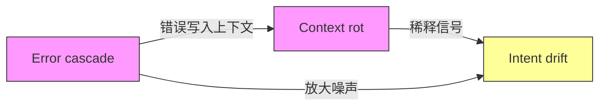

# Agent 系统里的熵

假设你的 agent 已经跑了两个小时。你回来看结果，发现它做的事跟你要的不太一样了。不是完全错——但方向偏了，细节走形了，有些决定让你摸不着头脑。

你试着回溯：哪里开始偏的？找不到一个清晰的转折点。它不是在某个时刻突然犯了一个大错，而是像一条河流，在你没注意的时候悄悄改了道——每一米的偏移都微不足道，两公里之后你已经在另一个山谷了。

这不是个例，是所有长时运行 agent 系统的共同命运。

理解它为什么发生，需要先拆清三种现象。

## 三种退化

**Context rot**——信号在稀释。

Agent 运行越久，它的上下文窗口里积累的东西越多：之前的对话、工具调用的返回值、中间推理的痕迹、文件内容的摘要。上下文越长，模型对每条信息的注意力越分散。Chroma 的实验精确测量了这件事：同样一条关键信息，放在 100 token 的上下文里能被准确提取，放在 10,000 token 的上下文里就开始打折扣。不是任务变难了，是信号被淹没了。

更麻烦的是，上下文里不只有有用的信息。那些跟当前任务"有点相关但不正确"的历史内容（之前探索过但放弃的方案、早期的错误假设、已经过时的中间状态），它们像杂讯一样干扰模型对真正重要信息的检索。Chroma 的实验发现，这种干扰项的干扰强度不均匀，而且不均匀性会随上下文长度增长而放大。

**Error cascade**——误差在放大。

多步任务中，前一步的小错会改变后续步骤面对的输入条件。第一步改错了一个函数签名，第二步调用这个函数时看到的是一个"看起来合理但语义错误"的接口。它不知道这个接口是错的。它按照错误的前提继续推理，产出一个建立在错误基础上的结果。

如果步骤之间完全独立，每步 95% 的成功率在十步后给你大约 60% 的成功率。几何衰减，不好但可预测。实际观测到的衰减比这更快。SWE-EVO 基准测试把单 issue 修复扩展到了多步软件演进：同一类任务，步数从平均不到 2 个 PR 增加到近 15 个 PR，即使是最强的模型也只有 25% 的解决率，而 64% 的任务在所有模型-框架组合下都无人解出。ReliabilityBench 的数据从另一个角度确认了超线性衰减的存在：步间错误正相关，一步错倾向于步步错。

这不是"做得多所以错得多"的平凡解释。这是耦合放大：每一步的错误不只是自己错了，它还在毒化下一步的输入。

**Intent drift**——行为在偏离意图。

你要它重构一个模块，它重构着重构着开始给不相关的文件加注释。你要它修一个 bug，它修着修着开始"顺便优化"周边代码。行为没有明显断裂，每一步看起来都有一定的道理，但总方向在悄悄漂移，最终产物跟你最初的意图之间出现了一段说不清的距离。

三种退化，三个名字。看起来是三个独立的问题。

但事情没这么简单。

## 不是三个问题

做一个反事实推理。

**先拿掉 context rot。** 假设模型对 100,000 token 的注意力跟对 100 token 一样均匀精确，没有任何信号稀释。Error cascade 会因此消失吗？不会。多步任务中前一步的错误仍然会改变后一步的输入条件，耦合放大照样发生。而只要 error cascade 存在，agent 的行为就会在错误积累中逐渐偏离原始意图。Drift 仍然在。

**再拿掉 error cascade。** 每一步都基于完全正确的前置状态运行，步骤之间没有任何耦合放大。Context rot 消失了吗？没有。上下文仍然在积累，注意力仍然在稀释，干扰项仍然在干扰。只要 context rot 存在，模型从上下文中提取关键信息的能力就在退化，agent 对"当前到底该做什么"的把握就会越来越模糊。Drift 仍然在。

**最后，假设 intent drift 本身被完美消除了。** Agent 的行为始终精确对准原始意图，一步不偏。但 context rot 不会因此消失，上下文还是在膨胀、注意力还是在稀释。Error cascade 也不会消失，多步任务的耦合放大跟意图是否对齐没有直接关系。

三个反事实实验，结论清晰：

- 消除 context rot → drift 减轻但不消失
- 消除 error cascade → drift 减轻但不消失
- 消除 drift → context rot 和 error cascade 照常发生

Context rot 和 error cascade 各自独立地导致 drift。反过来，drift 的消除不影响另外两者。Drift 是果，不是因。

## 因果结构

三者之间的关系不是并列的，是有方向的：

Context rot 和 error cascade 是两种独立的退化机制，各自通过不同的路径导致 intent drift。Drift 是它们的涌现效应——当上下文信号被稀释到一定程度，或误差累积到一定程度，agent 的行为就必然偏离意图。

但图里还有一条回路。

Error cascade 产生的错误（错误的工具调用结果、错误的中间推理、错误的代码修改），这些全部被写入上下文。它们变成了 context rot 里最危险的那类干扰项：跟当前任务高度相关但实际上错误的信息。模型在后续步骤中不得不在一个被错误信息污染的上下文里工作，注意力不仅被稀释，还被主动误导。

这条回路把两个独立的退化机制耦合成了一个正反馈系统：cascade 产生的错误加速 rot，恶化的 rot 让模型更容易在下一步犯错，更多的错误进一步污染上下文。ReliabilityBench 的数据为这个正反馈回路提供了间接证据：更复杂的 Reflexion 架构（反思再重试）在故障注入条件下反而比简单的 ReAct 架构退化更快，故障恢复率 67.3% vs 80.9%。机制正是回路：反思层从被污染的上下文中提取"教训"，这个教训本身就是错误的，然后用错误的教训指导下一步行动。反思的意图是好的，但它给正反馈回路加了一圈额外的迭代。

## 信息论的统一

三种现象各有各的名字和表现，但它们共享一个底层语言：信息论。

把 agent 系统看成一个通信系统。用户的意图是信号源，agent 的最终行为是接收端，中间经过的每一步处理（上下文的读取、推理的展开、工具的调用）都是信道。

**Context rot 是信道噪声在增大。** 上下文越长，信噪比越低。原始意图的信号在越来越多的无关信息和干扰项中被稀释。这跟通信工程里的基本问题一模一样：信道越长、噪声越多，接收端还原原始信号的能力就越弱。

**Error cascade 是级联信道的噪声复合。** 多步任务是多个信道串联。每个信道引入一点噪声，这些噪声不是简单叠加，而是以超线性的方式复合，因为前一个信道的输出噪声变成了下一个信道的输入噪声的一部分，扰动在传播过程中被放大。超线性衰减的实证数据（步间错误正相关、成功率比几何衰减预测更低）正是噪声复合效应的统计指纹。

**Intent drift 是信号失真的可观测表现。** 它不是一种独立的退化机制，它是接收端的测量：当你比较 agent 的最终行为和你的原始意图时，它们之间的偏差就是 drift。信道噪声（rot）和级联复合（cascade）是造成失真的原因，drift 是你看到的失真本身。

这个统一不只是修辞。既然三种现象本质上是信息通道中的噪声问题，对抗它们的逻辑框架就是一致的。理解信息如何在 agent 系统中退化，就掌握了分析所有退化的统一工具。

---

退化的全景看清了：两种独立的机制，一个涌现的效应，一条正反馈回路。但全景图不等于行动指南。要真正理解每种机制怎么在 agent 内部展开，需要走进去看细节。

Context rot 的三种退化机制具体是什么？它怎么从注意力稀释一步步走到信号丧失？这是下一个问题。而 error cascade 的耦合放大到底是怎么发生的、为什么比独立概率模型预测的更严重，是紧接其后的问题。

---

## 概念与实体

本文涉及的核心概念与实体，在项目知识库中有更详细的资料：

- [Context Rot](../../wiki/concepts/context-rot.md) — 本文识别的第一种独立退化机制，信号在上下文中被稀释的过程
- [Error Cascade](../../wiki/concepts/error-cascade.md) — 本文识别的第二种独立退化机制，误差在步间耦合中被放大
- [Reliability Decay](../../wiki/concepts/reliability-decay.md) — 三种退化共同驱动的宏观效应：系统可靠性随时间单调下降
- [Agentic Systems](../../wiki/concepts/agentic-systems.md) — 本文分析的对象：长时运行 agent 系统的退化全景
- [Harness Engineering](../../wiki/concepts/harness-engineering.md) — 因果结构揭示了 harness 需要对抗的两条独立退化路径
