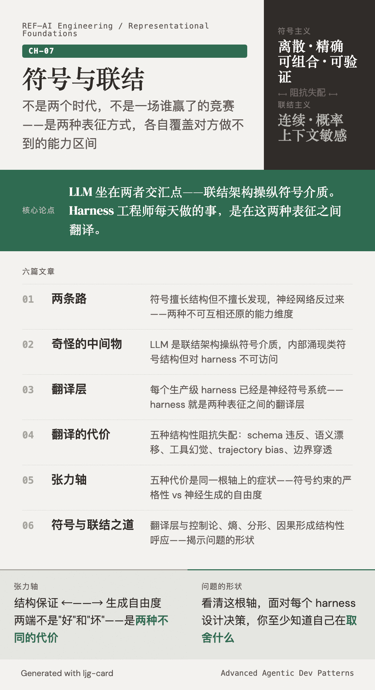

# 符号与联结

符号系统和神经网络不是两个时代，不是一场谁赢了的竞赛。它们是两种表征方式——一种擅长结构，一种擅长发现——各自覆盖对方做不到的能力区间。

大语言模型坐在两者的交汇点上：联结主义架构操纵着符号介质，内部涌现了类符号结构但对工程接口不可见。Harness 工程师每天做的事情，就是在这两种表征之间翻译。这个翻译不是免费的——它有结构性的代价，代价的分布沿一根张力轴展开：结构保证在这一端，生成自由度在那一端。

看清这根轴的形状，你面对每一个 harness 设计决策时，至少知道自己在取舍什么。

---

| | 标题 | 一句话 |
|---|------|--------|
| 01 | [两条路](01-two-roads.md) | 符号擅长结构但不擅长发现，神经网络反过来——两种不可互相还原的能力维度 |
| 02 | [奇怪的中间物](02-strange-hybrid.md) | LLM 是联结架构操纵符号介质，内部涌现类符号结构但对 harness 不可访问 |
| 03 | [翻译层](03-translation-layer.md) | 每个生产级 harness 已经是一个神经符号系统——harness 就是两种表征之间的翻译层 |
| 04 | [翻译的代价](04-cost-of-translation.md) | 五种结构性的阻抗失配：schema 违反、语义漂移、工具幻觉、trajectory bias、边界穿透 |
| 05 | [张力轴](05-tension-axis.md) | 五种代价背后是同一根轴——符号约束的严格性 vs 神经生成的自由度 |
| 06 | [符号与联结之道](06-the-dao.md) | 翻译层如何与控制论、熵、分形、因果形成结构性呼应 |

!!! note "前置阅读"

    本章假设读者已阅读：

    - [ch-01 正交](../ch-01-orthogonality/index.md) — 两股力、模型的操作特性
    - [ch-02 控制论](../ch-02-cybernetics/index.md) — 反馈环路、OCP 三角
    - [ch-03 熵](../ch-03-entropy/index.md) — 长链推理中的信息衰减
    - [ch-05 分形](../ch-05-fractal/index.md) — agentic 系统的自相似结构
    - [ch-06 因果](../ch-06-causality/index.md) — 因果纪律的载体问题
