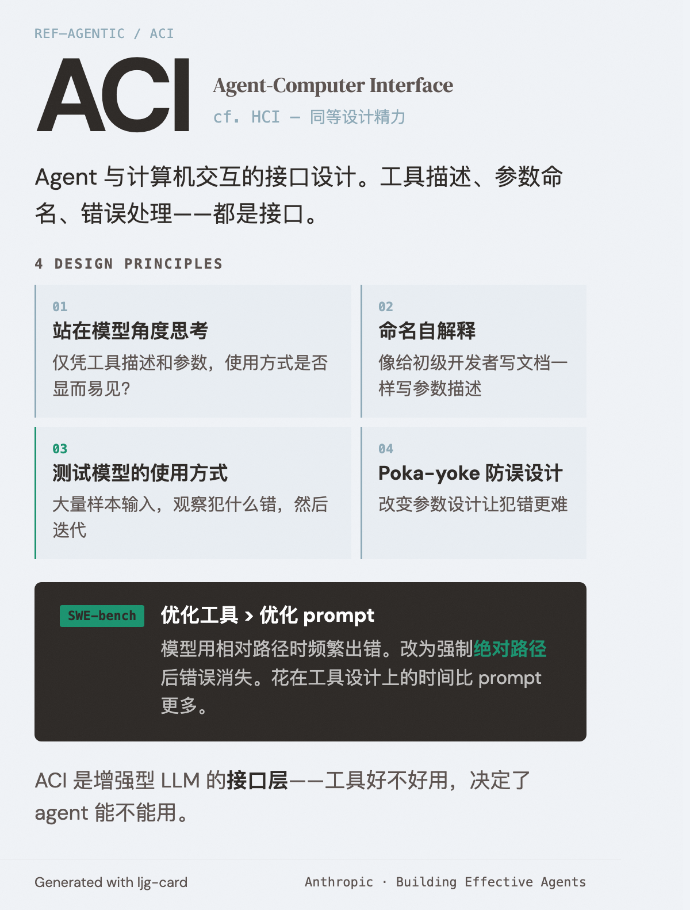

# ACI — Agent-Computer Interface

=== "图"

    { loading=lazy width="100%" }

=== "文"

    
    ## 定义
    
    Agent 与计算机（工具、API、文件系统）交互的接口设计。Anthropic 类比 HCI（Human-Computer Interface）提出：在 ACI 上投入的设计精力应该与 HCI 同等。
    
    ## 设计原则
    
    1. **站在模型的角度思考**：仅凭工具描述和参数，使用方式是否显而易见？如果你自己需要仔细想，模型也一样。
    2. **命名要自解释**：参数名和描述要让用途一目了然，就像给团队里的初级开发者写文档。
    3. **测试模型如何使用工具**：用大量样本输入观察模型犯什么错，然后迭代。
    4. **Poka-yoke（防误设计）**：改变参数设计让犯错更难。例如用绝对路径而非相对路径。
    
    ## 实践案例
    
    Anthropic 在 SWE-bench agent 中花在优化工具上的时间比优化 prompt 更多。例如：模型在使用相对路径时经常出错（因为 agent 移出了根目录），改为强制使用绝对路径后错误消失。
    
    ## 相关概念
    
    - [Tool design](tool-design.md) — ACI 的具体工程实践
    - [Augmented LLM](augmented-llm.md) — ACI 是增强型 LLM 的接口层
    
    ## References
    
    - `sources/anthropic_official/building-effective-agents.md`
    
