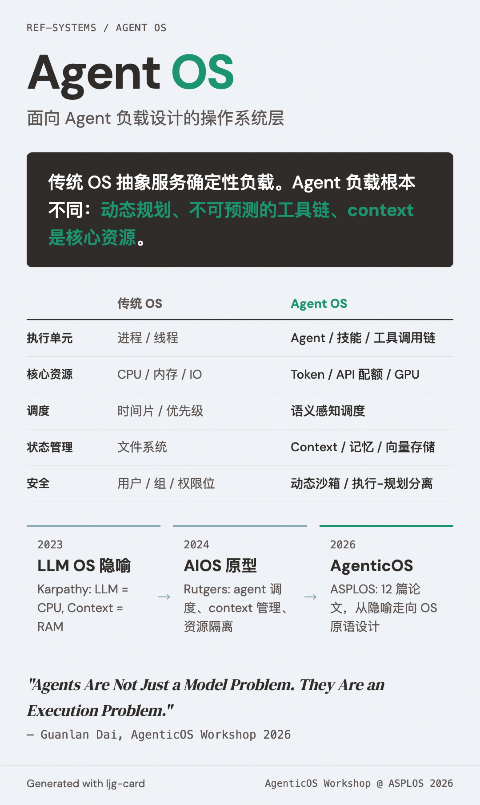

# Agent OS（面向 Agent 的操作系统）

=== "图"

    { loading=lazy width="100%" }

=== "文"

    
    ## 定义
    
    Agent OS 是为 AI agent 负载专门设计的操作系统层——不是在现有 OS 上跑 agent，而是让 OS 的核心抽象（进程、调度、内存、安全）原生理解 agent 的语义和行为模式。
    
    传统 OS 抽象服务的是确定性的、边界清晰的计算负载（进程有明确的入口、退出、资源需求）。Agent 负载根本不同：动态规划、工具调用链不可预测、context 是核心资源、执行路径由模型推理决定。这种不匹配催生了 Agent OS 的研究方向。
    
    ## 为什么需要新的 OS 抽象
    
    [AgenticOS Workshop](../sources/agenticos-workshop-asplos-2026.md)（ASPLOS 2026）勾勒出的核心矛盾：
    
    1. **进程模型不匹配**: Agent 不是传统进程——它可能 fork 多条探索路径（[Fork-Explore-Commit](fork-explore-commit.md)），需要在路径间共享和隔离状态
    2. **资源控制粒度不够**: 传统 cgroup 按 CPU/内存/IO 限制，但 agent 的关键资源是 token（context window）、API 调用配额、工具访问权限——需要 [agent 资源控制](agent-resource-control.md)
    3. **安全模型不适用**: Agent 执行的代码是动态生成的，传统的静态权限模型无法覆盖——需要新的 [沙箱和隔离](agent-sandboxing.md) 机制
    4. **调度语义缺失**: OS 调度器不理解"这个 agent 在等 LLM 推理"和"这个 agent 在等工具返回"的区别
    
    ## 研究维度
    
    | 维度 | 传统 OS | Agent OS |
    |------|---------|----------|
    | 执行单元 | 进程/线程 | Agent/技能/工具调用链 |
    | 核心资源 | CPU/内存/IO | Token/API 配额/工具权限/GPU |
    | 调度 | 时间片/优先级 | 语义感知（任务紧急度、探索 vs 利用） |
    | 状态管理 | 文件系统/内存 | Context window/episodic memory/向量存储 |
    | 安全 | 用户/组/权限位 | 动态沙箱/可信通道/执行-规划分离 |
    | 可观测性 | strace/perf | eBPF 驱动的 agent 行为追踪 |
    
    ## 与应用层概念的关系
    
    Agent OS 是 wiki 中多个应用层概念的系统层对应物：
    
    - [Harness engineering](harness-engineering.md) 在应用层解决执行控制问题，Agent OS 在系统层提供原语支持。Invited talk "Agents Are Not Just a Model Problem. They Are an Execution Problem." 精确表达了这个关系
    - [Context management](context-management.md) 目前由应用层实现（compaction、note-taking），Agent OS 研究方向是将其抽象为 OS 级的"长时状态管理"
    - [Guardrails](guardrails.md) 目前由 harness 运行时实现，Agent OS 方向是将隔离和安全下沉到内核级（Execute-Only Agents、Grimlock）
    - [Agent skills](agent-skills.md) 目前是应用标准，Skill OS 论文提出将其提升为 OS 级的应用管理范式
    
    ## 历史脉络
    
    Agent OS 不是凭空出现的概念。它沿着一条清晰的类比链演进：
    
    1. **Karpathy 的 LLM OS 类比**（2023）：LLM 是 CPU，context window 是 RAM，嵌入是文件系统——概念性比喻
    2. **AIOS**（Rutgers, 2024/COLM 2025）：将 OS 概念直接映射到 LLM agent 管理——agent 调度、context 管理、存储管理
    3. **AgenticOS Workshop**（ASPLOS 2026）：从比喻走向实现——8 篇研究论文 + 4 篇 vision paper 提出具体的 OS 原语设计
    
    这条线索从"LLM 像操作系统"的隐喻，经过"为 LLM 构建操作系统"的尝试，发展到"OS 需要为 agent 重新设计抽象"的系统研究。
    
    ## 相关概念
    
    - [Agent 资源控制](agent-resource-control.md) — Agent OS 的资源管理层
    - [Agent 沙箱](agent-sandboxing.md) — Agent OS 的安全隔离层
    - [Fork-Explore-Commit](fork-explore-commit.md) — Agent OS 的执行原语
    - [Harness engineering](harness-engineering.md) — 应用层的执行控制，Agent OS 的上层
    - [Context management](context-management.md) — 应用层的状态管理
    - [Agentic systems](agentic-systems.md) — Agent OS 服务的系统类型
    - [Agent skills](agent-skills.md) — Skill OS 将技能提升为 OS 级概念
    
    ## References
    
    - `sources/agenticos-workshop-asplos-2026.md`
    
