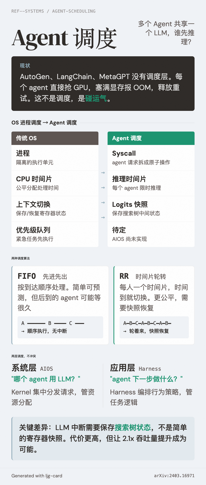

# Agent Scheduling（Agent 调度）

=== "图"

    { loading=lazy width="100%" }

=== "文"

    
    ## 定义
    
    Agent scheduling 是在多个 agent 共享有限 LLM 资源时，决定"谁先推理、推理多久"的机制。它是传统 OS 进程调度在 LLM agent 场景下的对应物。
    
    ## 问题
    
    当前主流 agent 框架（AutoGen、LangChain、MetaGPT）没有调度层——每个 agent 直接向 LLM 发请求。并发时的结果是试错式资源抢占：prompt 转成 tensor 塞入 GPU 显存，塞满报 CUDA OOM，释放后重试。这不是调度，是碰运气。
    
    ## 机制
    
    [AIOS](../sources/aios-llm-agent-operating-system.md) 实现了两种经典调度算法：
    
    - **FIFO（先进先出）**：按到达顺序处理请求。简单可预测，但后到的 agent 可能等很久
    - **Round Robin（时间片轮转）**：每个 agent 分配一个时间片，时间到就中断（依赖 context snapshot/restore），切到下一个。更公平，但增加切换开销
    
    调度器集中管理所有模块（LLM、Memory、Storage、Tool）的请求队列，而非让各模块自行排队。这种集中式设计简化了跨模块的任务协调。
    
    ## 与传统 OS 调度的映射
    
    | 传统 OS | Agent 调度 |
    |---------|-----------|
    | 进程 | Agent 请求（拆成 syscall） |
    | CPU 时间片 | LLM 推理时间片 |
    | 上下文切换 | Context snapshot/restore |
    | 优先级队列 | Agent 优先级（AIOS 中未实现，留作未来） |
    
    关键差异：LLM 推理的"中断"比 CPU 中断复杂得多——需要保存生成中的 token 序列和搜索树状态，而非简单的寄存器快照。
    
    ## 与 Harness 层调度的关系
    
    Agent scheduling 发生在系统层——管的是"哪个 agent 用 LLM"。[Harness engineering](harness-engineering.md) 中也有调度概念，但发生在应用层——管的是"agent 内部下一步做什么"（如 [orchestrator-workers](orchestrator-workers.md) 的任务分发）。
    
    两者不冲突，可以叠加：harness 决定 agent 的行为策略，AIOS 决定 agent 的资源分配。
    
    ## 相关概念
    
    - [LLM-OS 类比](llm-os-analogy.md) — agent scheduling 所处的概念框架
    - [Context management](context-management.md) — 调度切换时的状态保存依赖 context 管理
    - [Implicit loop architecture](implicit-loop-architecture.md) — agent 内部循环，与系统级调度正交
    - [Harness engineering](harness-engineering.md) — 应用层的 agent 行为编排
    
    ## References
    
    - `sources/arxiv_papers/2403.16971-aios-llm-agent-operating-system.md`
    
