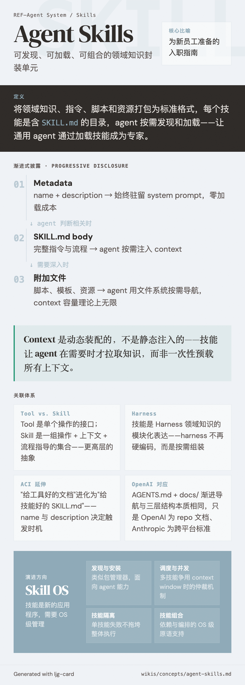

# Agent Skills（Agent 技能）

=== "图"

    { loading=lazy width="100%" }

=== "文"

    
    ## 定义
    
    Agent Skills 是将领域知识、指令、脚本和资源打包为可发现、可加载的可组合单元的标准。每个技能是一个包含 `SKILL.md` 文件的目录，agent 在运行时按需发现和加载。
    
    核心比喻：为新员工准备的入职指南。不是为每个场景定制 agent，而是让通用 agent 通过加载技能变成专家。
    
    ## 设计原则：渐进式披露（Progressive Disclosure）
    
    三层结构控制 context 的加载粒度：
    
    1. **Metadata**（name + description）→ 始终在 system prompt 中
    2. **SKILL.md body** → agent 判断相关时读取
    3. **附加文件** → agent 按需深入
    
    这使得技能的 context 容量理论上无上限——agent 使用文件系统按需导航，而非一次性加载。
    
    ## 与 Tool Design 的关系
    
    Agent Skills 是 [tool design](tool-design.md) 的更高层抽象：
    
    - Tool：单个操作的接口（函数签名 + 描述）
    - Skill：一组操作 + 上下文 + 流程指导的集合
    
    [ACI](aci.md) 原则中的"给工具好的文档"在技能中进化为"给技能好的 SKILL.md"。name 和 description 的质量直接影响 agent 是否在正确时机触发技能。
    
    ## 与 Harness Engineering 的关系
    
    技能是 [harness engineering](harness-engineering.md) 的模块化表达——将 harness 中的领域知识、约束和工具打包为可复用单元。这使得 harness 不再需要将所有知识硬编码在 system prompt 中，而是可以按需组装。
    
    ## 开放标准
    
    2025 年 12 月作为开放标准发布（[agentskills.io](https://agentskills.io/)），支持跨平台可移植性。详见 [Anthropic 的 Agent Skills 介绍](../sources/anthropic-equipping-agents-agent-skills.md)。
    
    ## OpenAI 的对应实践
    
    OpenAI 在 [harness engineering](../sources/openai-harness-engineering.md) 中采用了类似的渐进式披露思想——AGENTS.md 作为目录，`docs/` 作为深层知识库，agent 按需导航。这与 Agent Skills 的三层结构本质相同，只是 OpenAI 将其实现为 repo 内的文档结构，而 Anthropic 将其标准化为跨平台的技能格式。
    
    ## Skill OS：技能的 OS 级演进
    
    [AgenticOS Workshop](../sources/agenticos-workshop-asplos-2026.md) 中 Chen 等人（上海交大）的论文"Skills are the new Apps — Now It's Time for Skill OS"提出了一个激进但逻辑自洽的观点：**技能是新的应用程序**，因此需要 OS 级的管理和编排。
    
    如果技能是应用，那 OS 需要提供：
    - **技能发现与安装**：类似包管理器，但面向 agent 能力
    - **技能调度与并发**：多个技能争用同一个 agent 的 context window 时如何调度
    - **技能隔离**：一个技能的失败不应拖垮整个 agent 的执行
    - **技能组合**：技能之间的依赖和编排需要 OS 级的原语支持
    
    这将当前的 Agent Skills 标准（应用层的文件夹 + SKILL.md 约定）推向系统层的正式抽象。目前技能的生命周期管理完全由 harness 承担——Skill OS 的方向是让 [Agent OS](agent-os.md) 原生支持这些操作。
    
    ## 相关概念
    
    - [ACI](aci.md) — 技能是 agent-tool 接口的高层抽象
    - [Tool design](tool-design.md) — 技能继承并扩展了工具设计原则
    - [Harness engineering](harness-engineering.md) — 技能是 harness 知识的模块化表达
    - [Context management](context-management.md) — progressive disclosure 是一种 context 管理策略
    - [Implicit loop architecture](implicit-loop-architecture.md) — 技能在隐式循环中被按需激活
    - [Agent OS](agent-os.md) — Skill OS 将技能提升为 OS 级概念
    
    ## References
    
    - `sources/anthropic_official/equipping-agents-agent-skills.md`
    - `sources/agenticos-workshop-asplos-2026.md`
    
