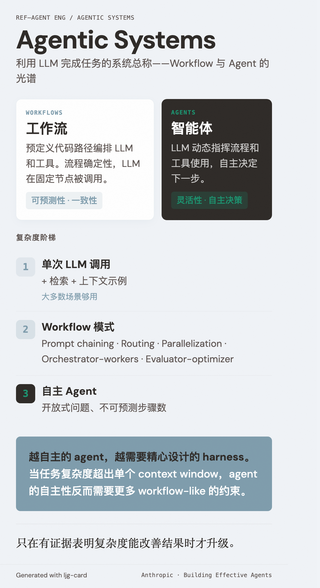

# Agentic Systems（Agentic 系统）

=== "图"

    { loading=lazy width="100%" }

=== "文"

    
    ## 定义
    
    Agentic 系统是利用 LLM 完成任务的系统的总称。Anthropic 将其分为两类：
    
    - **Workflows**（工作流）：通过预定义的代码路径编排 LLM 和工具。流程是确定性的，LLM 在固定节点被调用。
    - **Agents**（智能体）：LLM 动态指挥自身的流程和工具使用，自主决定下一步做什么。
    
    这个区分很重要——workflow 提供可预测性和一致性，agent 提供灵活性和自主决策能力。选择取决于任务的开放程度。
    
    ## 复杂度阶梯
    
    Anthropic 建议按复杂度递增选择：
    
    1. 单次 LLM 调用 + 检索 + 上下文示例（大多数场景够用）
    2. Workflow 模式（[prompt chaining](prompt-chaining.md)、[routing](routing.md)、[parallelization](parallelization.md)、[orchestrator-workers](orchestrator-workers.md)、[evaluator-optimizer](evaluator-optimizer.md)）
    3. 自主 Agent（开放式问题、不可预测步骤数）
    
    核心原则：只在有证据表明复杂度能改善结果时才升级。
    
    ## 长时运行维度
    
    当 agent 任务复杂度超出单个 context window，系统进入 [长时运行](long-running-agents.md) 模式。此时 agent 的自主性反而需要更多 workflow-like 的约束——[feature tracking](feature-tracking.md)、增量推进、状态交接——通过 [harness engineering](harness-engineering.md) 在自由度中保持方向。这揭示了一个有趣的张力：越自主的 agent，越需要精心设计的 harness。
    
    ## 相关概念
    
    - [Augmented LLM](augmented-llm.md) — agentic 系统的基础构建块
    - [ACI](aci.md) — agent 与计算机的接口设计
    - [Tool design](tool-design.md) — 工具定义的工程实践
    - [Long-running agents](long-running-agents.md) — 跨多个 context window 的长时任务
    - [Harness engineering](harness-engineering.md) — agent 系统的控制层设计
    
    ## References
    
    - `sources/anthropic_official/building-effective-agents.md`
    - `sources/anthropic_official/effective-harnesses-long-running-agents.md`
    
