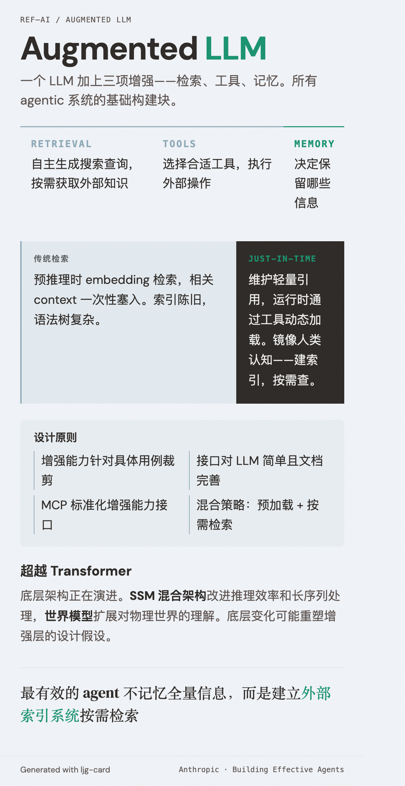

# Augmented LLM（增强型 LLM）

=== "图"

    { loading=lazy width="100%" }

=== "文"

    
    ## 定义
    
    Agentic 系统的基础构建块：一个 LLM 加上三项增强能力——检索（retrieval）、工具（tools）、记忆（memory）。当前模型已经能主动使用这些能力：自己生成搜索查询、选择合适的工具、决定保留哪些信息。
    
    ## 关键设计考量
    
    Anthropic 强调两点：
    1. 将增强能力**针对具体用例裁剪**，不是堆叠通用能力
    2. 确保接口对 LLM **简单且文档完善**
    
    [Model Context Protocol (MCP)](../entities/mcp.md) 是标准化增强能力接口的一种方式。
    
    ## 在 agentic 系统中的位置
    
    是所有 [agentic systems](agentic-systems.md) 的基础。无论是简单的 [prompt chaining](prompt-chaining.md) 还是自主 agent，每次 LLM 调用都建立在这个增强基础之上。
    
    ## 从预检索到 Just-in-time Context
    
    [Effective Context Engineering](../sources/anthropic-effective-context-engineering.md) 描述了增强型 LLM 的检索维度正在经历范式转移：
    
    - **传统方式**：预推理时通过 embedding 检索，将相关 context 一次性塞入
    - **Just-in-time 方式**：agent 维护轻量级引用（文件路径、查询、链接），运行时通过工具动态加载
    
    最有效的 agent 采用混合策略。例如 Claude Code：CLAUDE.md 预加载到 context，glob/grep 提供按需检索，绕过陈旧索引和复杂语法树的问题。Just-in-time 检索镜像人类认知——我们不记忆全量信息，而是建立外部索引系统按需检索。
    
    ## 超越 Transformer 的基础架构
    
    Augmented LLM 当前建立在 Transformer 之上，但底层架构正在演进。[SSM 混合架构](ssm-hybrid-architecture.md) 和 [世界模型](world-models.md) 代表了两个方向：前者改进推理效率和长序列处理，后者扩展模型对物理世界的理解能力。这些底层变化可能重塑增强层的设计假设。
    
    ## 相关概念
    
    - [Context engineering](context-engineering.md) — 检索策略是 context engineering 的核心维度
    - [Agentic systems](agentic-systems.md) — augmented LLM 是所有 agentic 系统的基础
    - [Tool design](tool-design.md) — 工具是增强能力的接口
    
    ## References
    
    - `sources/anthropic_official/building-effective-agents.md`
    - `sources/anthropic_official/effective-context-engineering-for-ai-agents.md`
    
