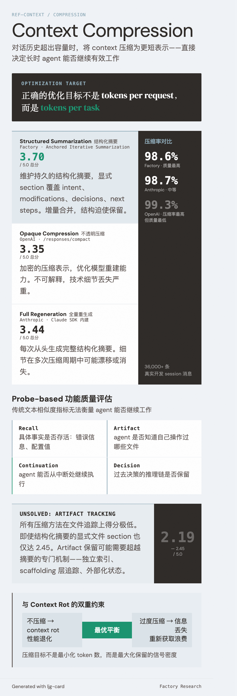

# Context Compression（上下文压缩）

=== "图"

    { loading=lazy width="100%" }

=== "文"

    
    ## 定义
    
    Context compression 是指在 agent session 中对话历史超出 context window 容量时，将已有 context 压缩为更短表示的技术。它是 [context management](context-management.md) 的核心机制之一，直接影响 [长时运行 agent](long-running-agents.md) 能否在压缩后继续有效工作。
    
    ## 压缩策略谱系
    
    [Factory 的评估研究](../sources/factory-evaluating-context-compression.md) 在 36,000+ 条真实开发 session 消息上对比了三种生产级策略：
    
    ### 结构化摘要（Structured Summarization）
    
    以 Factory 的**锚定式迭代摘要**（Anchored Iterative Summarization）为代表。核心设计：
    
    - 维护持久的结构化摘要，显式 section 覆盖 session intent、file modifications、decisions、next steps
    - 压缩触发时仅总结新截断部分，增量合并到已有摘要
    - **结构迫使保留**——每个 section 是检查清单，防止信息静默丢失
    
    优势：质量最高（总分 3.70/5.0），尤其在 Accuracy（4.04）和 Context Awareness（4.01）上领先。劣势：需要预定义摘要结构，对不同任务类型可能需要不同的 section 设计。
    
    ### 不透明压缩（Opaque Compression）
    
    以 [OpenAI](../entities/openai.md) 的 `/responses/compact` 端点为代表。产生加密的压缩表示，优化模型重建能力。
    
    优势：压缩率最高（99.3%）。劣势：不可解释——无法阅读或验证压缩内容；质量最低（3.35/5.0），技术细节（文件路径、错误信息）丢失严重。
    
    ### 全量重生成摘要（Full Regeneration Summary）
    
    以 [Anthropic](../entities/anthropic.md) Claude SDK 的内建压缩为代表。每次压缩时从头生成完整的结构化摘要（7-12k 字符）。
    
    优势：摘要结构清晰，包含 analysis、files、pending tasks、current state。劣势：每次重新生成可能导致细节在多次压缩周期中漂移或消失（3.44/5.0）。
    
    ## 评估维度
    
    传统的文本相似度指标（ROUGE、embedding similarity）不能衡量 agent 能否继续工作。Factory 提出的 **probe-based 功能质量评估**直接测试压缩后的任务继续能力：
    
    | 探针类型 | 测试目标 |
    |----------|----------|
    | **Recall** | 具体事实是否存活（错误信息、配置值） |
    | **Artifact** | agent 是否知道自己操作过哪些文件 |
    | **Continuation** | agent 能否从中断处继续 |
    | **Decision** | 过去决策的推理链是否保留 |
    
    六个评分维度：Accuracy、Context Awareness、Artifact Trail、Completeness、Continuity、Instruction Following。
    
    ## Artifact Tracking：未解决的难题
    
    所有压缩方法在文件追踪上的得分都很低（2.19-2.45/5.0）。即使结构化摘要的显式文件 section 也只达到 2.45。这暗示 artifact 保留可能需要超越摘要的专门机制：
    
    - 独立的 artifact 索引（文件路径 + 操作类型 + 变更摘要）
    - Agent scaffolding 层的显式文件状态追踪
    - 与 [feature tracking](feature-tracking.md) 类似的外部化状态
    
    这一发现与 [长时运行 agent](long-running-agents.md) 的"状态断裂"失败模式直接相关——当 agent 忘记自己修改过哪些文件，就会产生不一致的编辑或重复工作。
    
    ## 优化目标的重定向
    
    Factory 的研究揭示了一个关键认知转换：
    
    > 正确的优化目标不是 tokens per request，而是 **tokens per task**。
    
    高压缩率（如 OpenAI 的 99.3%）看似节省 token，但丢失的细节最终需要 agent 重新获取文件、重新探索已尝试的方案。这些重新获取的成本可能超过压缩节省的 token。
    
    这与 [context engineering](context-engineering.md) 的核心原则——"找到最小的高信号 token 集合"——形成呼应：压缩的目标不是最小化 token 数，而是最大化保留的信号密度。
    
    ## Manus 的"可恢复才可压缩"原则
    
    [Manus](../entities/manus.md) 为 context compression 引入了一个生产级约束：**压缩必须是可逆的**。具体规则：
    
    - 网页内容可从 context 中移除，但 URL 必须保留
    - 文档内容可省略，但文件路径必须保留
    - 不可恢复的压缩（无法通过指针重新获取原始内容）等同于数据销毁，被明确禁止
    
    这将压缩的优化目标从"最小化 context 长度"转移到"最大化可逆性"。与 Factory 研究中"tokens per task 优于 tokens per request"的量化发现互相印证：被压缩丢失的信息最终需要 agent 重新获取，总成本可能更高。
    
    ## Claude Code 的 AutoCompact 实现
    
    [Claude Code 源码分析](../sources/claude-code-source-leak-2026.md)揭示了生产级 compaction 的具体实现：
    
    **AutoCompact（`autoCompact.ts`）**：接近 token 限制时触发，派遣次级 Claude 实例对历史进行摘要。摘要器在 `<analysis>` 标签内进行思维链推理，然后剥除推理过程，仅将压缩摘要插入 context。与 [Factory 评估](../sources/factory-evaluating-context-compression.md)中"全量重生成摘要"策略（Anthropic SDK 内建）类似，但增加了思维链辅助。
    
    **Microcompaction**：比 AutoCompact 更轻量的分层策略：
    - 触发时机：空闲期（与 cache TTL 过期挂钩）
    - 保留：`tool_use` 调用块（函数调用本身）
    - 替换：实际工具输出 → `[Old tool result content cleared]`
    - 保证：始终保留最近 5 条工具结果完整内容
    
    这种分层策略体现了"不同老化程度的内容适用不同压缩力度"的思路——最近结果完整保留，深层历史仅保留结构元数据。
    
    ## 与 Context Rot 的互补关系
    
    [Context rot](context-rot.md) 研究的是"context 太长导致性能退化"；context compression 研究的是"压缩 context 时丢失关键信息"。两者共同定义了 context 管理的双重约束：
    
    - **不压缩**：context 过长 → context rot 导致性能下降
    - **过度压缩**：关键信息丢失 → agent 需要重新获取，浪费 token 和时间
    - **最优策略**：在保留功能性信息和控制 context 长度之间找到平衡
    
    ## 相关概念
    
    - [Context management](context-management.md) — compression 是 context management 的核心机制
    - [Context engineering](context-engineering.md) — 压缩是 context 策展的一环
    - [Context rot](context-rot.md) — 压缩的动机之一是对抗 context rot
    - [Long-running agents](long-running-agents.md) — 压缩对长时 agent 至关重要
    - [Feature tracking](feature-tracking.md) — 外部化状态可弥补压缩的 artifact 丢失
    - [Harness engineering](harness-engineering.md) — harness 层的设计决定压缩策略的选择
    
    ## References
    
    - `sources/factory-evaluating-context-compression.md`
    - `sources/manus-context-engineering.md`
    - `sources/claude-code-source-leak-2026.md`
    
