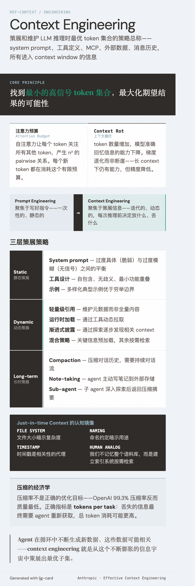

# Context Engineering（上下文工程）

=== "图"

    { loading=lazy width="100%" }

=== "文"

    
    ## 定义
    
    Context engineering 是策展和维护 LLM 推理时最优 token 集合的策略总称。它涵盖 system prompt、工具定义、[MCP](../entities/mcp.md)、外部数据、消息历史等所有进入 context window 的信息。
    
    与 prompt engineering 的区别：prompt engineering 聚焦于**写好指令**（一次性的、静态的）；context engineering 聚焦于**策展信息**（迭代的、动态的——每次推理前都要决定放什么、丢什么）。
    
    ## 核心原则
    
    **找到最小的高信号 token 集合，最大化期望结果的可能性。**
    
    这个原则来自两个架构约束：
    
    ### 注意力预算（Attention Budget）
    
    Transformer 的自注意力机制让每个 token 关注所有其他 token，产生 n^2 的 pairwise 关系。随着 token 数增长，模型的注意力被摊薄。类比人类有限的工作记忆容量——LLM 也有注意力预算，每个新 token 都在消耗这个预算。
    
    ### Context Rot
    
    随着 context window 中 token 数量增加，模型准确回忆信息的能力下降。这是梯度退化而非断崖——模型在长 context 下仍然有能力，但精度降低。原因包括：
    - 训练数据中短序列更常见，模型对长距离依赖经验更少
    - 位置编码插值（position encoding interpolation）允许处理更长序列，但会损失位置理解精度
    
    ## 实践维度
    
    ### 静态策展：有效 Context 的构成
    
    - **System prompt 的正确高度**：在过度具体（脆弱的 if-else 逻辑）和过度模糊（缺乏信号）之间找平衡。最小但完备。
    - **[工具设计](tool-design.md)**：自包含、无歧义、最小功能重叠。膨胀的工具集是最常见的 agent 失败模式之一。
    - **示例**：多样化的典型示例优于穷举边界情况。
    
    ### 动态策展：Just-in-time Context
    
    从预处理全量数据转向按需加载：
    
    1. **轻量级引用**：agent 维护文件路径、查询、链接等元数据，而非全量内容
    2. **运行时加载**：通过工具动态拉取需要的数据
    3. **渐进式披露**：agent 通过探索逐步发现相关 context——文件大小暗示复杂度、命名约定暗示用途、时间戳是相关性的代理
    4. **混合策略**：部分关键信息预加载（如 CLAUDE.md），其余按需检索（如 glob/grep）
    
    这镜像了人类认知：我们不记忆整个语料库，而是建立索引系统（文件系统、收件箱、书签）按需检索。
    
    ### 长时策展：跨 Context Window 的策略
    
    三种互补策略应对 context window 耗尽：
    
    | 策略 | 机制 | 适用场景 |
    |------|------|----------|
    | **Compaction** | 压缩对话历史，用摘要替换 | 需要持续对话流的任务 |
    | **Structured note-taking** | agent 主动写笔记到外部存储 | 有明确里程碑的迭代开发 |
    | **Sub-agent 架构** | 子 agent 深入探索后返回压缩摘要（通常 1000-2000 token） | 需要并行探索的复杂研究 |
    
    详见 [context management](context-management.md) 中对 compaction 机制的深入讨论。
    
    ## 与 Prompt Engineering 的演化关系
    
    Context engineering 不是替代 prompt engineering，而是其自然延伸。当应用从单次分类/生成走向多轮自主 agent，工程对象从"prompt 文本"扩展为"整个 context 状态"。Agent 在循环中不断生成新数据，这些数据**可能**相关——context engineering 就是从这个不断膨胀的信息宇宙中策展出最优子集。
    
    ## 压缩评估：从理论到实证
    
    [Factory 的 Context Compression 评估](../sources/factory-evaluating-context-compression.md) 为 context engineering 的"最小高信号 token 集合"原则提供了实证支撑。研究表明压缩率不是正确的优化目标——OpenAI 的 99.3% 压缩率反而导致质量最低（3.35/5.0）。正确的指标是 **tokens per task**：丢失的信息最终需要 agent 重新获取，总 token 消耗可能更高。
    
    这为 context engineering 增加了一个量化维度：[压缩策略](context-compression.md) 的选择不仅是技术权衡，也是经济权衡——压缩的质量直接影响下游的 token 效率。
    
    ## 相关概念
    
    - [Context management](context-management.md) — compaction、外部化状态等具体机制
    - [Context compression](context-compression.md) — 压缩策略的质量评估和选择
    - [Tool design](tool-design.md) — 工具的 token 效率是 context engineering 的组成部分
    - [Augmented LLM](augmented-llm.md) — 检索/工具/记忆三维增强，context engineering 横跨所有维度
    - [Harness engineering](harness-engineering.md) — harness 的核心职责之一就是 context 策展
    - [Long-running agents](long-running-agents.md) — context engineering 最具挑战性的应用场景
    - [Agent skills](agent-skills.md) — 渐进式披露是 just-in-time context 的实例
    
    ## References
    
    - `sources/anthropic_official/effective-context-engineering-for-ai-agents.md`
    - `sources/factory-evaluating-context-compression.md`
    
