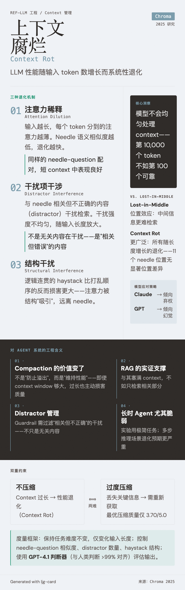

# Context Rot（上下文腐烂）

=== "图"

    { loading=lazy width="100%" }

=== "文"

    
    ## 定义
    
    Context rot 是指 LLM 性能随输入 token 数增长而系统性退化的现象。由 [Chroma](../entities/chroma.md) 在 2025 年的研究中命名和系统化测量。
    
    核心含义：模型不会均匀地处理其 context window——第 10,000 个 token 不如第 100 个 token 可靠。
    
    ## 机制
    
    [Chroma 的研究](../sources/chroma-context-rot.md) 通过控制实验隔离出三种退化机制：
    
    ### 1. 注意力稀释（Attention Dilution）
    
    随着输入长度增加，模型对每个 token 分配的注意力被稀释。表现为：
    - Needle-question 语义相似度越低，退化越快
    - 并非任务变难了——同样的 needle-question 配对在短 context 中表现良好
    
    ### 2. 干扰项干涉（Distractor Interference）
    
    与 needle 主题相关但不正确的内容（distractor）会干扰模型检索正确信息。关键发现：
    - 不同 distractor 的干扰强度不均匀
    - 这种非均匀性随输入长度增长而放大
    - 模型家族对 distractor 的反应策略不同：Claude 倾向弃权，GPT 倾向幻觉
    
    ### 3. 结构干扰（Structural Interference）
    
    逻辑连贯的 haystack 反而比打乱顺序的 haystack 更损害性能——暗示注意力机制被结构化内容"吸引"，从而减少对 needle 的关注。
    
    ## 与 Lost-in-the-Middle 的区别
    
    Lost-in-the-middle 是一个已知的位置效应（中间位置的信息更难检索）。Context rot 是一个更广泛的概念——它不限于位置效应，而是包含了所有随输入长度增长的退化现象。Chroma 的 NIAH 实验在 11 个 needle 位置上未发现显著位置效应，暗示 context rot 的机制比单纯的位置偏差更复杂。
    
    ## 对 Agent 系统的影响
    
    Context rot 对 [harness engineering](harness-engineering.md) 和 [context management](context-management.md) 有直接的工程含义：
    
    1. **Compaction 不仅是节约 token**：即使 context window 足够大，过长的 context 也会主动损害性能。Compaction 的价值从"防止溢出"变为"维持性能"。
    
    2. **RAG vs 长 context**：context rot 为 RAG（检索增强生成）提供了实证支持——与其把所有信息塞入 context，不如只检索相关部分。这也是 Chroma 作为向量数据库公司的研究动机。
    
    3. **Distractor 管理**：[guardrails](guardrails.md) 和检索系统需要不仅过滤无关内容，还需过滤相关但不正确的干扰内容。
    
    4. **任务复杂度放大**：Chroma 的实验使用极简任务；实际 agent 任务涉及多步推理，预期退化更严重。[长时运行 agent](long-running-agents.md) 尤其脆弱。
    
    ## 度量方法
    
    Chroma 的实验设计提供了一个可复用的 context rot 度量框架：
    - 保持任务难度不变，仅变化输入长度
    - 控制 needle-question 相似度、distractor 数量、haystack 结构
    - 使用 LLM 判断器（GPT-4.1，与人类判断 >99% 对齐）评估输出
    
    ## 与 Context Compression 的双重约束
    
    Context rot 和 [context compression](context-compression.md) 共同定义了 context 管理的两难：不压缩则 context 过长导致性能退化（context rot），过度压缩则丢失关键信息需要重新获取。[Factory 的压缩评估](../sources/factory-evaluating-context-compression.md) 表明即使最好的压缩方法也只达到 3.70/5.0 的信息保留质量，这意味着实践中需要在两种损失之间寻找平衡点。
    
    ## 相关概念
    
    - [Context management](context-management.md) — context rot 是 context management 存在的根本原因之一
    - [Virtual context management](virtual-context-management.md) — [MemGPT](../entities/memgpt.md) 的层次化存储方案天然分离活跃与非活跃信息，是对抗 context rot 的架构级策略
    - [Context compression](context-compression.md) — 压缩是对抗 context rot 的核心手段，但自身也有信息损失
    - [Harness engineering](harness-engineering.md) — harness 需要对抗 context rot
    - [Long-running agents](long-running-agents.md) — 长任务累积更多 context，更容易遭受 context rot
    - [Guardrails](guardrails.md) — distractor 过滤是 guardrail 的新维度
    - [Mechanistic interpretability](../concepts/mechanistic-interpretability.md) — 解释 context rot 机制需要可解释性研究
    
    ## References
    
    - `sources/chroma-context-rot.md`
    
