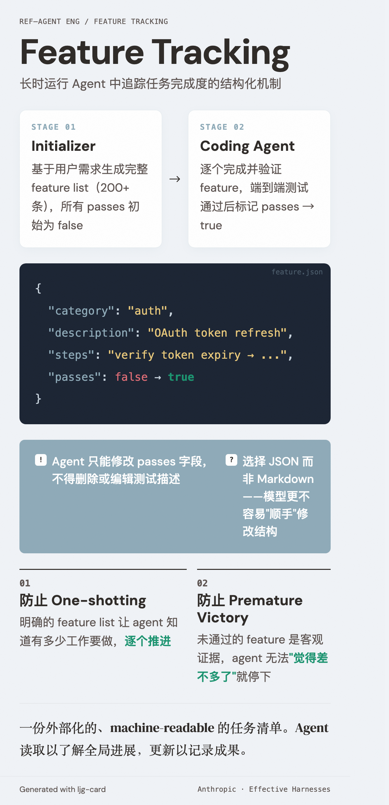

# Feature Tracking（特性追踪）

=== "图"

    { loading=lazy width="100%" }

=== "文"

    
    ## 定义
    
    Feature tracking 是 [长时运行 agent](long-running-agents.md) 中用于追踪任务完成度的结构化机制。其核心是一份外部化的、machine-readable 的任务清单，agent 可以读取以了解全局进展，可以更新以记录自己的成果。
    
    ## Anthropic 的实践
    
    在 Anthropic 的 [harness 设计](harness-engineering.md) 中，feature tracking 采用 JSON 格式的 feature list：
    
    - 每条 feature 包含：`category`、`description`、`steps`、`passes`（布尔值）
    - **Initializer agent** 基于用户需求生成完整列表（200+ 条），所有 `passes` 初始为 `false`
    - **Coding agent** 完成并验证一个 feature 后，将其 `passes` 改为 `true`
    
    ### 关键约束
    
    - Agent **只能修改 `passes` 字段**，不得删除或编辑测试描述
    - 选择 JSON 而非 Markdown，因为模型更不容易"顺手"修改 JSON 结构
    - Feature 必须经过端到端测试才能标记为通过
    
    ## 设计意图
    
    Feature tracking 同时解决两个 [长时 agent 的失败模式](long-running-agents.md)：
    
    1. **防止 one-shotting**：明确的 feature list 让 agent 知道有多少工作要做，逐个推进
    2. **防止 premature victory**：未通过的 feature 是客观证据，agent 无法"觉得差不多了"就停下
    
    ## 相关概念
    
    - [Long-running agents](long-running-agents.md) — feature tracking 服务的场景
    - [Harness engineering](harness-engineering.md) — feature tracking 是 harness 的组成部分
    - [Context management](context-management.md) — feature list 是跨 session 状态传递的关键载体
    
    ## References
    
    - `sources/anthropic_official/effective-harnesses-long-running-agents.md`
    
