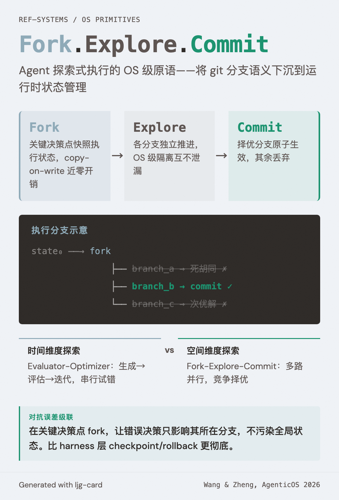

# Fork-Explore-Commit（分叉-探索-提交原语）

=== "图"

    { loading=lazy width="100%" }

=== "文"

    
    ## 定义
    
    Fork-Explore-Commit 是面向 agent 探索式执行的 OS 级原语——agent 可以 fork 当前执行状态到多条探索路径，独立推进各路径，最终选择最优路径 commit，丢弃其余。
    
    这是将 git 的分支/合并语义下沉到 OS 执行层：不是在版本控制中管理代码变更的分支，而是在运行时管理 agent 执行状态的分支。
    
    ## 背景
    
    [AgenticOS Workshop](../sources/agenticos-workshop-asplos-2026.md) 中 Wang 和 Zheng 的论文"Fork, Explore, Commit: OS Primitives for Agentic Exploration"提出了这一概念。
    
    ## 为什么需要 OS 级原语
    
    Agent 的探索式执行目前只有应用层的实现方式：
    
    1. **多次独立运行**：每次从头开始，浪费已共享的前期工作
    2. **应用层状态管理**：harness 自行实现 checkpoint/restore，脆弱且开销大
    3. **子 agent 并行**：通过 [隐式循环架构](implicit-loop-architecture.md) 的 subagent 机制，但 context 隔离不够彻底
    
    OS 级原语可以提供：
    - **高效的状态快照**：利用 copy-on-write 实现近乎零开销的 fork
    - **真正的隔离**：不同探索路径在 OS 级别隔离，一条路径的副作用不会泄漏到另一条
    - **原子 commit**：选中的路径的所有副作用原子性地生效
    
    ## 与现有概念的关系
    
    ### 与 Evaluator-Optimizer 的类比
    
    [Evaluator-optimizer](evaluator-optimizer.md) 模式是时间维度上的探索——生成、评估、迭代。Fork-Explore-Commit 是空间维度上的探索——同时生成多条路径，选最优。两者互补：在每条 fork 路径内部仍可运行 evaluator-optimizer 循环。
    
    ### 与 Parallelization 的区别
    
    [Parallelization](parallelization.md) 中的 sectioning 将不同子任务分发给不同 agent，各自负责不同部分。Fork-Explore-Commit 让多个分支解决同一个问题，竞争择优。更接近 parallelization 中的 voting 模式，但在 OS 级实现。
    
    ### 与误差级联的对抗
    
    [Error cascade](error-cascade.md) 表明前序错误在多步任务中放大。Fork-Explore-Commit 提供了一种系统级的对抗策略：在关键决策点 fork，让错误决策只影响其所在分支而不污染全局状态。这比 harness 层的 checkpoint/rollback 更彻底。
    
    ## 相关概念
    
    - [Agent OS](agent-os.md) — Fork-Explore-Commit 是 Agent OS 的执行原语
    - [Implicit loop architecture](implicit-loop-architecture.md) — 隐式循环中的探索可由 OS 原语支持
    - [Evaluator-optimizer](evaluator-optimizer.md) — 时间维度的探索，互补关系
    - [Parallelization](parallelization.md) — 空间维度的任务分发
    - [Error cascade](error-cascade.md) — Fork 是对抗误差级联的系统级手段
    - [Agent 沙箱](agent-sandboxing.md) — Fork 隔离也是一种安全隔离
    
    ## References
    
    - `sources/agenticos-workshop-asplos-2026.md`
    
