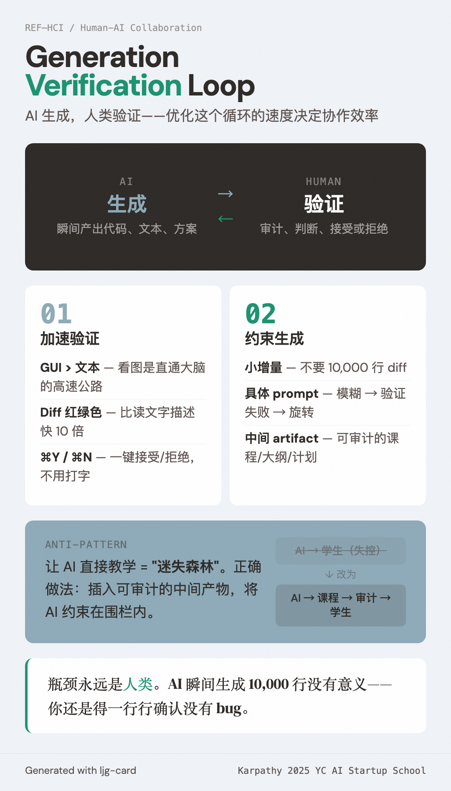

# Generation-Verification Loop（生成-验证循环）

=== "图"

    { loading=lazy width="100%" }

=== "文"

    
    ## 定义
    
    人与 AI 协作的核心模式：**AI 负责生成，人类负责验证**。Karpathy 在 [Software Is Changing (Again)](../sources/karpathy-software-is-changing-again.md) 中强调，优化这个循环的速度决定了人-AI 协作的效率。
    
    这不同于 [evaluator-optimizer](evaluator-optimizer.md) 模式——后者的评估器也是 LLM，是全自动循环。Generation-verification loop 中验证者是人类，这是一个根本性区别，因为人类是瓶颈。
    
    ## 两种优化方向
    
    ### 1. 加速验证
    
    - **GUI > 文本**：阅读文本是费力的，看图是"直通大脑的高速公路"。diff 用红绿色显示比读文字描述快得多。Cmd+Y 接受 / Cmd+N 拒绝比输入文本快得多。
    - **可视化表示**：利用人类的"视觉 GPU"——视觉皮层的并行处理能力远超文本阅读。
    
    ### 2. 约束生成（keep AI on leash）
    
    - **不要 10,000 行 diff**：AI 瞬间生成没有意义，人类仍然是验证瓶颈。
    - **小增量**：单次生成覆盖小而具体的变更。
    - **具体 prompt**：模糊 prompt → 验证失败 → 反复旋转。具体 prompt → 高验证通过率 → 快速前进。
    - **中间 artifact**：课程设计案例——教师 app 创建课程（可审计 artifact），学生 app 按课程学习。中间 artifact 阻止 AI "迷失森林"。
    
    ## 与 wiki 其他概念的关系
    
    - [Evaluator-Optimizer](evaluator-optimizer.md) — 全自动版本的生成-评估循环，验证者是 LLM 而非人类
    - [Autonomy Slider](autonomy-slider.md) — 滑块越高，单次循环中 AI 生成的 scope 越大，验证难度越高
    - [Harness Engineering](harness-engineering.md) — "keep AI on leash"的工程实现：约束、工具、反馈回路
    - [Feature Tracking](feature-tracking.md) — feature list 是约束 AI 生成范围的具体机制
    - [Context Engineering](context-engineering.md) — 具体 prompt 是 context engineering 在循环层面的应用
    
    ## References
    
    - `sources/karpathy-software-is-changing-again.md` — Karpathy 2025 YC 演讲
    
