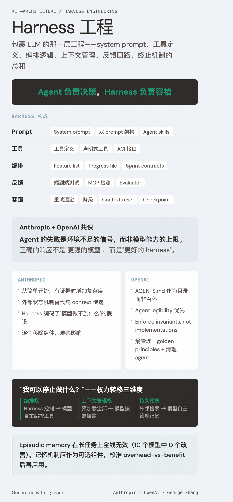

# Harness Engineering（Harness 工程）

=== "图"

    { loading=lazy width="100%" }

=== "文"

    
    ## 定义
    
    Harness 是 agent 系统中包裹 LLM 的那一层工程——system prompt、工具定义、编排逻辑、上下文管理、权限系统、反馈回路、终止机制的总和。它不是"调用 API 的胶水代码"，而是一个完整的控制系统。
    
    Harness engineering 是设计这一层的学科：通过约束、工具、反馈回路、文档和验证系统来引导 agent 的行为，使其在自由度中保持方向。
    
    ## 核心思想
    
    Harness 的作用不是限制 agent，而是让 agent 的能力可靠地发挥。正如 [Building Effective Agents](../sources/anthropic-building-effective-agents.md) 所强调的——从简单开始，只在有证据时增加复杂度——harness 的设计也遵循同样原则。
    
    在 [长时运行 agent](long-running-agents.md) 的案例中，harness 的具体形态是：
    - **Initializer-Coder 双 prompt 架构**：不同阶段使用不同的 prompt，但共享工具和系统
    - **外部状态机制**：progress file + git history 替代纯 context 传递
    - **行为约束**：feature list 中 agent 只能改 `passes` 字段，不能删除测试
    - **反馈回路**：端到端测试（Puppeteer MCP）提供真实反馈而非自我判断
    
    ## 控制论视角
    
    [George Zhang](../sources/george-zhang-harness-engineering-cybernetics.md) 将 harness engineering 置于控制论（Cybernetics）框架下，建立三次同构映射：瓦特离心调速器 → K8s controller → agent harness。核心洞察：
    
    - 人的角色从**执行者**变为**设计者**——从直接操控变为设定约束
    - 代码库的底层反馈回路（编译器、测试、linter）已存在，但**高层反馈回路**（架构一致性、设计正确性）只有 LLM 才能闭合
    - **Agent 失败 = 隐性知识未编码**，不是模型能力不足
    
    ## 与 ACI 的关系
    
    [ACI](aci.md)（Agent-Computer Interface）关注 agent 与单个工具的接口设计；harness engineering 关注整个系统的编排设计。ACI 是 harness 的组成部分——好的 harness 需要好的工具接口，但仅有好的接口不构成好的 harness。
    
    ## OpenAI 的视角：Agent-First 开发
    
    [OpenAI 的实践](../sources/openai-harness-engineering.md) 从更极端的角度定义 harness engineering——当整个开发流程由 agent 驱动时，harness 成为核心基础设施：
    
    - **AGENTS.md 作为目录而非百科**：~100 行入口指向结构化的 `docs/` 知识库
    - **Agent legibility**：优化为 agent 可读性而非人类可读性，"agent 无法访问的信息等于不存在"
    - **Enforce invariants, not implementations**：机械化执行架构边界，允许边界内自由
    - **熵管理**：golden principles + 后台清理 agent = 技术债的持续偿还
    
    关键共识（Anthropic + OpenAI）：agent 的失败是环境不足的信号，而非模型能力的上限。正确的响应不是"更强的模型"，而是"更好的 harness"。
    
    ## Harness 随模型进化
    
    Anthropic 在 [harness 迭代实践](../sources/anthropic-harness-design-long-running-apps.md) 中提出一个重要原则：**harness 的每个组件都编码了"模型做不到什么"的假设，这些假设需要随模型升级持续检验。**
    
    具体表现：
    - Sonnet 4.5 需要 sprint 结构 + context reset → Opus 4.6 可以移除两者
    - Evaluator 的边际价值随模型能力提升向任务边界收缩
    - Planner 的价值始终存在——模型不会自发做充分前期规划
    
    方法论：不要一次性大幅简化（难以判断哪些组件真正承重），而是逐个移除、观察影响。
    
    ## "What Can I Stop Doing?" 原则
    
    Anthropic 在 [Harnessing Claude's Intelligence](../sources/anthropic-harnessing-claudes-intelligence.md) 中将 harness 进化原则提炼为一个核心问题：**"我可以停止做什么？"**
    
    三个维度的权力转移：
    1. **编排权**：从 harness 控制每个工具调用 → 让模型通过代码执行工具自主编排（BrowseComp 准确率从 45.3% → 61.6%）
    2. **上下文管理权**：从预加载所有指令 → 让模型通过 [agent skills](agent-skills.md) 按需披露
    3. **持久化权**：从外部检索系统 → 让模型通过 compaction + memory folder 自主管理
    
    这是 Bitter Lesson 的 agent 版本：harness 中的结构可能成为模型性能的瓶颈，需要持续修剪。
    
    ## SWE-EVO：Harness 必要性的量化证据
    
    [SWE-EVO](../sources/swe-evo.md) 的实验结果为 harness engineering 的必要性提供了硬数据。在多步软件演进任务中，[误差级联](error-cascade.md) 将模型的单步 72.8% 成功率击落至多步 25%。
    
    对 harness 设计的具体启示：
    
    - **Checkpoint 不是可选项**：级联放大效应意味着每一步之后的验证（跑测试、确认无回归）不只是"确认这步对了"，更是在错误传播前截断级联
    - **需求分解比模型能力更关键**：强模型的主要失败是 *指令遵循*（理解歪了 release notes），不是"不会写代码"。Harness 中的需求澄清和分解机制直接决定上限
    - **框架-模型匹配度是隐藏变量**：同一模型在不同 agent 框架上表现差距可达 4 倍（GLM-5：SWE-agent 37.5% vs OpenHands 8.33%）。Harness 的 prompt 风格和交互模式是能力发挥的关键因素
    - **Fix Rate 可迁移到 harness 内部**：SWE-EVO 的软评分设计（部分通过率 + 回归惩罚）可用于 harness 的中间评估，不用等完全做完才判断进退
    
    ## 可靠性科学视角的 Harness 设计
    
    [Beyond pass@1](../sources/beyond-pass-at-1-reliability-framework.md) 的 23,392 episode 实验为 harness 设计提供了三个可操作的量化工具：
    
    1. **MOP 检测嵌入监控层**：论文的滑动窗口熵检测（w=5 步，监测工具调用分布的信息熵）可直接嵌入 harness 的 step callback。当 H(t) 超阈值时触发 context reset——保存 GDS 进度、清空 context、从最近成功的 subtask 继续。这比"重复 3 次就停"的循环检测精细得多，捕捉的是"行为模式变无序"而非仅仅"重复同一动作"。
    
    2. **任务分解的量化决策**：RDC 斜率直接量化了分解收益。对 RDS 陡峭的模型（如 Qwen3 30B：短任务 75.8% → 超长 34.3%，分解增益 41.5pp），任务分解是高回报策略；对 RDS 平缓的前沿模型（DeepSeek V3 增益仅 13.1pp），分解的收益更小。harness 可根据目标模型的 RDC 动态调整分解粒度。
    
    3. **记忆组件的谨慎使用**：episodic memory 在长任务上全线无效（10 个模型中 0 个改善），便签占步数和 context 的代价超过收益。这启示 harness 中的记忆机制应作为可选组件，只在校准过 overhead-vs-benefit 后启用——或采用有过期机制的分层记忆替代朴素便签本。
    
    ## 容错逻辑的归属：Harness 而非 Agent
    
    [ReliabilityBench](../sources/reliabilitybench.md) 的实验为 harness 设计提供了一个重要的架构判据：容错逻辑应放在 harness 层，而非 agent 的推理链。
    
    证据来自 ReAct vs Reflexion 的对比：
    - ReAct（简单重试）在故障注入下恢复率 80.9%，Reflexion（反思+重试）仅 67.3%
    - Reflexion 的退化梯度更陡（-0.50/0.1λ vs -0.38），说明反思层在错误观察上建立的"教训"反而误导后续行为
    
    这支持一个设计原则：**agent 负责决策，harness 负责容错**。重试、退避、降级、超时兜底——这些机制应该在 harness 的工具调用包装层实现，agent 看到的应该是"工具调用成功"或"永久失败"的干净信号。
    
    [可靠性曲面](reliability-surface.md) 框架还提供了一种评估 harness 设计有效性的方法：对不同 harness 配置画 R(k, ε, λ) 曲面，曲面更平坦的配置在生产中更可靠。
    
    ## 相关概念
    
    - [Long-running agents](long-running-agents.md) — harness 设计的核心应用场景
    - [ACI](aci.md) — harness 的工具接口层
    - [Tool design](tool-design.md) — 工具定义的工程实践
    - [Context management](context-management.md) — harness 中的上下文管理机制
    - [Feature tracking](feature-tracking.md) — harness 中的进度追踪机制
    - [Evaluator-optimizer](evaluator-optimizer.md) — harness 中的质量反馈回路
    - [Agentic systems](agentic-systems.md) — harness 服务的系统类型
    - [Error cascade](error-cascade.md) — harness 必须对抗的核心失败机制
    - [可靠性衰减](reliability-decay.md) — harness 必须对抗的另一核心失败机制
    - [Agent 可靠性评估](agent-reliability-evaluation.md) — 量化 harness 有效性的评估框架
    - [可靠性曲面](reliability-surface.md) — 多维可靠性测量，可用于评估 harness 配置
    - [Agent 混沌工程](chaos-engineering-for-agents.md) — 通过故障注入测试 harness 容错能力
    
    ## References
    
    - `sources/anthropic_official/building-effective-agents.md`
    - `sources/anthropic_official/effective-harnesses-long-running-agents.md`
    - `sources/anthropic_official/harness-design-long-running-apps.md`
    - `sources/anthropic_official/harnessing-claudes-intelligence.md`
    - `sources/openai_official/harness-engineering.md`
    - `sources/george-zhang-harness-engineering-cybernetics.md`
    - `sources/arxiv_papers/2512.18470-swe-evo.md`
    - `sources/arxiv_papers/2603.29231-beyond-pass-at-1-reliability-science-framework.md`
    - `sources/arxiv_papers/2601.06112-reliabilitybench.md`
    
