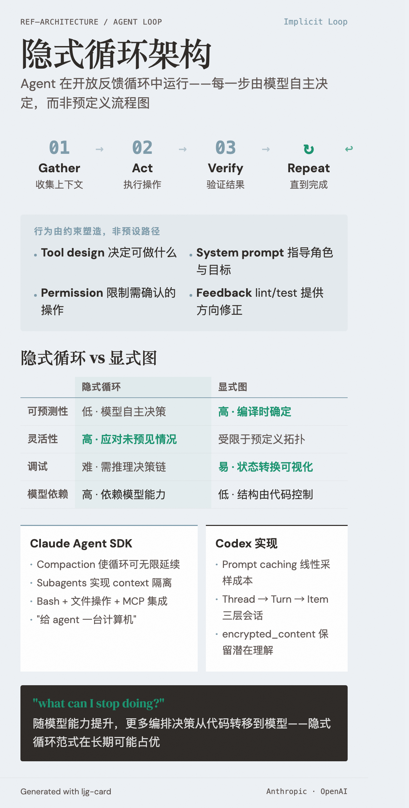

# Implicit Loop Architecture（隐式循环架构）

=== "图"

    { loading=lazy width="100%" }

=== "文"

    
    ## 定义
    
    隐式循环是 agent 系统的一种架构范式：agent 在一个开放的反馈循环中运行——**gather context → take action → verify work → repeat**——每一步由模型自主决定，而非预定义的流程图。
    
    与之对比的是 **显式图架构**（如 LangGraph），后者将流程编码为节点和边的有向图，每个节点的前后关系在编译时确定。
    
    ## 核心特征
    
    ### 行为由约束塑造，非预设路径
    
    隐式循环中不存在"第一步做 X、第二步做 Y"的硬编码。Agent 的行为通过以下机制间接约束：
    - **Tool design**：[工具定义](tool-design.md) 决定了 agent 可以做什么
    - **System prompt**：指导 agent 的角色、目标、约束
    - **Permission handling**：限制哪些操作需要确认
    - **Feedback mechanisms**：linting、测试、visual check 等提供方向修正
    
    ### 与 Workflows 的关系
    
    在 [agentic systems](agentic-systems.md) 的分类中，隐式循环属于"agent"端而非"workflow"端。但 [harness engineering](harness-engineering.md) 的实践表明，最有效的系统往往在隐式循环内嵌入 workflow-like 的约束——如 [feature tracking](feature-tracking.md)、增量推进、状态交接。
    
    ## 实现：Claude Agent SDK
    
    [Claude Agent SDK](../entities/claude-agent-sdk.md) 是隐式循环架构的典型实现。SDK 提供：
    - **Compaction**：[context management](context-management.md) 使循环可无限延续
    - **Subagents**：context 隔离 + 并行化
    - **Tool system**：bash、文件操作、[MCP](../entities/mcp.md) 集成
    
    核心设计原则："给 agent 一台计算机"——文件系统结构本身就是 context engineering 的一种形式。
    
    ## Codex 的实现细节
    
    OpenAI 在 [agent loop 拆解](../sources/openai-unrolling-codex-agent-loop.md) 中详细展示了隐式循环的工程实现：
    
    - **Prompt 构建**：system message → instructions → tools → developer message → user instructions（AGENTS.md 聚合）→ environment context → user message
    - **循环驱动**：模型返回 tool call → 执行 → 输出追加到 prompt → 重新查询，直到产出 assistant message
    - **Prompt caching**：后续请求是前序的精确前缀，实现线性而非二次方的采样成本
    - **Compaction**：context 超限时自动压缩，包含 `encrypted_content` 保留模型潜在理解
    
    ### 会话原语
    
    [Codex App Server](../sources/openai-unlocking-codex-harness.md) 将隐式循环表达为三层会话结构：Thread（持久会话） → Turn（一次 user→agent 交互） → Item（原子 I/O 单元），通过双向 JSON-RPC 暴露给客户端。
    
    ## 显式图对比：LangGraph
    
    [LangGraph](../entities/langgraph.md) 是显式图架构的代表实现（详见 [LangGraph 文档摘要](../sources/langgraph-documentation.md)）——用 StateGraph 定义节点和边的有向图，流程拓扑在编译时确定。
    
    | | 隐式循环 (Claude SDK / Codex) | 显式图 (LangGraph) |
    |---|---|---|
    | 可预测性 | 低——模型自主决策 | 高——编译时确定流程 |
    | 灵活性 | 高——可应对未预见情况 | 受限于预定义拓扑 |
    | 调试 | 难——需推理决策链 | 易——状态转换可视化 |
    | 模型依赖 | 高——依赖模型能力 | 低——结构由代码控制 |
    
    [Harness engineering](harness-engineering.md) 的演进趋势（"what can I stop doing?"）暗示：随着模型能力提升，更多编排决策从代码转移到模型，隐式循环范式可能在长期占优。但对流程固定、合规优先的企业场景，显式图仍有其位置。
    
    ## 相关概念
    
    - [Agentic systems](agentic-systems.md) — 隐式循环在 workflows-agents 谱上的位置
    - [Harness engineering](harness-engineering.md) — 在隐式循环中注入约束
    - [Tool design](tool-design.md) — 工具定义塑造 agent 行为
    - [Context management](context-management.md) — 循环持续运行的基础
    - [ACI](aci.md) — agent 与工具的接口层
    - [LangGraph](../entities/langgraph.md) — 显式图范式的代表
    
    ## References
    
    - `sources/anthropic_official/building-agents-claude-agent-sdk.md`
    - `sources/openai_official/unrolling-codex-agent-loop.md`
    - `sources/openai_official/unlocking-codex-harness.md`
    - `sources/langgraph-documentation.md`
    
