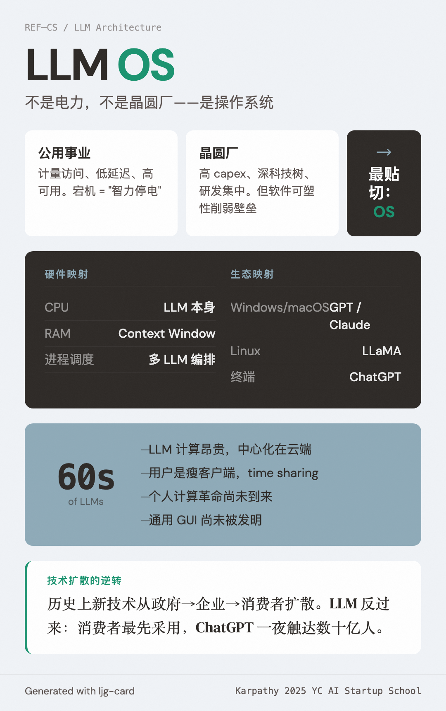

# LLM OS（LLM 操作系统）

=== "图"

    { loading=lazy width="100%" }

=== "文"

    
    ## 定义
    
    将 LLM 视为一种新型操作系统的类比框架。Karpathy 认为 LLM 不只是公用事业（electricity）或晶圆厂（fab），最贴切的类比是**操作系统**——它们是日益复杂的软件生态系统，不是水电一样的简单 commodity。
    
    ## 核心映射
    
    | 传统 OS | LLM OS |
    |---------|--------|
    | CPU | LLM 本身 |
    | RAM / 工作记忆 | Context window |
    | 进程调度 | 多 LLM 调用编排 |
    | 应用程序 | LLM 应用（Cursor、Perplexity 等） |
    | 闭源 OS（Windows/macOS） | 闭源 LLM（GPT/Claude/Gemini） |
    | Linux | LLaMA 生态 |
    | 下载 app 选平台 | 选 LLM provider（Cursor 可切换 GPT/Claude/Gemini） |
    | 终端 | ChatGPT 文本界面 |
    
    ## "1960 年代"论断
    
    Karpathy 断言我们处于 LLM 计算的 1960 年代：
    - LLM 计算昂贵 → 中心化在云端
    - 用户是瘦客户端，通过网络连接
    - Time sharing（用户共享批次维度）
    - 个人计算革命尚未到来（Mac Mini 做 batch-1 推理是早期迹象）
    - 通用 GUI 尚未被发明（ChatGPT = 终端）
    
    ## 技术扩散的逆转
    
    LLM 颠覆了传统的技术扩散方向。历史上，新技术（电力、密码学、GPS）从政府/军方→企业→消费者扩散。LLM 反过来：消费者最先采用（"帮我煮鸡蛋"），企业和政府反而落后。这个特征源于 LLM 是纯软件——ChatGPT 一夜之间触达数十亿人。
    
    ## 与 wiki 其他概念的关系
    
    - [Software 3.0](software-3-0.md) — LLM OS 是 Software 3.0 的运行平台
    - [Context Management](context-management.md) — context window 是 LLM OS 的"内存管理"
    - [Implicit Loop Architecture](implicit-loop-architecture.md) — agent 在 LLM OS 上的进程模型
    - [Augmented LLM](augmented-llm.md) — retrieval + tools + memory 是 LLM OS 的外设和驱动
    
    ## References
    
    - `sources/karpathy-software-is-changing-again.md` — Karpathy 2025 YC 演讲，系统阐述 LLM OS 类比
    
