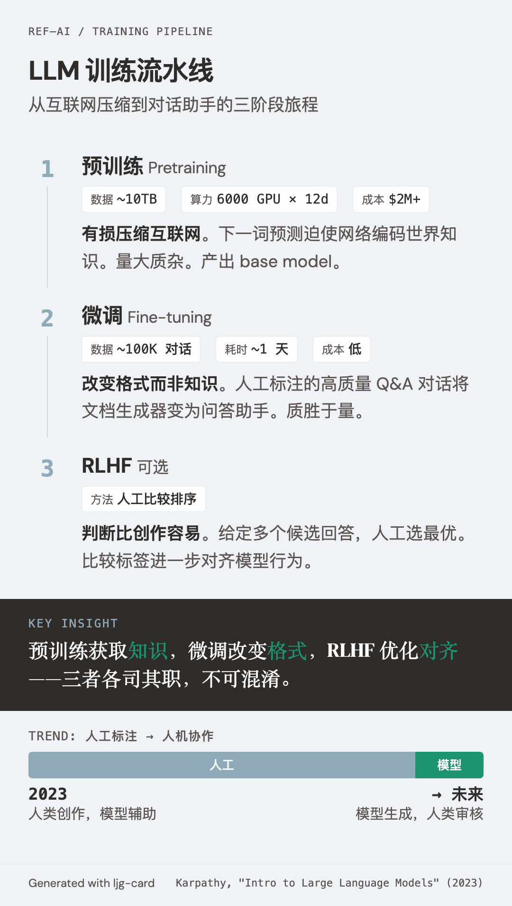

# LLM Training Pipeline（LLM 训练流水线）

=== "图"

    { loading=lazy width="100%" }

=== "文"

    
    ## 定义
    
    将原始互联网文本转化为可用的对话助手的多阶段训练过程。[Karpathy](../entities/andrej-karpathy.md) 在 [2023 年演讲](../sources/karpathy-intro-to-large-language-models.md) 中将其归纳为三个阶段，构成了 LLM 训练的标准心智模型。
    
    ## 三阶段架构
    
    ### Stage 1: 预训练 (Pretraining)
    
    - **输入**: ~10TB 互联网文本（网页爬取）
    - **目标**: 下一词预测（Next Word Prediction）
    - **计算**: ~6000 GPU × 12 天（以 Llama 2 70B 为例）
    - **成本**: ~$2M（2023 年；前沿模型数十至数亿美元）
    - **产出**: Base model——互联网文档的有损压缩，140GB 参数 ≈ 10TB 文本的 100x 压缩
    
    核心洞察：预训练不是简单的信息存储，而是通过预测任务被迫学习世界知识。模型"知道" Ruth Handler 的生卒年月，因为这是在 Wikipedia 文本中准确预测下一词所必需的。
    
    ### Stage 2: 微调 (Fine-tuning)
    
    - **输入**: ~100K 人工标注的 Q&A 对话
    - **目标**: 同样是下一词预测，但数据从互联网文档换成了高质量对话
    - **计算**: 远低于预训练（约 1 天）
    - **产出**: Assistant model——从文档生成器变为问答助手
    
    关键区别：预训练追求量（海量低质数据），微调追求质（少量高质数据）。微调改变的是格式而非知识——预训练阶段获取的知识在微调后依然可用。
    
    ### Stage 3: RLHF (可选)
    
    - **输入**: 人工比较标签（"回答 A 比回答 B 好"）
    - **机制**: 从 stage 2 模型采样多个回答 → 人工排序 → 用比较结果进一步优化
    - **优势**: 在很多任务中，判断哪个好比自己写一个好答案更容易
    
    ## 演进趋势
    
    Karpathy 在 2023 年就指出了一个至今仍在加速的趋势：**人工标注正被人机协作替代**。模型采样候选答案 → 人工挑选/编辑 → 生成训练数据。随着模型能力提升，人类角色从"创作者"转向"审核者"。
    
    ## 与 Wiki 已有概念的关系
    
    - [Scaling Laws](scaling-laws.md) — 主要描述 Stage 1 的行为规律
    - [Augmented LLM](augmented-llm.md) — 训练产出的 base model 经过增强（检索、工具、记忆）成为 agentic 系统的构建块
    - [LLM-OS Analogy](llm-os-analogy.md) — 训练流水线生产的是 OS 的"硬件"（LLM 内核），harness engineering 在其上构建软件栈
    
    ## References
    
    - `sources/karpathy-intro-to-large-language-models.md`
    
