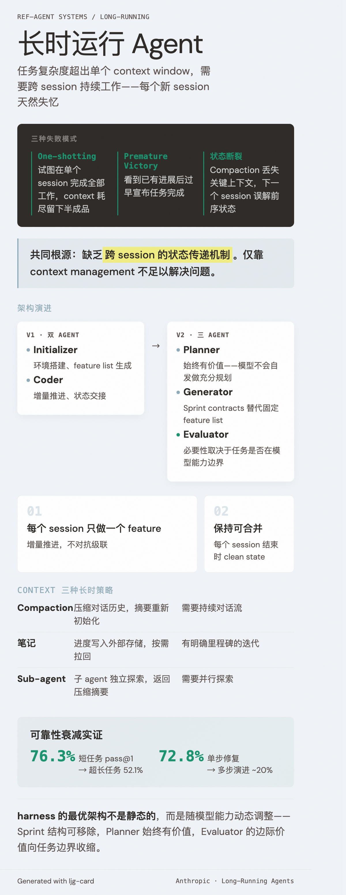

# Long-Running Agents（长时运行 Agent）

=== "图"

    { loading=lazy width="100%" }

=== "文"

    
    ## 定义
    
    长时运行 agent 是指任务复杂度超出单个 context window 能力范围，需要跨多个 session 持续工作的 [agentic system](agentic-systems.md)。这不是简单的"运行时间长"，而是一个根本性的架构挑战——每个新 session 天然失忆。
    
    Anthropic 的比喻：一个软件项目由轮班工程师开发，每位工程师上班时对前一班发生了什么毫无记忆。
    
    ## 核心挑战
    
    ### 失败模式
    
    1. **One-shotting**：agent 试图在单个 session 内完成全部工作，context 耗尽时留下半成品
    2. **Premature victory**：agent 看到已有进展后过早宣布任务完成
    3. **状态断裂**：compaction 丢失关键上下文，下一个 session 误解前序状态
    
    ### 根因
    
    这些失败模式的共同根源是缺乏 **跨 session 的状态传递机制**。仅靠 [context management](context-management.md)（如 compaction）不足以解决问题——需要外部化的、持久的进度追踪。
    
    ## 解决方案模式
    
    Anthropic 提出的 **Initializer-Coder 双 agent 架构**：
    
    - **Initializer agent**：首次运行，负责环境搭建、[feature list](feature-tracking.md) 生成、进度文件初始化
    - **Coding agent**：后续运行，负责增量推进、状态交接、端到端验证
    
    关键原则：
    - 每个 session 只做一个 feature（增量推进）
    - 每个 session 结束时保持代码库可合并（clean state）
    - 使用外部文件（progress file + git history）而非 context window 传递状态
    
    ## 与 Agentic Systems 分类的关系
    
    在 [agentic systems](agentic-systems.md) 的 workflows vs agents 框架中，长时运行 agent 属于高复杂度端——任务开放、步骤数不可预测、需要自主决策。但有趣的是，解决长时问题的关键恰恰是引入 workflow-like 的约束（feature list、增量推进、固定交接流程），用 [harness engineering](harness-engineering.md) 来驯服 agent 的自由度。
    
    ## 架构演进
    
    Anthropic 在 [后续实践](../sources/anthropic-harness-design-long-running-apps.md) 中将双 agent 架构扩展为三 agent 架构（Planner-Generator-Evaluator），并发现：
    
    - **Planner** 始终有价值——模型不会自发做充分的前期规划
    - **Sprint 结构** 可随模型能力提升移除（Opus 4.6 可保持长时连贯性）
    - **Evaluator** 的必要性取决于任务是否在模型能力边界上
    - **Sprint contracts**（generator-evaluator 间的协商）替代了固定的 feature list
    
    这表明长时运行 agent 的最优架构不是静态的，而是随模型能力动态调整的。
    
    ## 相关概念
    
    - [Harness engineering](harness-engineering.md) — 设计约束让 agent 在自由度中保持方向
    - [Context management](context-management.md) — 长时 agent 的必要但不充分条件
    - [Feature tracking](feature-tracking.md) — 结构化进度追踪
    - [Evaluator-optimizer](evaluator-optimizer.md) — 质量保障的反馈回路
    - [Agentic systems](agentic-systems.md) — 长时 agent 在复杂度谱上的位置
    
    ## Context Engineering 的三种长时策略
    
    [Effective Context Engineering](../sources/anthropic-effective-context-engineering.md) 从 [context engineering](context-engineering.md) 视角系统化了长时 agent 的策略选择：
    
    | 策略 | 机制 | 适用场景 |
    |------|------|----------|
    | **Compaction** | 压缩对话历史，保留关键细节，用摘要重新初始化 context | 需要持续对话流的任务 |
    | **Structured note-taking** | agent 定期将进度笔记写入外部存储，后续按需拉回 | 有明确里程碑的迭代开发 |
    | **Sub-agent 架构** | 子 agent 在独立 context 中深入探索，仅返回压缩摘要 | 需要并行探索的复杂研究 |
    
    这与 initializer-coder 架构互补——initializer-coder 解决的是**跨 session 的状态传递**，而这三种策略解决的是**单 session 内的 context 耗尽**。实际的长时 agent 往往需要同时使用两套机制。
    
    文章也指出，即使 context window 持续扩大，context rot 问题意味着长时策略在可预见的未来仍然必要。
    
    [Beyond pass@1 框架](../sources/beyond-pass-at-1-reliability-framework.md) 对 10 个模型、23,392 个 episode 的系统测量进一步量化了长时运行的 [可靠性衰减](reliability-decay.md)：
    
    - 平均 pass@1 从短任务 76.3% 降到超长任务 52.1%，衰减速率超线性——错误正相关（犯错后倾向继续犯错）
    - 领域差异巨大：SE（代码编辑）GDS 从 0.90 暴跌到 0.44，DP（文档处理）几乎不变（0.74 → 0.71）
    - 能力排名 != 可靠性排名：短任务最强的模型在超长任务上未必可靠
    - MOP 悖论：前沿模型熔断率最高（19%），因为尝试更激进的策略——MOP 检测可嵌入 harness 监控层，触发 context reset 而非终止
    - 记忆脚手架全线失败：episodic memory 在长任务上 6/10 模型变差、4/10 中性、0/10 改善
    
    这些发现验证了增量推进和 context reset 策略的合理性，同时对"默认启用 episodic memory"的假设提出了有力反驳。
    
    ## SWE-EVO：多步演进的断崖效应
    
    [SWE-EVO](../sources/swe-evo.md) 提供了长时多步 agent 任务失败的直接量化证据。48 个软件演进任务（平均跨 21 个文件、874 个测试），结果触目惊心：
    
    - GPT-5.2 单步修复（[SWE-Bench](../entities/swe-bench.md) Verified）72.8% → 多步演进（SWE-EVO）~20%
    - 最强模型 GPT-5.4 也只达到 25%
    - 任务难度与涉及的 PR 数量（即步骤数）强相关：平均 PR 从易到难 1.67 → 14.84
    
    这不是"难了一点"，是 [误差级联](error-cascade.md) 导致的断崖式下降。前一步的小错改变后续步骤的输入条件，错误在步骤间被放大。
    
    这为 Anthropic 的"增量推进"策略（每个 session 只做一个 feature）提供了量化理由——不是保守，是在多步耦合失败面前的必要策略。同时也表明：强模型在多步任务中的主要失败不是"不会写代码"，而是 *指令遵循*（理解歪了 release notes 的意图），这指向 harness 层面的需求分解和澄清机制比单纯提升模型能力更有效。
    
    ## References
    
    - `sources/anthropic_official/effective-harnesses-long-running-agents.md`
    - `sources/anthropic_official/harness-design-long-running-apps.md`
    - `sources/anthropic_official/effective-context-engineering-for-ai-agents.md`
    - `sources/arxiv_papers/2512.18470-swe-evo.md`
    - `sources/arxiv_papers/2603.29231-beyond-pass-at-1-reliability-science-framework.md`
    
