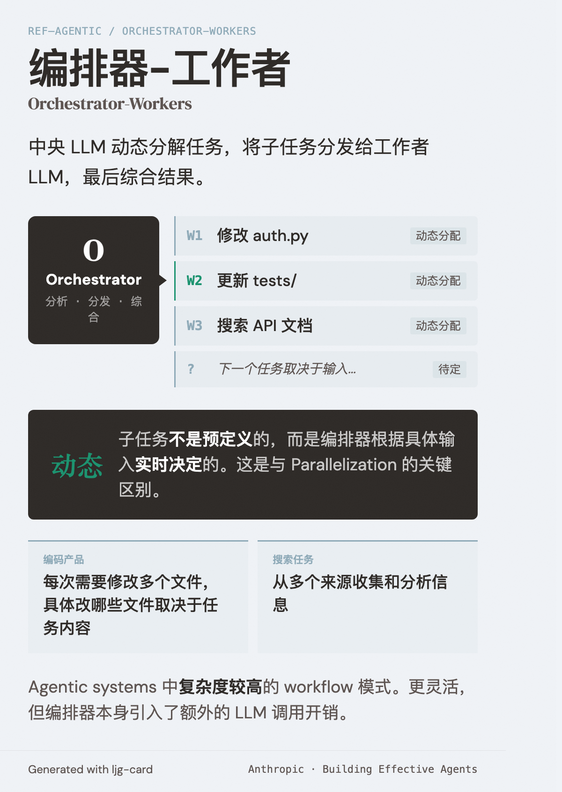

# Orchestrator-Workers（编排器-工作者）

=== "图"

    { loading=lazy width="100%" }

=== "文"

    
    ## 定义
    
    中央 LLM（编排器）动态分解任务，将子任务分发给工作者 LLM，最后综合结果。与 [parallelization](parallelization.md) 的关键区别：子任务不是预定义的，而是编排器根据具体输入动态决定的。
    
    ## 适用场景
    
    复杂任务的子任务无法提前预测时。
    
    **典型用例**：
    - 编码产品：每次需要修改多个文件，具体改哪些文件取决于任务内容
    - 搜索任务：从多个来源收集和分析信息
    
    ## 在 agentic 系统中的位置
    
    属于 [agentic systems](agentic-systems.md) 中复杂度较高的 workflow 模式。比 [parallelization](parallelization.md) 更灵活，但编排器本身引入了额外的 LLM 调用开销。
    
    ## 跨框架扩展：A2A 协议
    
    Orchestrator-Workers 原本描述单系统内的 agent 编排。[A2A 协议](a2a-protocol.md) 将这个模式扩展到跨系统边界：orchestrator 可以是任何框架的 client agent，workers 可以是任何框架实现的 remote agent，通过标准化的 A2A 协议通信。
    
    这意味着 orchestrator 不再需要了解每个 worker agent 的内部实现——只需通过 [Agent Card](agent-card.md) 发现能力，通过 A2A Task 委派任务，通过 SSE 或 push notification 接收结果。
    
    ## References
    
    - `sources/anthropic_official/building-effective-agents.md`
    - `sources/google-a2a-protocol.md`
    
