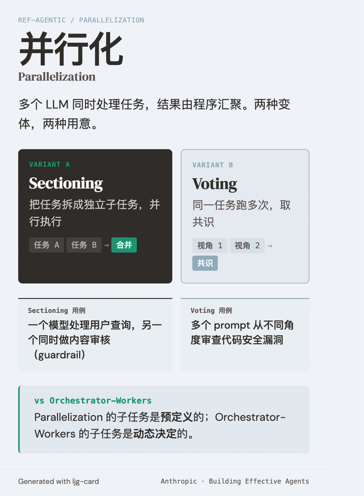

# Parallelization（并行化）

=== "图"

    { loading=lazy width="100%" }

=== "文"

    
    ## 定义
    
    多个 LLM 同时处理任务，结果由程序汇聚。有两种变体：
    
    - **Sectioning（分段）**：把任务拆成独立子任务并行执行
    - **Voting（投票）**：同一任务跑多次获得多样化输出，取共识
    
    ## 适用场景
    
    子任务可独立执行时用 sectioning 加速；需要更高置信度或多角度审视时用 voting。
    
    **典型用例**：
    - Sectioning：一个模型处理用户查询，另一个同时做内容审核（guardrail）
    - Voting：多个 prompt 从不同角度审查代码安全漏洞
    
    ## 在 agentic 系统中的位置
    
    属于 [agentic systems](agentic-systems.md) 中的 workflow 模式。与 [orchestrator-workers](orchestrator-workers.md) 的区别：parallelization 的子任务是预定义的，orchestrator-workers 的子任务是动态决定的。
    
    ## References
    
    - `sources/anthropic_official/building-effective-agents.md`
    
