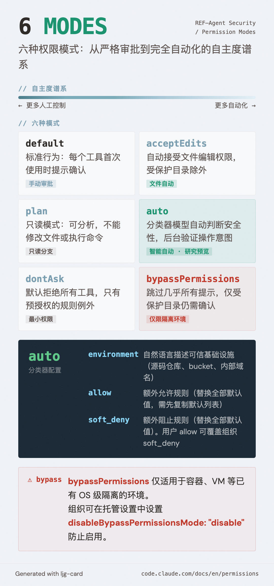

# 权限模式（Permission Modes）

=== "图"

    { loading=lazy width="100%" }

=== "文"

    
    ## 定义
    
    权限模式是 Claude Code 的全局审批策略开关——通过 `defaultMode` 配置，决定工具调用的默认处理方式，在此基础上叠加具体的 allow/ask/deny 规则。
    
    ## 六种模式
    
    | 模式 | 描述 | 典型使用场景 |
    |---|---|---|
    | `default` | 标准行为：每个工具首次使用时提示确认 | 日常开发，需要人工审批 |
    | `acceptEdits` | 自动接受文件编辑权限（受保护目录除外） | 信任文件修改，但仍审查命令 |
    | `plan` | 计划模式：只能分析，不能修改文件或执行命令 | 只读探索、方案制定阶段 |
    | `auto` | 自动审批，后台分类器验证操作意图 | 受信任的自动化场景（研究预览） |
    | `dontAsk` | 自动拒绝，仅预授权工具可用 | 高安全场景，最小权限面 |
    | `bypassPermissions` | 跳过权限提示（受保护目录仍提示） | 隔离容器/VM，危险 |
    
    ## 模式设计哲学：自主度与安全性的权衡
    
    六种模式形成一个**自主度谱系**：
    
    ```
    ← 更多人工控制                    更多自动化 →
    dontAsk — default — acceptEdits — auto — bypassPermissions
                        plan（只读分支）
    ```
    
    - `plan` 是特殊的只读分支——agent 可以分析代码、提出方案，但无法执行。适合方案评审阶段。
    - `auto` 引入了分类器模型作为"自动监察员"，在减少提示的同时维持安全性。与其他模式的区别在于智能而非规则驱动。
    - `bypassPermissions` 是"核选项"——完全信任 agent，仅适合已有 OS 级隔离的环境。
    
    ## bypassPermissions 的保护边界
    
    即使在 `bypassPermissions` 模式下，以下目录的写操作仍触发提示：
    - `.git`、`.claude`、`.vscode`、`.idea`、`.husky`（防止意外损坏 repo 状态、编辑器配置、git hooks）
    
    但 `.claude/commands`、`.claude/agents`、`.claude/skills` **豁免**——Claude 在创建技能、子 agent 和命令时需要写这些路径。
    
    **禁用方式**：在托管设置中设置 `permissions.disableBypassPermissionsMode: "disable"` 可防止用户启用此模式——这是[作用域层次](settings-scope-hierarchy.md)的典型用例。
    
    ## auto 模式的分类器机制
    
    `auto` 模式内置分类器读取 `autoMode` 配置：
    
    ```json
    {
      "autoMode": {
        "environment": ["Source control: github.com/your-org"],
        "allow": ["Deploying to staging is allowed: isolated from production"],
        "soft_deny": ["Never modify infra/terraform/prod/"]
      }
    }
    ```
    
    **重要约束**：
    - `allow` 或 `soft_deny` 配置会**替换**全部默认规则，而非叠加
    - 分类器只读取用户设置、`.claude/settings.local.json` 和托管设置——不读取共享项目设置（防止 repo 注入自己的 allow 规则）
    - 用户的 `allow` 条目可以覆盖组织的 `soft_deny`，但组织的 `permissions.deny` 无法被用户覆盖
    
    **安全管理工具**：
    ```bash
    claude auto-mode defaults  # 查看内置规则
    claude auto-mode config    # 查看当前生效配置
    claude auto-mode critique  # AI 审查自定义规则质量
    ```
    
    ## 禁用危险模式
    
    组织可在托管设置中封锁危险模式：
    - `permissions.disableBypassPermissionsMode: "disable"` — 禁用 bypassPermissions
    - `permissions.disableAutoMode: "disable"` — 禁用 auto 模式
    
    ## 与规则系统的关系
    
    权限模式设定"底色"，[allow/ask/deny 规则](permission-rules-hierarchy.md)在其上叠加：
    - `dontAsk` 模式默认拒绝，但 allow 规则定义的工具仍可使用
    - `bypassPermissions` 跳过大部分提示，但 deny 规则仍生效
    - deny-first 语义在所有模式下均成立
    
    ## 相关概念
    
    - [Claude Code 权限系统](claude-code-permission-system.md) — 分层工具审批机制全貌
    - [Allow/Ask/Deny 规则层次](permission-rules-hierarchy.md) — 模式之上的精细规则控制
    - [设置作用域层次](settings-scope-hierarchy.md) — 模式配置的继承与覆盖
    - [Agent 沙箱](agent-sandboxing.md) — bypassPermissions 应配合的 OS 级隔离
    - [Guardrails](guardrails.md) — 更宏观的 agent 安全约束框架
    
    ## References
    
    - `sources/anthropic_official/claude-code-permissions.md`
    
