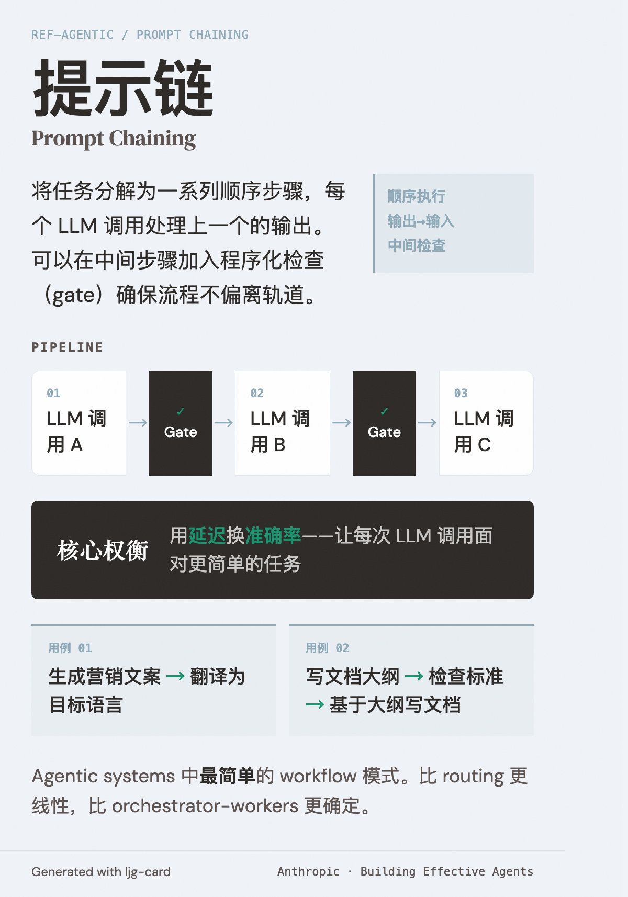

# Prompt Chaining（提示链）

=== "图"

    { loading=lazy width="100%" }

=== "文"

    
    ## 定义
    
    将任务分解为一系列顺序步骤，每个 LLM 调用处理上一个的输出。可以在中间步骤加入程序化检查（gate）确保流程不偏离轨道。
    
    ## 适用场景
    
    任务能干净地分解为固定子任务时。本质是用延迟换准确率——让每次 LLM 调用面对更简单的任务。
    
    **典型用例**：
    - 生成营销文案 → 翻译为目标语言
    - 写文档大纲 → 检查大纲是否满足标准 → 基于大纲写文档
    
    ## 在 agentic 系统中的位置
    
    属于 [agentic systems](agentic-systems.md) 中最简单的 workflow 模式。比 [routing](routing.md) 更线性，比 [orchestrator-workers](orchestrator-workers.md) 更确定。
    
    ## References
    
    - `sources/anthropic_official/building-effective-agents.md`
    
