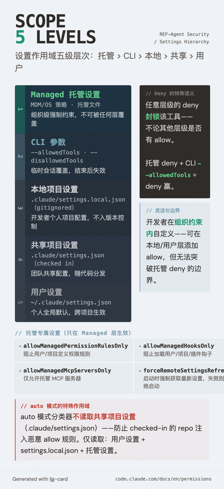

# 设置作用域层次（Settings Scope Hierarchy）

=== "图"

    { loading=lazy width="100%" }

=== "文"

    
    ## 定义
    
    Claude Code 的设置作用域层次是一个五级优先级系统，决定当多个配置源对同一设置有不同值时，哪个生效。层级越高，优先级越高，且**任意层级的 deny 不可被低优先级的 allow 覆盖**。
    
    ## 五级层次
    
    | 优先级 | 层级 | 文件 / 来源 | 适用场景 |
    |---|---|---|---|
    | 1（最高）| **托管设置**（Managed） | MDM/OS 策略、托管文件 | 组织级强制约束 |
    | 2 | **命令行参数** | `--allowedTools`、`--disallowedTools` | 临时会话覆盖 |
    | 3 | **本地项目设置** | `.claude/settings.local.json`（gitignored）| 开发者个人项目配置 |
    | 4 | **共享项目设置** | `.claude/settings.json`（checked in）| 团队共享的项目配置 |
    | 5（最低）| **用户设置** | `~/.claude/settings.json` | 个人全局默认 |
    
    ## 关键语义：deny 的跨层封锁
    
    普通设置遵循"高优先级覆盖低优先级"，但 **deny 规则有特殊语义**：
    
    > 任意层级的 deny 都封锁该工具，不论其他层级是否有 allow 规则。
    
    例如：
    - 共享项目设置 deny 了 `Bash(git push *)`，用户设置的 allow 无法覆盖
    - 托管设置 deny 了 `Bash`，`--allowedTools Bash` 命令行参数也无法覆盖
    
    这确保了组织安全策略无法被个别开发者绕过。
    
    ## 托管设置（Managed Settings）
    
    托管设置是层次顶端，通过 MDM/OS 级策略或托管文件下发，无法被任何其他层级（包括命令行参数）覆盖。这是企业部署的安全基础。
    
    **托管专属设置**（只在托管层生效，其他层设置无效）：
    
    | 设置 | 功能 |
    |---|---|
    | `allowManagedPermissionRulesOnly` | 阻止用户/项目定义权限规则，仅托管规则生效 |
    | `allowManagedHooksOnly` | 阻止加载用户/项目/插件钩子 |
    | `allowManagedMcpServersOnly` | 仅允许托管 MCP 服务器（deny 仍合并） |
    | `allowManagedReadPathsOnly`（沙箱） | 仅允许托管 allowRead 路径 |
    | `allowManagedDomainsOnly`（沙箱网络） | 仅允许托管 allowedDomains |
    | `forceRemoteSettingsRefresh` | 启动时必须成功获取最新托管设置才放行 |
    | `strictKnownMarketplaces` | 控制用户可添加的插件市场 |
    
    ## auto 模式的特殊作用域
    
    [auto 模式](permission-modes.md)的 `autoMode` 分类器配置有**独立的作用域规则**：
    
    - 读取：用户设置 + `.claude/settings.local.json` + 托管设置
    - **不**读取：共享项目设置（`.claude/settings.json`）
    
    原因：共享项目设置是 checked-in 的，被 compromise 的 repo 可能注入恶意 allow 规则。分类器排除这个来源是预防供应链攻击。
    
    ## 配置灵活性与安全边界
    
    层次设计允许组织在不同粒度实施策略：
    
    ```
    组织级（托管）: 禁止 bypassPermissions 模式，强制审计日志
        ↓
    项目级（共享）: 允许 npm run * 和 git commit *，拒绝 git push *
        ↓
    个人级（本地/用户）: 允许自己常用的工具，定制 autoMode.environment
    ```
    
    开发者可以在组织约束内自定义，但无法突破组织设置的边界。
    
    ## Working Directories 与作用域
    
    `--add-dir` 添加额外工作目录扩展了文件访问，但**不是配置根目录**。例外：
    - `.claude/skills/`（技能，实时加载）
    - `enabledPlugins` 和 `extraKnownMarketplaces`（插件设置子集）
    
    其余配置（子 agent、hooks、output styles 等）仍只从当前工作目录和父目录发现。
    
    ## 相关概念
    
    - [Claude Code 权限系统](claude-code-permission-system.md) — 权限层次的完整背景
    - [权限模式](permission-modes.md) — 全局审批策略的六种配置
    - [Allow/Ask/Deny 规则层次](permission-rules-hierarchy.md) — 规则在同一层级内的评估顺序
    - [Harness Engineering](harness-engineering.md) — "将约束编码进 harness"的宏观思路
    
    ## References
    
    - `sources/anthropic_official/claude-code-permissions.md`
    
