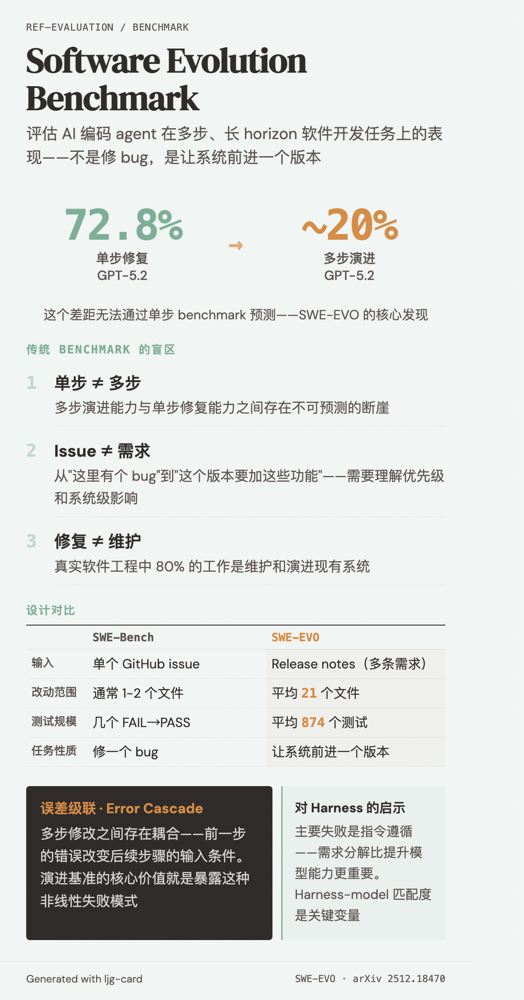

# Software Evolution Benchmark（软件演进基准）

=== "图"

    { loading=lazy width="100%" }

=== "文"

    
    ## 定义
    
    软件演进基准是一类评估 AI 编码 agent 在多步、长 horizon 软件开发任务上表现的测试框架。与传统的单 issue 修复基准（如 [SWE-Bench](../entities/swe-bench.md)）不同，演进基准要求 agent 理解高层需求规格（如 release notes），协调跨多个文件的修改，并在保持现有功能的前提下将代码库推进到新版本。
    
    ## 为什么需要演进基准
    
    传统 benchmark 的盲区：
    
    1. **单步 ≠ 多步**：[SWE-EVO](../sources/swe-evo.md) 证明 GPT-5.2 在单步修复上 72.8%，多步演进上降至 ~20%。这个差距无法通过单步 benchmark 预测
    2. **Issue ≠ 需求**：单 issue 修复的输入是"这里有个 bug"，演进的输入是"这个版本要加这些功能、改这些接口"——后者需要理解优先级、依赖关系和系统级影响
    3. **修复 ≠ 维护**：真实软件工程中 80% 的工作是维护和演进现有系统，而非从零构建或修单个 bug
    
    ## 设计维度
    
    好的演进基准应覆盖：
    
    | 维度 | SWE-Bench | SWE-EVO |
    |---|---|---|
    | 输入 | 单个 GitHub issue | Release notes（多条需求） |
    | 改动范围 | 通常 1-2 个文件 | 平均 21 个文件 |
    | 测试规模 | 几个 FAIL→PASS | 平均 874 个测试 |
    | 评估 | 二值（全过/不过） | 二值 + Fix Rate（部分进展） |
    | 任务性质 | 修一个 bug | 让系统前进一个版本 |
    
    ## 与 [Error Cascade](error-cascade.md) 的关系
    
    演进基准之所以难，根源在于 [误差级联](error-cascade.md)：多步修改之间存在耦合，前一步的错误会改变后续步骤的输入条件。演进基准的核心价值就是暴露这种非线性失败模式——单步 benchmark 无法测到的能力边界。
    
    ## 对 [Harness Engineering](harness-engineering.md) 的启示
    
    演进基准的结果反向指导 harness 设计：
    - 强模型在 SWE-EVO 上的主要失败是 *指令遵循*，说明 harness 中的需求分解和澄清机制比提升模型能力更重要
    - 模型在不同框架上表现差异巨大（GLM-5 在 SWE-agent 37.5% vs OpenHands 8.33%），说明 harness-model 匹配度是关键变量
    
    ## 相关概念
    
    - [Error cascade](error-cascade.md) — 演进基准暴露的核心失败机制
    - [Long-running agents](long-running-agents.md) — 演进任务天然是长 horizon 任务
    - [Harness engineering](harness-engineering.md) — 应对演进挑战的系统设计
    - [Feature tracking](feature-tracking.md) — 多步演进中的进度管理
    
    ## References
    
    - `sources/arxiv_papers/2512.18470-swe-evo.md`
    
