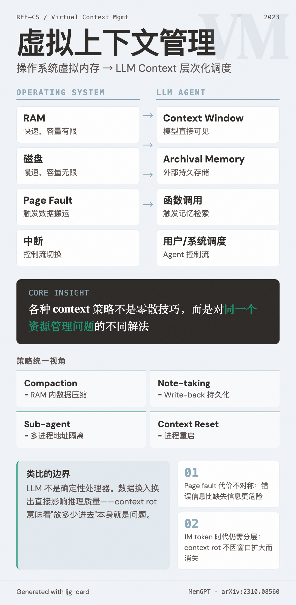

# Virtual Context Management（虚拟上下文管理）

=== "图"

    { loading=lazy width="100%" }

=== "文"

    
    ## 定义
    
    虚拟上下文管理是一种借鉴操作系统虚拟内存机制的 LLM 上下文扩展技术。核心思想：通过在快速存储（context window）和慢速存储（外部记忆）之间智能调度数据，为 LLM 提供超出其物理 context window 限制的"虚拟"上下文空间。
    
    由 [MemGPT](../entities/memgpt.md)（Packer et al., 2023）首次提出并系统化。
    
    ## OS-LLM 映射
    
    | 操作系统概念 | LLM 对应 | 说明 |
    |---|---|---|
    | RAM | Context window | 模型直接可见的信息，快速但容量有限 |
    | 磁盘 | Archival / recall memory | 外部持久存储，容量大但需要显式加载 |
    | Page fault | 函数调用（memory retrieval） | 当所需信息不在 context 中时，触发从外部存储加载 |
    | 虚拟内存管理器 | LLM 自身 | 模型自主决定何时读写外部存储 |
    | 中断 | 控制流切换 | 系统与用户之间的调度机制 |
    
    ## 与 Context Management 策略的关系
    
    [Context management](context-management.md) 中已记录的多种策略可以在虚拟上下文管理的框架下统一理解：
    
    - **Compaction** = RAM 内的数据压缩（减少工作集大小，但不涉及磁盘交换）
    - **Structured note-taking** = 显式的 write-back 操作（将 context window 中的信息持久化到外部存储）
    - **Sub-agent 架构** = 多进程隔离（每个子 agent 拥有独立的虚拟地址空间）
    - **Context reset** = 进程重启（清空 RAM，从磁盘重新加载状态）
    
    这一映射的价值不在于精确的技术对应，而在于提供了一个统一的思考框架——[context engineering](context-engineering.md) 的各种策略不是零散的技巧，而是对同一个资源管理问题的不同解法。
    
    ## 局限与演进
    
    虚拟上下文管理的 OS 类比有其边界：
    
    1. **LLM 不是确定性处理器**：OS 虚拟内存中，数据换入换出不改变计算结果；但 LLM 的 context 变化直接影响推理质量（参见 [context rot](context-rot.md)）
    2. **"Page fault" 的代价不对称**：OS 中 page fault 只增加延迟；LLM 中加载错误的信息可能引入干扰，反而损害性能
    3. **模型能力的演进**：随着 context window 扩大（如 Opus 4.6 的 1M token），"虚拟化"的需求在变化——但 [context rot](context-rot.md) 的存在意味着层次化存储的思路仍然有效
    
    ## 相关概念
    
    - [Context management](context-management.md) — 虚拟上下文管理是其架构级框架
    - [Context rot](context-rot.md) — 证明了即使 context window 足够大，层次化存储仍然必要
    - [Context engineering](context-engineering.md) — 更广义的上下文策展框架
    - [Context compression](context-compression.md) — "RAM 内"的压缩策略
    - [Long-running agents](long-running-agents.md) — 虚拟上下文管理的主要应用场景
    - [Harness engineering](harness-engineering.md) — harness 层负责实现记忆层次的调度逻辑
    
    ## References
    
    - `sources/arxiv_papers/2310.08560-memgpt-towards-llms-as-operating-systems.md`
    
