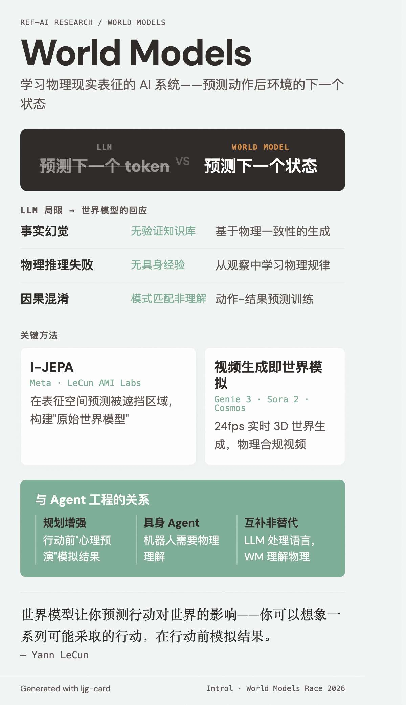

# World Models（世界模型）

=== "图"

    { loading=lazy width="100%" }

=== "文"

    
    ## 定义
    
    世界模型是学习物理现实表征的 AI 系统——不预测下一个 token，而是预测给定动作后环境的下一个状态。核心能力：规划（模拟结果后再行动）、物理推理（理解质量、动量、空间关系）、因果理解、持久记忆。
    
    LeCun 的表述："你的心智模型，关于世界如何运转。你可以想象一系列可能采取的行动，世界模型让你预测这些行动对世界的影响。"
    
    ## LLM 的局限与世界模型的回应
    
    [World Models Race 2026](../sources/introl-world-models-race-2026.md) 综述了核心论点：
    
    | LLM 局限 | 根因 | 世界模型的回应 |
    |----------|------|--------------|
    | 事实幻觉 | 无验证知识库 | 基于物理一致性的生成 |
    | 物理推理失败 | 无具身经验 | 从观察中学习物理规律 |
    | 因果混淆 | 模式匹配而非理解 | 动作-结果预测训练 |
    
    ## 关键方法
    
    ### I-JEPA
    
    [Meta 的 I-JEPA](../sources/meta-i-jepa.md) 是世界模型方向的理论基础之一。核心创新：在表征空间（而非像素空间）预测被遮挡的图像区域，构建"原始世界模型"。LeCun 的 AMI Labs 在此基础上扩展。
    
    ### 视频生成即世界模拟
    
    视频生成和世界模型的边界模糊：DeepMind 的 Genie 3（24fps 实时 3D 世界生成）、OpenAI 的 Sora 2（物理合规视频）、NVIDIA Cosmos（自动驾驶/机器人合成训练数据）都在将视频生成推向物理模拟。
    
    ## 与 Agent 工程的关系
    
    世界模型对 [agentic systems](agentic-systems.md) 的多模态演进有重要启示：
    
    - **规划增强**：世界模型可为 agent 提供"心理预演"能力——在行动前模拟结果
    - **具身 agent**：机器人和自动驾驶 agent 需要物理理解，LLM 无法直接提供
    - **互补而非替代**：LLM 处理语言推理和工具使用，世界模型提供物理环境理解
    
    但目前世界模型尚处早期，与文本 agent 工程的交叉有限。
    
    ## 相关概念
    
    - [Agentic systems](agentic-systems.md) — 世界模型可能成为未来 agentic 系统的感知层
    
    ## References
    
    - `sources/introl-world-models-race-2026.md`
    - `sources/meta-i-jepa.md`
    
