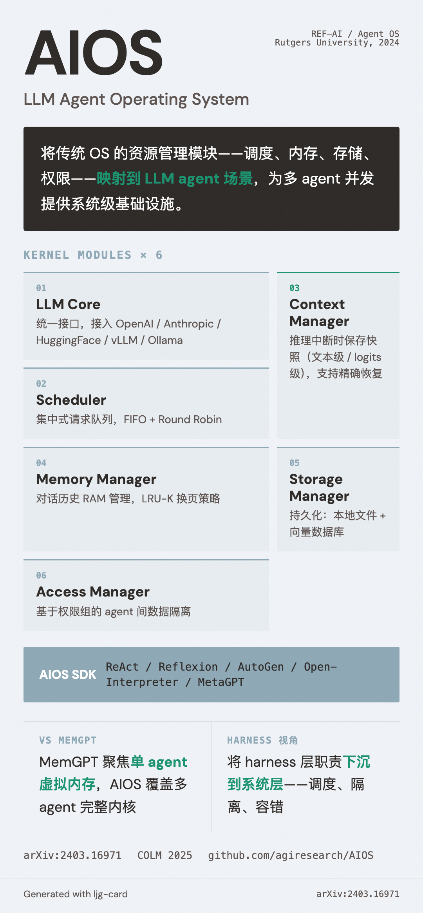

# AIOS (LLM Agent Operating System)

=== "图"

    { loading=lazy width="100%" }

=== "文"

    
    ## 概述
    
    AIOS 是 Rutgers University 团队（Kai Mei、Yongfeng Zhang 等）开发的 LLM agent 操作系统。核心思想：将传统 OS 的资源管理模块（调度、内存、存储、权限）映射到 LLM agent 场景，为多 agent 并发提供系统级基础设施。
    
    - **论文**: arXiv:2403.16971（2024-03-25），发表于 COLM 2025
    - **代码**: https://github.com/agiresearch/AIOS
    
    ## 核心组件
    
    AIOS 内核包含六大模块：
    
    1. **LLM Core**：统一 LLM 实例接口，支持 OpenAI/Anthropic/Google/HuggingFace/vLLM/Ollama 等后端
    2. **Scheduler**：集中式请求队列，FIFO 和 Round Robin 调度
    3. **Context Manager**：推理中断时保存快照（文本级或 logits 级），支持精确恢复
    4. **Memory Manager**：agent 对话历史的 RAM 管理，LRU-K 换页
    5. **Storage Manager**：持久化存储，本地文件 + 向量数据库
    6. **Access Manager**：基于权限组的 agent 间数据隔离
    
    ## AIOS SDK
    
    提供 API 层抽象和 adapter 层，支持 ReAct、Reflexion、AutoGen、Open-Interpreter、MetaGPT 等框架的 agent 接入 AIOS kernel。
    
    ## 在 Wiki 知识体系中的位置
    
    AIOS 是 [LLM-OS 类比](../concepts/llm-os-analogy.md) 的最完整工程实现。它与 [MemGPT](memgpt.md) 互补：MemGPT 聚焦单 agent 的虚拟内存管理，AIOS 覆盖多 agent 的完整内核。
    
    在 [harness engineering](../concepts/harness-engineering.md) 的上下文中，AIOS 代表了一种"向下"的解决方案：将 harness 层的某些职责（调度、隔离、容错）下沉到系统层。
    
    ## 相关实体
    
    - [MemGPT](memgpt.md) — OS 类比的另一方向（虚拟内存）
    - [OpenAI](openai.md) — Codex 的 agent loop 在应用层解决类似问题
    - [Anthropic](anthropic.md) — Claude Agent SDK 在应用层提供 context management
    
    ## References
    
    - `sources/arxiv_papers/2403.16971-aios-llm-agent-operating-system.md`
    
