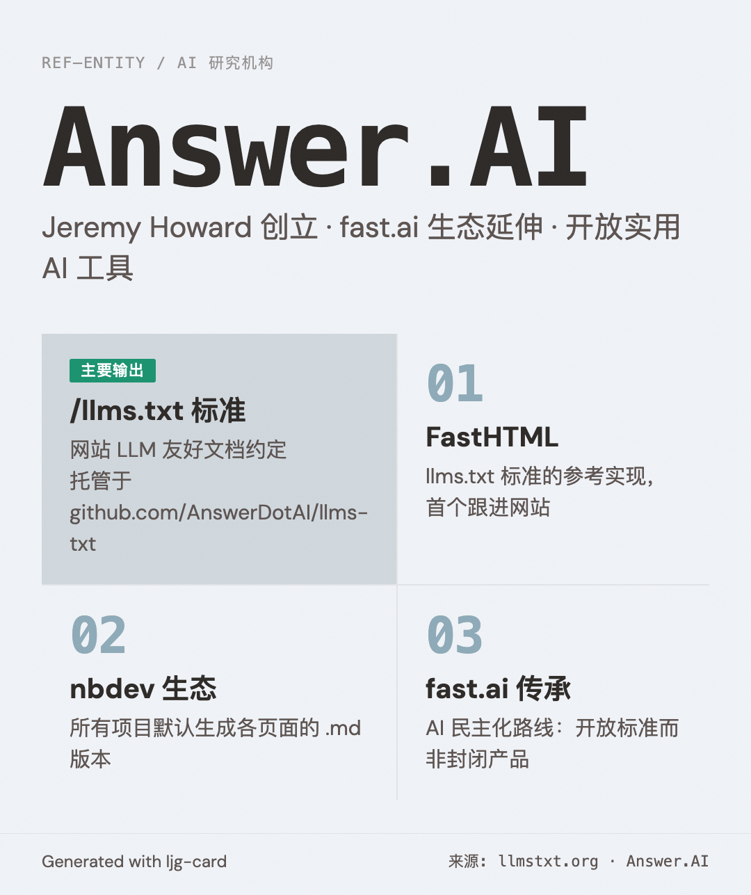

# Answer.AI

=== "图"

    { loading=lazy width="100%" }

=== "文"

    
    ## 简介
    
    由 Jeremy Howard 创立的 AI 研究机构，聚焦于开放、实用的 AI 工具和标准。fast.ai 生态的延伸组织。
    
    ## 主要输出
    
    - **`llms.txt` 标准**：网站 LLM 友好文档约定，源仓库托管于 `github.com/AnswerDotAI/llms-txt`
    - **FastHTML**：`llms.txt` 标准的参考实现网站
    - **nbdev 生态**：所有 Answer.AI 和 fast.ai 软件项目默认生成各页面的 `.md` 版本
    
    ## 与本 wiki 的关联
    
    - [llms.txt 概念](../concepts/llms-txt.md) — Answer.AI 提出并维护的标准
    - [Jeremy Howard](jeremy-howard.md) — 创始人
    
    ## References
    
    - `sources/llmstxt-org-the-llms-txt-file.md`
    
