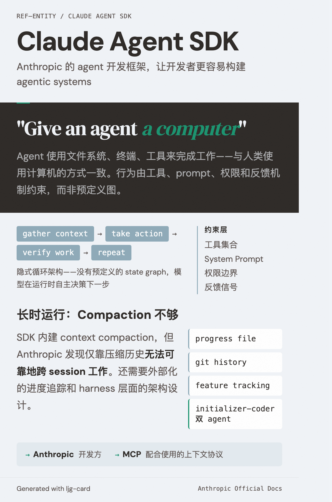

# Claude Agent SDK

=== "图"

    { loading=lazy width="100%" }

=== "文"

    
    Anthropic 的 agent 开发框架（原 Claude Code SDK）。
    
    ## 概述
    
    在 [Building Effective Agents](../sources/anthropic-building-effective-agents.md) 中作为推荐的实现框架被提及。属于让开发者更容易构建 [agentic systems](../concepts/agentic-systems.md) 的工具之一。
    
    ## 设计哲学
    
    核心原则："给 agent 一台计算机"。SDK 让 agent 能使用文件系统、终端、工具来完成工作——与人类使用计算机的方式一致。运行在 [隐式循环架构](../concepts/implicit-loop-architecture.md) 上：gather context → take action → verify work → repeat，行为由工具、prompt、权限和反馈机制约束，而非预定义图。详见 [SDK 官方介绍](../sources/anthropic-building-agents-claude-agent-sdk.md)。
    
    ## 长时运行能力
    
    SDK 内建 [context management](../concepts/context-management.md) 能力（如 compaction），使 agent 可以在 context 接近上限时压缩历史继续工作。但 Anthropic 在 [长时运行 agent 实践](../sources/anthropic-effective-harnesses-long-running-agents.md) 中发现，仅有 compaction 不够——还需要外部化的进度追踪（progress file + git history + [feature tracking](../concepts/feature-tracking.md)）和 [harness 层面的设计](../concepts/harness-engineering.md)（initializer-coder 双 agent 架构）才能实现可靠的跨 session 工作。
    
    ## 相关实体
    
    - [Anthropic](anthropic.md) — 开发方
    - [MCP](mcp.md) — 配合使用的上下文协议
    
    ## References
    
    - `sources/anthropic_official/building-effective-agents.md`
    - `sources/anthropic_official/effective-harnesses-long-running-agents.md`
    - `sources/anthropic_official/harness-design-long-running-apps.md`
    - `sources/anthropic_official/building-agents-claude-agent-sdk.md`
    
