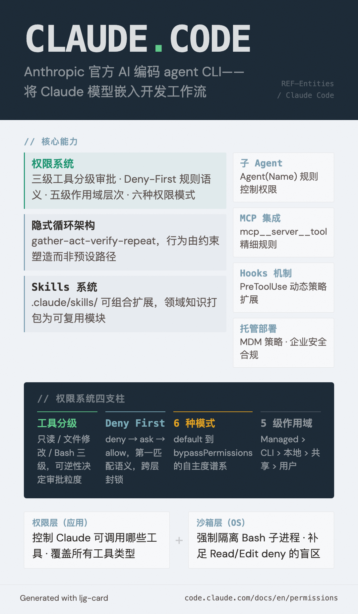

# Claude Code

=== "图"

    { loading=lazy width="100%" }

=== "文"

    
    Anthropic 开发的 AI 编码 agent，官方 CLI 工具，支持在终端中与 Claude 模型协作进行代码开发。
    
    ## 核心定位
    
    Claude Code 是一款将 Claude 模型直接嵌入开发工作流的 agent——它不只是聊天界面，而是可以读写文件、执行 Bash 命令、调用 MCP 工具、启动子 agent 的完整代理系统。
    
    ## 权限系统
    
    Claude Code 的权限系统是其核心安全机制，围绕三个设计轴展开：
    
    **1. 工具分级审批**（见 [Claude Code 权限系统](../concepts/claude-code-permission-system.md)）
    - 只读工具（Read/Grep）：无需审批
    - 文件修改工具（Edit/Write）：会话级审批
    - Bash 命令：永久记录的审批
    
    **2. Deny-First 规则语义**（见 [Allow/Ask/Deny 规则层次](../concepts/permission-rules-hierarchy.md)）
    - deny → ask → allow 的优先级评估
    - 任意层级的 deny 无法被 allow 覆盖
    
    **3. 五级作用域层次**（见 [设置作用域层次](../concepts/settings-scope-hierarchy.md)）
    - 托管设置 > CLI 参数 > 本地项目 > 共享项目 > 用户设置
    
    ## 六种权限模式
    
    详见 [权限模式](../concepts/permission-modes.md)：`default`、`acceptEdits`、`plan`、`auto`、`dontAsk`、`bypassPermissions`
    
    ## 与其他 agent 框架的区别
    
    Claude Code 相比通用 agent 框架的特殊设计：
    - **隐式循环架构**：行为由约束塑造而非预设路径（见 [隐式循环架构](../concepts/implicit-loop-architecture.md)）
    - **Skills 系统**：通过 `.claude/skills/` 可组合扩展 agent 能力（见 [Agent Skills](../concepts/agent-skills.md)）
    - **子 agent 支持**：通过 `Agent(AgentName)` 规则控制子 agent 权限
    - **Hooks 机制**：PreToolUse hooks 在权限评估前运行，支持动态策略
    
    ## 与沙箱的关系
    
    Claude Code 的权限系统与 OS 级[沙箱](../concepts/agent-sandboxing.md)是互补安全层：权限规则阻止 Claude 发起受限请求，沙箱在 prompt injection 绕过模型决策时作为最后防线。
    
    ## References
    
    - `sources/anthropic_official/claude-code-permissions.md`
    - `sources/anthropic_official/building-agents-claude-agent-sdk.md`
    - `sources/anthropic_official/equipping-agents-agent-skills.md`
    
