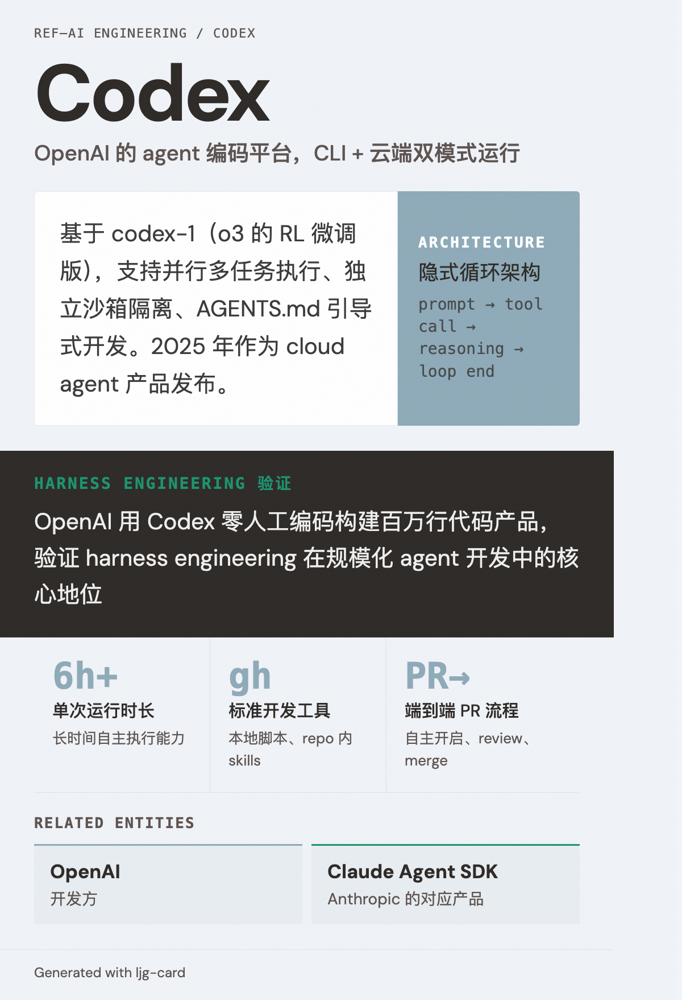

# Codex

=== "图"

    { loading=lazy width="100%" }

=== "文"

    
    OpenAI 的 agent 编码平台，支持 CLI 和云端运行模式。
    
    ## 概述
    
    Codex 是 [OpenAI](openai.md) 的 agentic 编码解决方案，类似于 Anthropic 的 [Claude Agent SDK](claude-agent-sdk.md)。其内部运行 [隐式循环架构](../concepts/implicit-loop-architecture.md)（Runner 组件驱动 prompt → tool call → reasoning → loop end 循环）。
    
    Codex 于 2025 年作为 [cloud agent 产品发布](../sources/openai-introducing-codex.md)，基于 codex-1（o3 的 RL 微调版），支持并行多任务、独立沙箱、AGENTS.md 引导。
    
    ## 在 Harness Engineering 中的角色
    
    OpenAI 团队用 Codex 零人工编码构建了百万行代码的产品（详见 [harness engineering 实践](../sources/openai-harness-engineering.md)），验证了 [harness engineering](../concepts/harness-engineering.md) 在规模化 agent 开发中的核心地位。关键特征：
    - 单次运行可持续 6+ 小时
    - 使用标准开发工具（gh、本地脚本、repo 内 skills）
    - 支持自主 PR 开启、review 响应、merge
    
    ## 相关实体
    
    - [OpenAI](openai.md) — 开发方
    - [Claude Agent SDK](claude-agent-sdk.md) — Anthropic 的对应产品
    
    ## References
    
    - `sources/openai_official/harness-engineering.md`
    - `sources/openai_official/unlocking-codex-harness.md`
    - `sources/openai_official/unrolling-codex-agent-loop.md`
    
