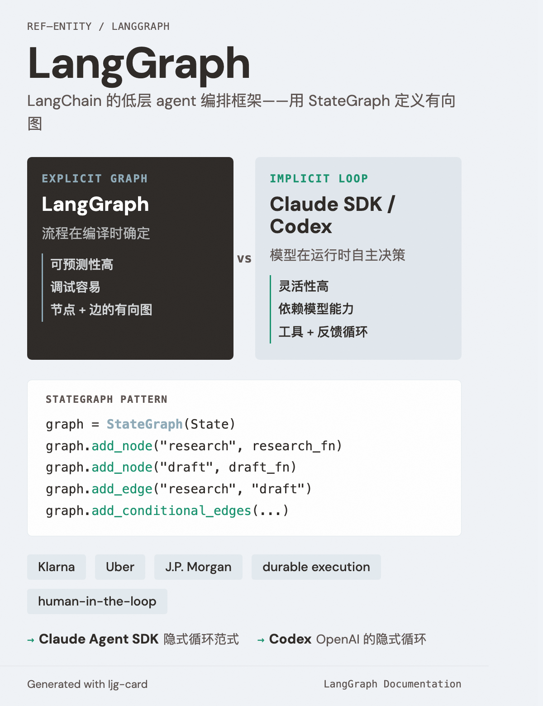

# LangGraph

=== "图"

    { loading=lazy width="100%" }

=== "文"

    
    LangChain 提供的低层 agent 编排框架，采用**显式图架构**——用 StateGraph 定义节点和边的有向图来编排 agent 行为。
    
    ## 与本 wiki 的关联
    
    LangGraph 是 [隐式循环架构](../concepts/implicit-loop-architecture.md)（Claude Agent SDK、Codex）的主要对比范式。两者代表了 agent 编排的两极：
    
    - **LangGraph**：流程在编译时确定，可预测性高，调试容易
    - **隐式循环**：模型在运行时自主决策，灵活性高，依赖模型能力
    
    被 Klarna、Uber、J.P. Morgan 等企业采用，主打 durable execution、human-in-the-loop、内存管理。
    
    ## 相关实体
    
    - [Claude Agent SDK](claude-agent-sdk.md) — 隐式循环范式的代表
    - [Codex](codex.md) — OpenAI 的隐式循环实现
    
    ## References
    
    - `sources/langgraph-documentation.md`
    
