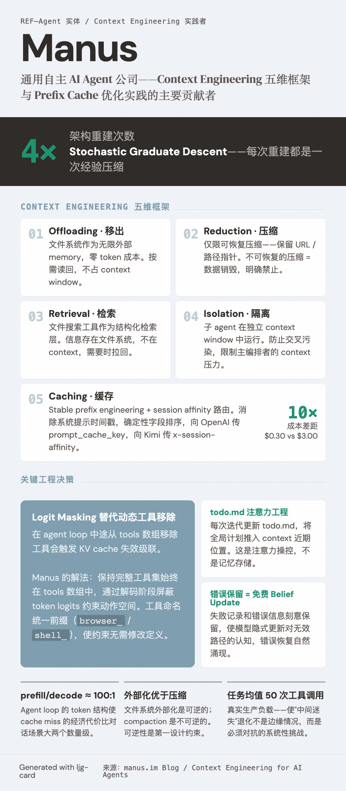

# Manus

=== "图"

    { loading=lazy width="100%" }

=== "文"

    
    ## 简介
    
    Manus 是一家 AI agent 公司，开发了同名的通用自主 agent 产品。在上下文工程（context engineering）领域，Manus 团队以公开分享生产级 agent 架构经验著称，其博客文章《Context Engineering for AI Agents: Lessons from Building Manus》（作者：Yichao "Peak" Ji）成为行业重要参考。
    
    ## 对 Context Engineering 的贡献
    
    Manus 经历了四次架构重建（自称"Stochastic Graduate Descent"），发展出一套生产验证的 context engineering 五维框架：
    
    | 维度 | 核心策略 |
    |------|---------|
    | **Context Offloading** | 文件系统作为无限外部 memory，零 token 成本 |
    | **Context Reduction** | 仅限可恢复压缩（保留路径/URL 指针）|
    | **Context Retrieval** | 文件搜索工具作为结构化检索层 |
    | **Context Isolation** | 子 agent 在独立 context window 中运行 |
    | **Context Caching** | Stable prefix engineering + session affinity 路由 |
    
    核心经济洞察：agent loop 的 prefill/decode 比例约 100:1，prefix cache 命中率（Claude Sonnet：命中 $0.30/MTok vs 未命中 $3.00/MTok）是首要生产成本杠杆。
    
    ## 代表性技术决策
    
    **Logit Masking 替代动态工具移除**：在 agent loop 中修改 tools 数组会破坏 KV cache。Manus 保持完整工具集不变，通过解码阶段的 logit masking 约束动作空间。
    
    **`todo.md` 的注意力工程**：通过在每次迭代中更新 `todo.md` 文件，将全局计划维持在 context 近期位置，对抗"中间迷失"（lost-in-the-middle）退化。
    
    **错误保留策略**：刻意保留失败记录和错误信息，为模型提供隐式 belief update，使错误恢复行为自然涌现。
    
    ## 相关来源
    
    - [Manus Context Engineering 博客](../sources/manus-context-engineering.md) — 五维框架、KV cache 优化、生产经验
    - [Prefix caching](../concepts/prefix-caching.md) — Manus 对 prefix cache 优化的具体实践
    
    ## References
    
    - https://manus.im/blog/Context-Engineering-for-AI-Agents-Lessons-from-Building-Manus
    - https://www.zenml.io/llmops-database/context-engineering-for-production-ai-agents-at-scale
    
