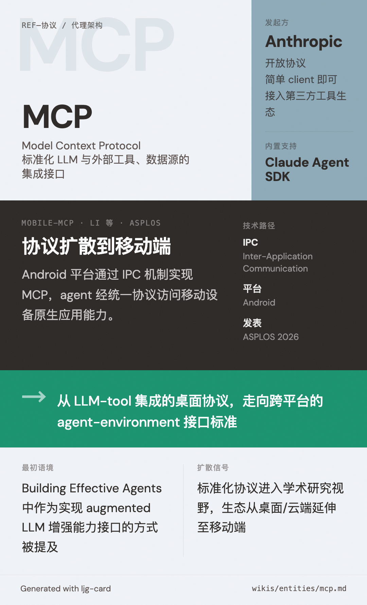

# MCP — Model Context Protocol

=== "图"

    { loading=lazy width="100%" }

=== "文"

    
    Anthropic 推出的开放协议，标准化 LLM 与外部工具、数据源的集成接口。
    
    ## 概述
    
    在 [Building Effective Agents](../sources/anthropic-building-effective-agents.md) 中被提及为实现 [augmented LLM](../concepts/augmented-llm.md) 增强能力接口的一种方式。开发者通过简单的 client 实现即可接入不断增长的第三方工具生态。
    
    ## 跨平台实现：Mobile-MCP
    
    [AgenticOS Workshop](../sources/agenticos-workshop-asplos-2026.md) 中的 Mobile-MCP 论文（Li 等）探索了在 Android 平台上通过 IPC（Inter-Application Communication）机制实现 MCP 的方案。这将 MCP 从桌面/云端扩展到移动端，意味着 agent 可以通过统一的协议访问移动设备上的原生应用能力。
    
    这是 MCP 作为标准化协议向更广泛生态扩散的信号——从 LLM-tool 集成的桌面协议，走向跨平台的 agent-environment 接口标准。
    
    ## MCP 与 A2A：互补协议
    
    [A2A 协议](../concepts/a2a-protocol.md)（Google/Linux Foundation）是 MCP 的互补标准，两者共同覆盖 agent 生态的全部外部接口：
    
    | 维度 | MCP | A2A |
    |---|---|---|
    | 连接对象 | Agent ↔ 工具/数据 | Agent ↔ Agent |
    | 通信性质 | 无状态函数调用 | 有状态任务委派 |
    | 发现机制 | JSON Schema 能力描述 | Agent Card（`/.well-known/agent-card`） |
    | 认证模式 | 工具级别授权 | HTTPS + OAuth 2.0 |
    
    A2A 官方文档明确表述："将 agent 包装成 MCP 工具是根本性的降格"——agent 有自主性和多轮对话需求，不应被约束为无状态工具调用。
    
    ## 相关实体
    
    - [Anthropic](anthropic.md) — MCP 协议发起方
    - [Google](google.md) — A2A 协议原始开发者
    - [Claude Agent SDK](claude-agent-sdk.md) — 内置 MCP 支持
    - [ASPLOS](asplos.md) — Mobile-MCP 发表的学术会场
    
    ## References
    
    - `sources/anthropic_official/building-effective-agents.md`
    - `sources/anthropic_official/building-agents-claude-agent-sdk.md`
    - `sources/agenticos-workshop-asplos-2026.md`
    - `sources/google-a2a-protocol.md`
    
