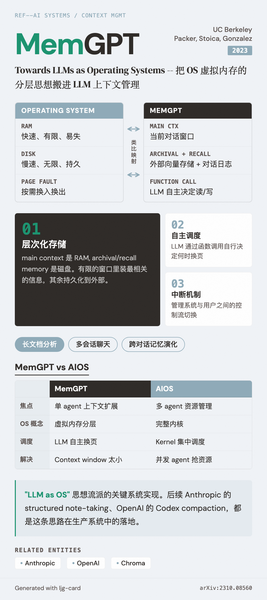

# MemGPT (Memory-GPT)

=== "图"

    { loading=lazy width="100%" }

=== "文"

    
    ## 概述
    
    MemGPT 是 UC Berkeley 团队（Charles Packer、Ion Stoica、Joseph Gonzalez 等）于 2023 年提出的系统，将操作系统的层次化内存管理思想应用于 LLM 上下文管理。论文标题"Towards LLMs as Operating Systems"直接表达了其定位：不是一个应用，而是一种系统架构思路。
    
    - **论文**: arXiv:2310.08560（2023-10-12）
    - **网站**: https://memgpt.ai/
    
    ## 核心机制
    
    MemGPT 引入 [虚拟上下文管理](../concepts/virtual-context-management.md)：
    
    1. **层次化存储**：main context（类似 RAM）+ archival memory / recall memory（类似磁盘）
    2. **自主调度**：LLM 通过函数调用自主决定何时从外部存储读取或写入信息
    3. **中断机制**：管理系统与用户之间的控制流切换
    
    ## 评估域
    
    - **长文档分析**：处理远超 context window 的文档
    - **多会话聊天**：跨多次对话维持记忆、反思、动态演化
    
    ## 在 Wiki 知识体系中的位置
    
    MemGPT 是"LLM as OS"思想流派的关键系统实现。在本 wiki 的 [context management](../concepts/context-management.md) 知识图谱中，它位于"架构级方案"层——介于底层的 compaction 机制和上层的 [harness engineering](../concepts/harness-engineering.md) 设计模式之间。
    
    后续的工程实践（Anthropic 的 structured note-taking、initializer-coder 架构；OpenAI 的 Codex compaction）可以视为 MemGPT 层次化思路在生产系统中的具体落地。
    
    ## 与 AIOS 的关系
    
    MemGPT 和 [AIOS](../sources/aios-llm-agent-operating-system.md) 都借鉴 OS 概念，但切入点不同：
    
    | | MemGPT | AIOS |
    |---|---|---|
    | 焦点 | 单 agent 的上下文扩展 | 多 agent 的资源管理 |
    | OS 概念 | 虚拟内存（RAM + 磁盘分层） | 完整内核（调度 + 内存 + 工具 + 权限） |
    | 调度方式 | LLM 自主决定何时换页 | Kernel 集中调度 |
    | 解决的问题 | Context window 太小 | 并发 agent 抢资源 |
    
    两者互补：MemGPT 的层次化存储可以作为 AIOS Memory Manager 的底层实现，AIOS 的调度和隔离机制可以管理多个 MemGPT agent 的并发。
    
    ## 相关实体
    
    - [Anthropic](anthropic.md) — 后续在 context management 工程上的主要推动者
    - [OpenAI](openai.md) — Codex 的 compaction 机制与 MemGPT 思路呼应
    - [Chroma](chroma.md) — context rot 研究为 MemGPT 的分层存储提供了实证支持
    
    ## References
    
    - `sources/arxiv_papers/2310.08560-memgpt-towards-llms-as-operating-systems.md`
    - `sources/arxiv_papers/2403.16971-aios-llm-agent-operating-system.md`
    
