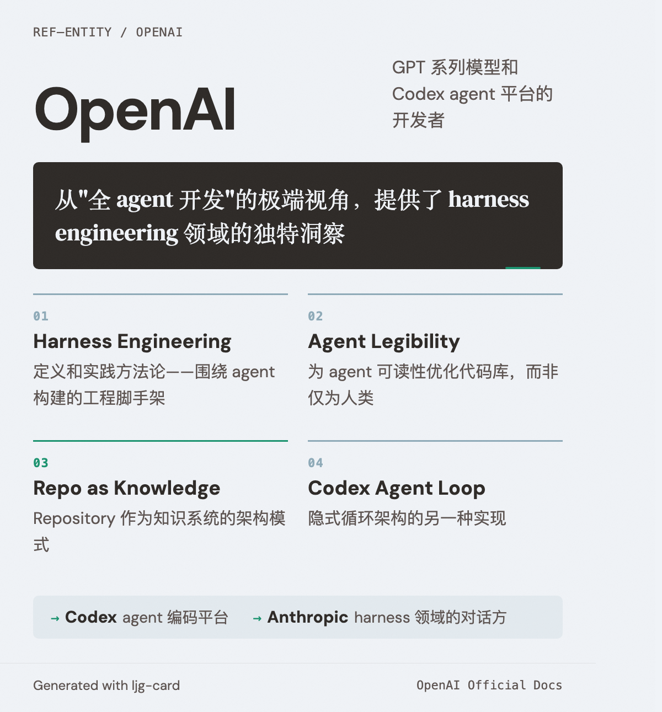

# OpenAI

=== "图"

    { loading=lazy width="100%" }

=== "文"

    
    AI 研究公司，GPT 系列模型和 Codex agent 平台的开发者。
    
    ## 与本 wiki 的关联
    
    OpenAI 是本项目 [harness engineering](../concepts/harness-engineering.md) 主题的重要参考来源。其实践从"全 agent 开发"的极端视角提供了独特洞察：
    - [Harness engineering](../sources/openai-harness-engineering.md) 的定义和实践方法论
    - Agent legibility 的概念——为 agent 可读性优化，而非仅为人类
    - Repository 作为知识系统的架构模式
    - [隐式循环架构](../concepts/implicit-loop-architecture.md) 的另一种实现（Codex agent loop）
    
    ## 相关实体
    
    - [Codex](codex.md) — OpenAI 的 agent 编码平台
    - [Anthropic](anthropic.md) — 在 harness engineering 领域形成对话的另一家公司
    
    ## References
    
    - `sources/openai_official/harness-engineering.md`
    - `sources/openai_official/unlocking-codex-harness.md`
    - `sources/openai_official/unrolling-codex-agent-loop.md`
    - `sources/openai_official/practical-guide-building-agents.md`
    
