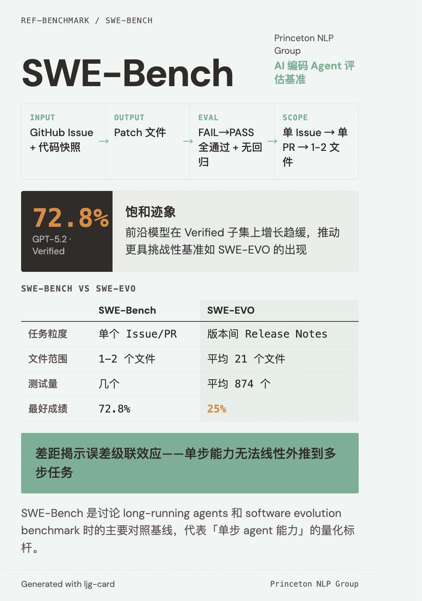

# SWE-Bench

=== "图"

    { loading=lazy width="100%" }

=== "文"

    
    ## 简介
    
    SWE-Bench 是由 Princeton NLP Group 发布的 AI 编码 agent 评估基准，从真实 GitHub issue 和对应的 pull request 中构造任务。Agent 需要为给定的 issue 生成可通过测试验证的补丁。
    
    SWE-Bench 已成为评估编码 agent 的事实标准，其 Verified 子集（SWE-Bench Verified）是最常用的排行榜。
    
    ## 核心设计
    
    - **输入**：一个 GitHub issue 描述 + 对应仓库的代码快照
    - **输出**：一个 patch 文件
    - **评估**：FAIL→PASS 测试全部通过 + PASS→PASS 测试无回归
    - **范围**：单个 issue → 单个 PR → 通常涉及 1-2 个文件
    
    ## 当前水平与饱和迹象
    
    截至 2025-2026，前沿模型在 SWE-Bench Verified 上已达到 ~72.8%（GPT-5.2），排行榜增长趋于平缓。这种饱和推动了更具挑战性的评估基准的出现，如 [SWE-EVO](../sources/swe-evo.md)。
    
    ## 与 SWE-EVO 的对比
    
    [SWE-EVO](../sources/swe-evo.md) 从 SWE-Bench 继承了仓库和执行环境（便于现有 agent 直接跑），但将任务从"单 issue 修复"升级为"版本间演进"：
    
    | 维度 | SWE-Bench | SWE-EVO |
    |---|---|---|
    | 任务粒度 | 单个 issue/PR | 版本间 release notes（多 PR） |
    | 文件范围 | 通常 1-2 个文件 | 平均 21 个文件 |
    | 测试量 | 几个 | 平均 874 个 |
    | 最好成绩 | 72.8% | 25% |
    
    这个差距揭示了 [误差级联](../concepts/error-cascade.md) 效应——单步能力无法线性外推到多步任务。
    
    ## 在 wiki 中的角色
    
    SWE-Bench 是本 wiki 讨论 [long-running agents](../concepts/long-running-agents.md) 和 [software evolution benchmark](../concepts/software-evolution-benchmark.md) 时的主要对照基线。它代表了"单步 agent 能力"的量化标杆。
    
    ## References
    
    - `sources/arxiv_papers/2512.18470-swe-evo.md`
    
